#### 39. A Kho『鴉科』

|台灣名|中譯名|學名|
|Kheh-chiáu（客鳥）|喜鵲|Pica serica|

# 39-2. Kheh-chiáu（客鳥）

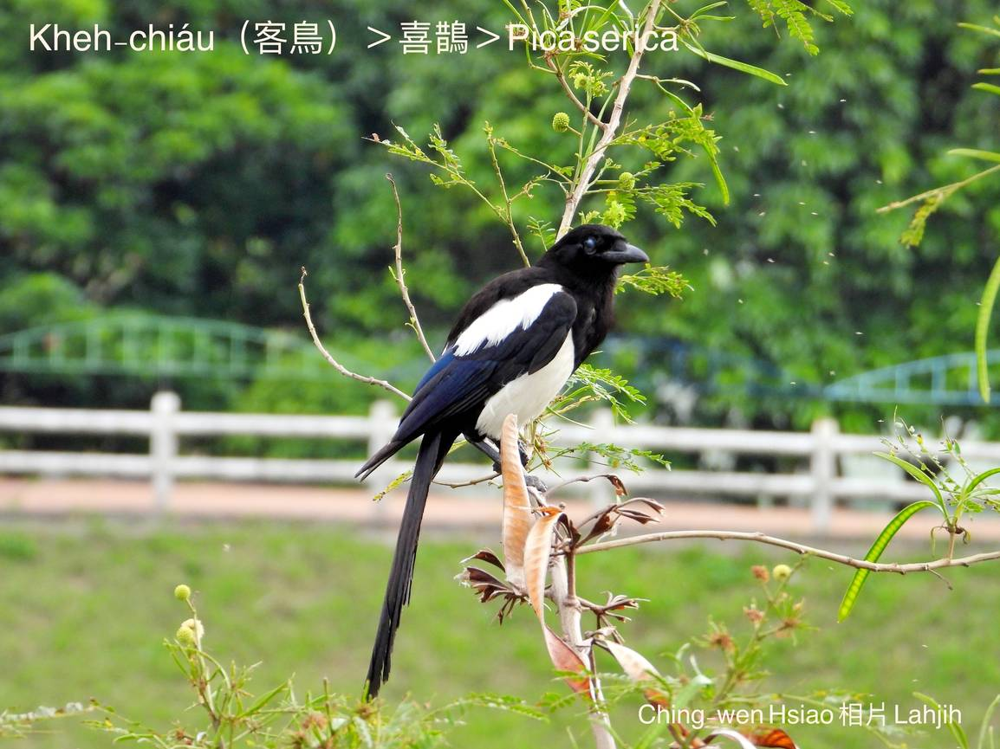

Kheh-chiáu，tī台灣是無gōa普遍ê在地鳥，生活tī西部南北平洋a̍h是低山區，ùi中國引進台灣已經200外年，中國話叫『喜鵲』，台灣人叫kheh鳥，叫聲「ka̍h ka̍h ka̍h ka̍h」。

Kheh-chiáu歇tī農耕地帶，庄腳郊區，雙雙對對出入，尤其是生湠期間，特別相好，chhōe食做siū lóng ká-ná翁某kāng-khoán。做siū tī môa-hông、Eucalyptus robusta樹尾頂，用樹枝竹枝cha̍p-chhò hoâiⁿ-ke̍h做成半球形空心ê siū，雜食性，大尾蟲、鳥仔-kiáⁿ、果子，特別siāng kah意食木瓜。

Kheh-chiáu生做chiâⁿ-súi，kui身軀烏chhap白，尾真長，飛行時翼股phia̍t--leh phia̍t--leh姿勢有夠迷人，尤其行路bē chhia̍k-chhia̍k-tiô，chi̍t-hoa̍h chi̍t-hoa̍h穩重chiok tōa-pān。

# 【Tâi-oân Chiáu-á Liām Koa-si】

### **Tâi-oân Kheh-chiáu ​M̄-sī Lâng-kheh**

O͘, tōa-pān, pe̍h, sûn-kiat ê sin-chhēng

Taⁿ-thâu, théng-heng, phiau-phiat, ū-sìn-sim

Kiâⁿ-lō͘ chi̍t-pō͘ chi̍t-pō͘, chiok tāi-châi

Lí sī kheh-chiáu kheh kheh kheh

Lí sī chāi-tē kheh-chiáu, m̄-sī lâng-kheh

Mā m̄-sī kòe-kheh

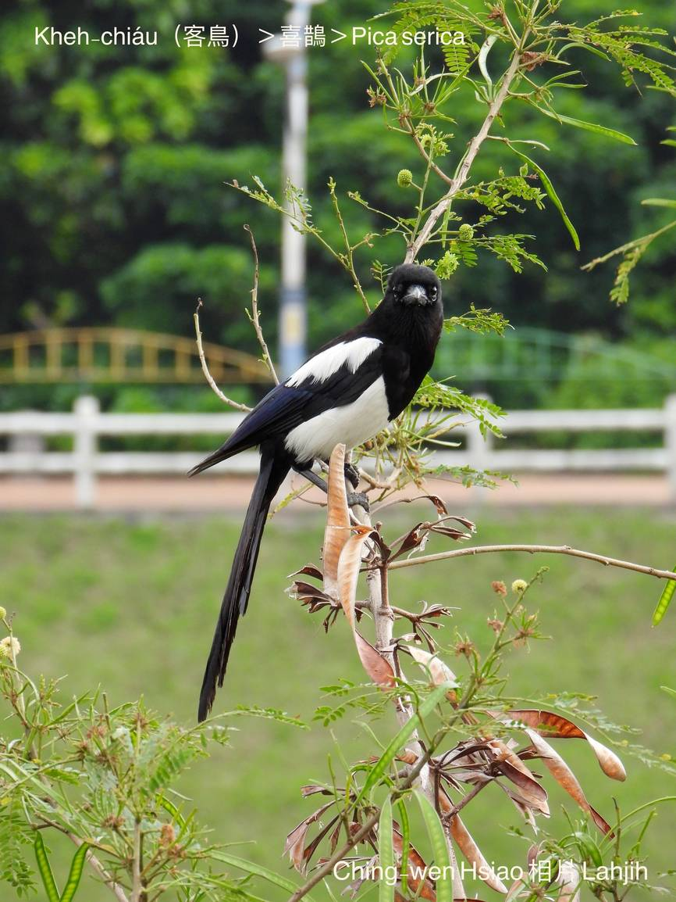
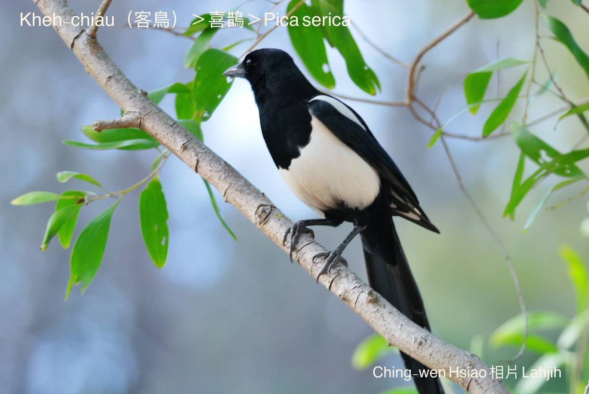
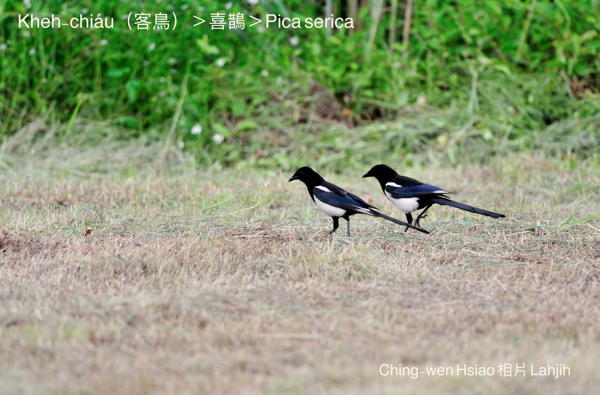
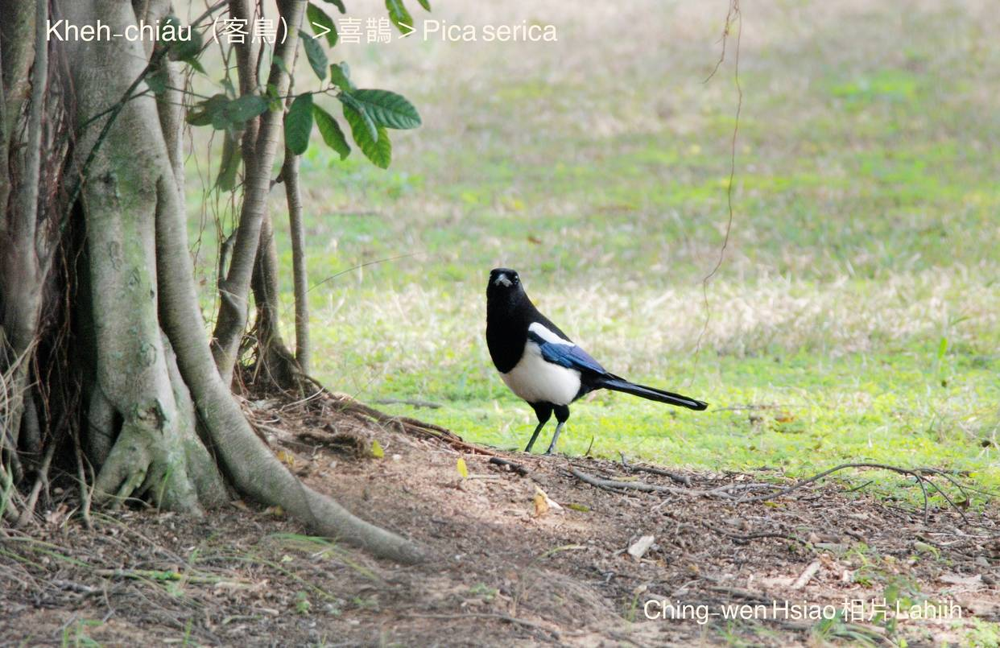
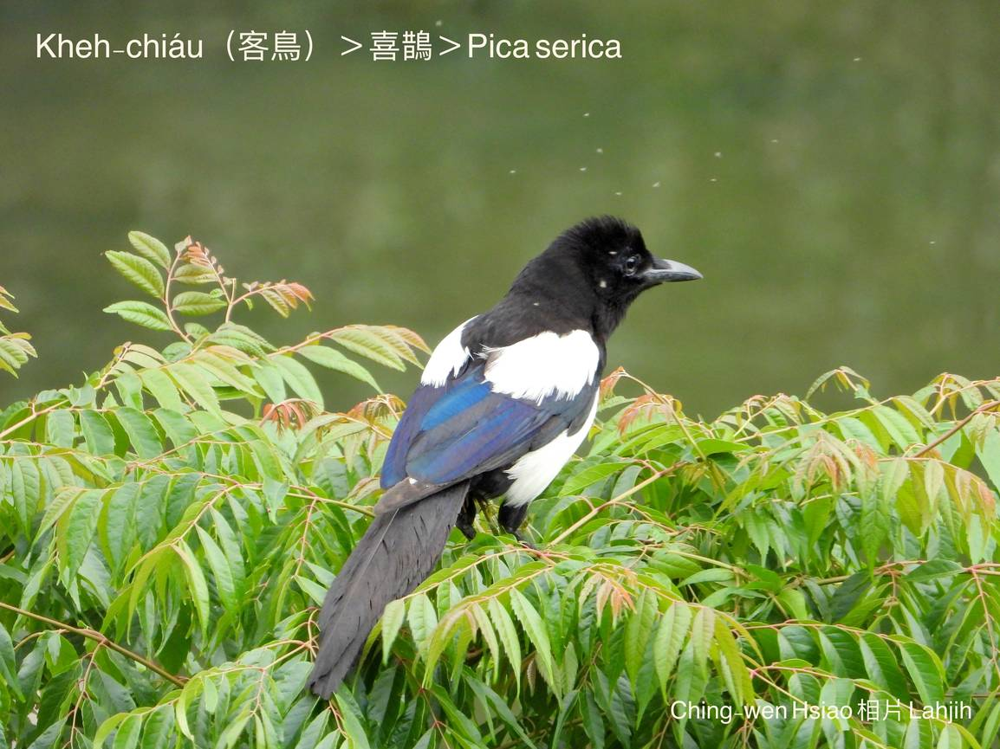
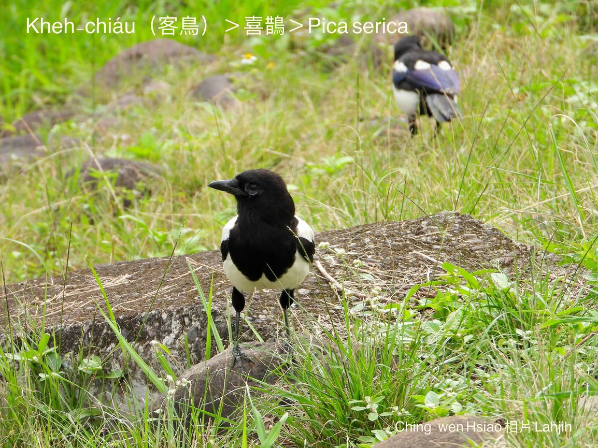
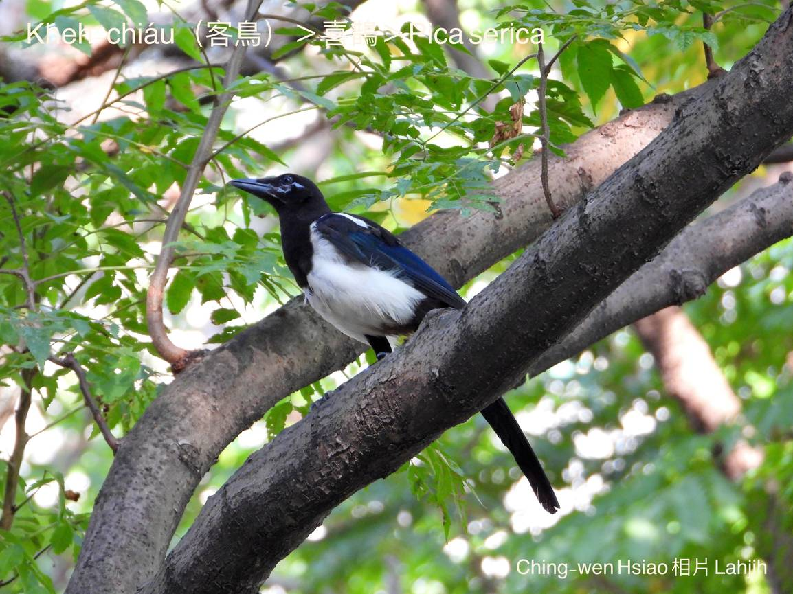
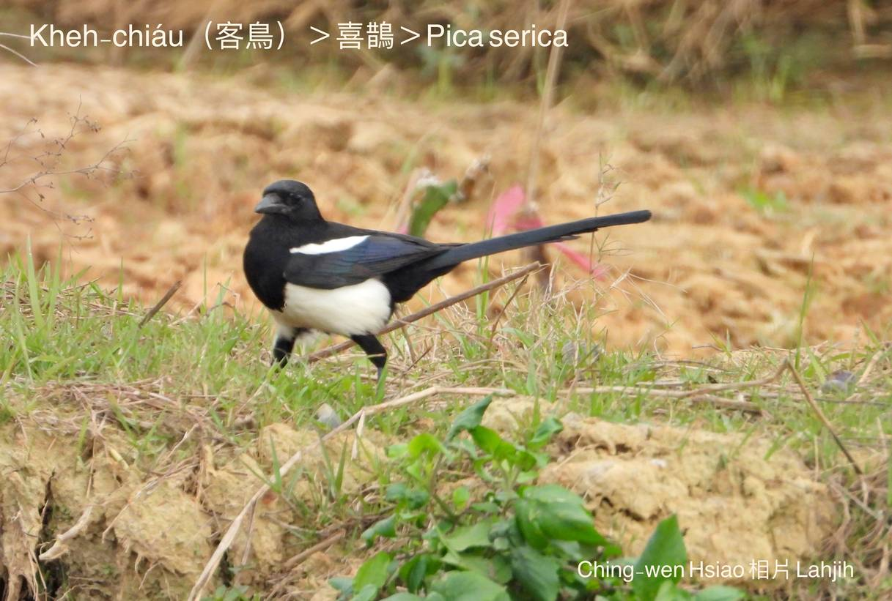
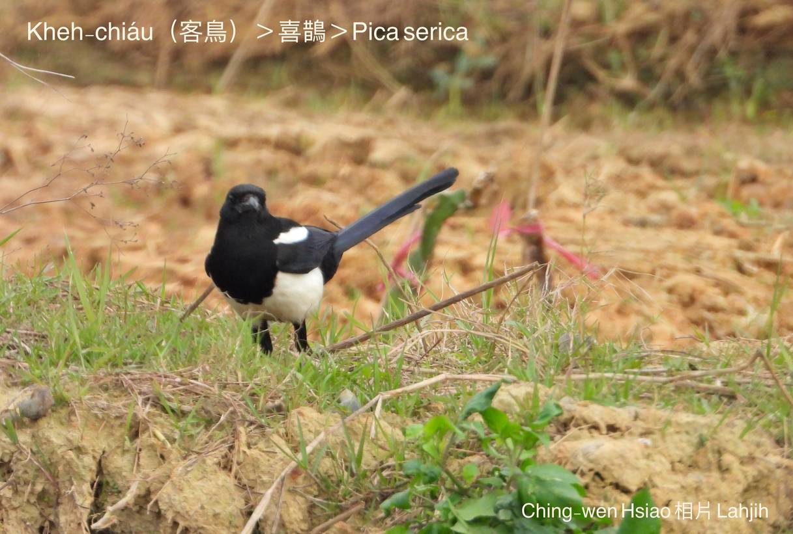
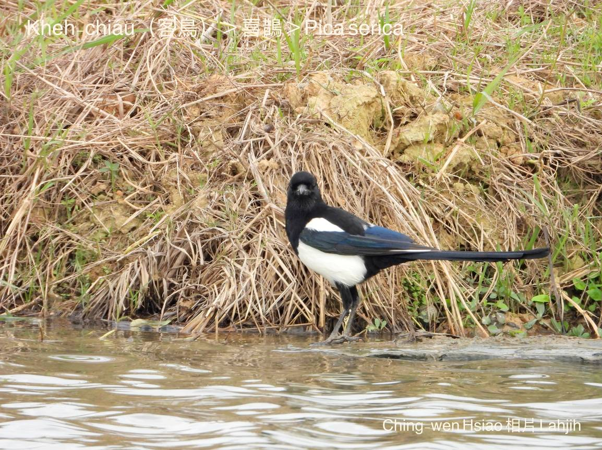

### **客鳥 —— Lah-jih**
>**（1994/1/1第二篇台語文手寫稿）**

>**（1994/4/1第二篇台文作品發表tī台文通訊29期）**

>**（1998/3/1修正，收集tī林央敏主編：台語散文一紀年）**

頂禮拜三chái-khí，tú-boeh peh-chiūⁿ三樓教冊，無意中看tio̍h兩隻鳥仔，tī運動埕hia leh散步，chhōe食物。Chit兩隻鳥仔，生做真大隻，kui身軀ê鳥毛是烏chhap白，尾長長，頭殼額á giâ koân-koân，看起來不止á高雅，尤其是行路，bē chhia̍k-chhia̍k-tiô，一步á一步，尾koh sìm--leh sìm--leh，hō͘人感覺chiok大方chiok高貴--ê！Chit兩隻鳥仔，親像一對翁á某ê款，chit隻nā行，hit隻to̍h tòe。

當我看kah無nih目ê時，phŭ--chi̍t-ē，一隻飛去--à，續--落另外hit隻mā tòe後壁飛--去。Chim-chiok ka看in ē飛去tó位，in無驚惶，也無hiông-kông，khoaⁿ-khoaⁿ-á飛，飛到運動埕西旁hit叢siāng大叢、siāng koân ê chhàu-chheⁿ-á『銀合歡』樹頂，ah to̍h無khòaiⁿ--à！

隔轉工，來到學校，kāng-khoán peh chiūⁿ三樓，hit兩隻鳥仔iū-koh tī-hia leh散步，kāng-khoán hiah-nī相好，chiâⁿ hō͘人欣羨，mā chiâⁿ hō͘人o-ló！好好á kā in看chim-chiok：「Ah！客鳥！He是客鳥！」差chi̍t-sut-á to̍h喝--出-來。莫怪--ò͘！原來是gín-á時代ê老朋友，chiah-ē hō͘人感覺hiah-nī面熟hiah-nī親切，真是「久見」。

Gín-á時代，庄腳舊厝正身後壁，有兩欉ke-jiû-á樹，chiok koân大--ê，樹á尾頂時常有一種鳥仔來hia做siū生湠。阿爸ē牽我ê手，比樹頂ê鳥仔kā我講：「He號做客鳥！伊真巧--ō͘！Siū lóng做chiok koân--ê，án-ne chiah bē hông lia̍h去飼，hông關tiàm鳥籠á內。」

「Ah hiah koân！Nā poa̍h--落-來boeh án-chóaⁿ？Kám m̄是chiâⁿ危險--leh！」

「應該bē chiah-tio̍h，in ê siū lóng做kah chiok大ê，koh chiok勇--ê！你ka看，lóng是用hit-lō樹á枝做--ê，親像阿爸teh圍籬笆án-ne，一枝橫過來，一枝橫過去，每一枝柴á lóng相kit-tiâu--leh『交叉固定』，to̍h是thàu大風、落大雨，mā bē去ho͘ liàn--落-來，chiok安全--ō͘！你koh ka看詳細，chit兩隻客鳥，ta̍k日lóng chiok無閒--ê，一時á飛--出-去， 一時á iū-koh飛--轉-來，伊ê嘴pe，lóng-ē咬一枝柴á枝，有--bò͘？Chit-mái in tú-leh做siū，大概母--ê boeh生卵--ā，koh一月外日，咱to̍h-ē看tio̍h鳥仔-kiáⁿ，tī siū內hia ngiauh--leh ngiauh--leh！」

「阿爸！我知影--lah！Ah你mā chiok辛苦--ê hoⁿh！」......。

將近boeh四十冬--a，lóng罕得看tio̍h客鳥，最近看--tio̍h hit-pái，ē記得是四、五冬前，去參觀新萬仁製藥廠時，看tio̍h大門邊hit欉南洋杉頂koân，歇兩隻鳥仔，看--起-來ká-ná熟似面熟似面，khah緊ka khiā tī邊--a ê牽手講：「你看！樹á頂hit兩隻鳥仔，是m̄是客鳥？」

「Hò͘！大概是--ō͘！你目chiu hiah金，m̄知lōa久m̄-bat看--tio̍h-à，khah-kín用kha-mé-lah ka hip--起-來！」

相片洗好，無kài-gōa滿意，細細隻á，相片koh烏烏，連ka-tī都看bē出來是「客鳥」......。
 
Koh飛來ti-hia leh散步--ā，chiâⁿ-si̍t是一對翁á某á，猶原是雙雙對對，hiah-nī恩愛，翁行某tòe，漂撇大pān iū-koh高貴。Chit pái boeh kā恁看ho͘ chim-chiok，看ho͘清楚，有影生做chiâⁿ súi，嘴pe烏烏尖尖，尾長長khiàu-khiàu，白色ê腹肚，si̍t股頭mā chhap一寡á白--ê，sīn--ê lóng是烏色。Ah！M̄-tio̍h！看in飛--起-來chiah知影，si̍t ê外緣hit排羽毛mā是白--ê。飛tiàm半空中phia̍t--leh phia̍t--leh，真正優美，真正好看，看in飛去樹á頂chiah發現，原來in早to̍h tī-hia做一ê chiok大kâi ê siū，mā是做chiok koân--ê，hām我細漢看tio̍h--ê kāng一樣。

Siū愈做愈大，照看boeh tòa--落-來ê款--ō͘！來--ò͘！來--ò͘！阮chiâⁿ歡喜恁留tiàm chia hām阮做厝邊！阮是chiâⁿ hó͘ⁿ-kheh ê在地人，向望恁ē-tàng疼惜chit-ê所在，chiâⁿ做阮ê好厝邊，永遠tòa--落-來，hām阮相kap來phah-piàⁿ，kā chit-ê所在chiâⁿ做一ê真正有自由，有尊嚴ê美麗寶島。自chit-mái起，咱lóng是ka-tī人--ā，無ài koh叫恁是「客鳥」，應該稱呼恁是『喜鵲』，tī咱人七月初七hit一工，搭橋hō͘牛郎織女天河相會，做好tāi ê『喜鵲』！
 

### **客鳥 — Lah-jih**
>**19940301第四篇台語文（試寫台語韻文手寫稿）**

客鳥！客鳥！恁tau死了了！

原諒阮，gín-á人真bē-hiáu，

M̄-bat事，chiah ē大聲細聲kā恁khàu-iau。

大漢了，阮to̍h m̄-bat koh kā恁kiāu，

M̄-koh，有一chân tāi-chì實在想bē-hiáu，

冊內明明講恁是『喜鵲』，是好鳥！

是án-chóaⁿ阮老爸教阮是客鳥？

阮知影，恁是kah意阮chia美麗景色，

生活富裕，gâu生湠，

Mā bē hō͘恁ê gín-á腹肚iau。

尤其是，阮chia ê人，

古意好客、gâu招呼、相照顧，

M̄管i是sàn-chhiah a̍h好額。

所以恁，chiah-ē千里thiâu-thiâu搬來阮chia做「客鳥」。

客鳥！客鳥！

恁ài ē-hiáu，這是咱所在，m̄是別人tau。

咱！

咱to̍h-ài講是ka-tī，M̄好koh分講恁是人，阮是鳥。

Taⁿ開始！

咱lóng來疼惜chit ê好所在，

疼惜chit粒美麗ê蕃薯條！

Chiah bē hō͘別人kā咱看衰siâu 。

### **Ah！Kheh-chiáu！**
>**​Lahjih 20020412**

阿客ùi半空中chhu落來網球埕邊ê樹頂，kheh kheh hán 2聲。

「Tī tah？」

感覺chiâⁿ奇怪--neh？球m̄ phah，soah來關心我？

「已經飛對……ah！歇tī hit欉樺樹頂hia…」吳老師用手kí ùi東旁hit欉樺樹。

Hit ê吳老師實在真心適，最近定定leh kā阮hip相錄影，m̄知boeh chhòng-saⁿh？

「Ah！Koh飛來1隻！」無khà phah球，隨時將球poe-á tú-tiàm土腳，球賽暫時停止，8、9對目chiu kui-ê siòng-tùi樹á尾溜去。

原來A-kheh嫂--à已經tòe後壁飛來A-kheh身軀邊，kāng-khoán kheh kheh 2聲，4蕊目chiu金金看網球埕ê人群…。

「He siáⁿ-mih鳥仔？Ná-ē chiah-nī大隻？」

牽--ê！你有感覺貼心、感覺hiau-pai--bò͘？In田中國小ê老師lóng真kā咱關心，piān-nā看tio̍h咱ê形影，in to̍h kí-kí chí-chí，o-ló褒獎，歡喜tang-tang。

「客鳥！He叫做客鳥！」

聽講kā咱在地名「客鳥」khioh倒轉來ê人，to̍h是chit-ê蕭老師，chit-mái已經chiâⁿ-chē人bat咱ê名叫客鳥--à-neh！

「客鳥？Siáⁿ-mih是客鳥？Ná-ē m̄-bat聽--過？Koh chiâⁿ-súi to-tio̍h！」少年ê劉老師感覺怪怪leh問。

莫怪伊m̄-bat，看--起-來生份面生份面，tăⁿ來田中國小教冊ê款，chiah少年，m̄-chiah 20 thóng歲niâ。

「客鳥！to̍h是『喜鵲』，在來咱台灣人to̍h叫in客鳥，聽講是中國ê清朝時代移民過來--ê，過去生湠chiâⁿ-chē，可惜chit-mái已經pìⁿ-chiâⁿ保育動物，chhun無幾隻，你kám知，咱田中國小有幾隻？」

牽--ê！你kám知影咱ê祖先已經有lōa-chē kiáⁿ孫tī-chia leh khiā起？

聽講已經經過幾nā代，chit-mái分散tī各所在，罕得ka關心--過，a̍h無你kám知影？

我mā m̄知！

「O͘h！原來是án-ne--ò͘，咱學校iáu有真chē隻--hio͘h？」

「啊！電火柱á hia有兩隻！」球埕邊--a一個學生gín-á koh發現。

「He m̄是客鳥--lah，he是烏鶖，khah細隻，kui身烏sô-sô，mā無客鳥仔n-ne烏--ê chhap白，súi koh大pān。」

Che mā莫怪，少年人m̄-bat客鳥，gín-á bē認得烏鶖，che應該kap in ê教育有關係，冊內nā無寫，老師koh無認bat…，aih？He是人ê問題，kap咱siáⁿ關係？

都是--meh！Chhap人閒á事？

咱án-ne想mā m̄-tio̍h，lóng是tī-chia khiā起，總是互相關心，互相照顧mā是應該--ê。你看，chit-ê蕭老師m̄是一直leh kā咱關心！

有khah choa̍h？伊iā m̄是專家，kan-nā用hit支嘴講講--leh，kám有siáⁿ-mih幫贊？

有比無khah贏，其實，咱mā m̄-thang kâng誤會，chit幾冬來，咱台灣ê兄弟已經進步真chē，有保育觀念，lóng真愛護咱鳥仔類，m̄-chiah hō͘咱好生存，chit-mái咱m̄是自由自在tī-chia kap in leh tàu-tīn生活，tio̍h ē-hiáu感謝--人chiah-tio̍h！

「蕭老師！你講咱田中國小有幾隻？我ná-ē lóng m̄-bat看--過？」

「親目看--過ê記錄是兩對，吳老師bat看過三對，頂日á tī頭前運動埕hia chiah看過4隻，同齊tī樹á頂thit-thô，飛koân飛低，tī樹á頂跳來跳去，hām一隻膨鼠走相jiok，chiok趣味。」

除了蕭老師以外，iáu有chit-ê吳老師mā是真正hō͘咱感心，伊ê觀察比蕭老師khah深入，時常kōaⁿ 1-kâi hip相機leh kā咱hip相錄影，可惜mā m̄是專業--ê。

「蕭老師！你kám知影hit 4隻客鳥ê關係？」 吳老師是舊年chiah派來田中國小ê少年cha-po͘老師，發現學校內chia ê客鳥，to̍h一直用心leh斟酌觀察。

「Siáⁿ-mih關係？客鳥tī咱學校出現已經7、8冬，ē記得1994年第一pái發現，to̍h一直tī咱學校出出入入，m̄-bat消失--過，到taⁿ生湠應該mā bē少，當然有ê ē徙去別位，總--是應該bē離開田中地區siuⁿ遠chiah-tio̍h，chit 4隻ká-ná是2對tú好kāng時陣出現niâ，kám也有siáⁿ-mih關係？」

「頂禮拜，tī力行樓對面hit塊球埕，mā同時出現4隻，看--起-來是雙雙對對，kap蕭老師hit篇客鳥所描寫ê同一樣，代先mā kioh是兩對朋友同時招出來thit-thô，感覺chiâⁿ稀奇，因為上課中，我tú好無課，to̍h bih bih tiām-tiām ka看，tiām-tiām ka欣賞，實在有影súi，烏chhap白，行路大pān定tio̍h，可惜無chah錄影機，nā有，ka錄影--起-來，一定真珍貴。看boeh 4、5分鐘久，chiah去hō͘我發現，原來chit兩對客鳥m̄是兩對朋友，是一家伙á。」

「一家伙á？你ná-ē知影？Kám m̄是lóng平大隻平大隻。」

「In是父母chhōa kiáⁿ出來實習，學飛學chhōe物件食，chit-mái飛ê技術已經無問題，討食iáu有khah ham-bān，所以客鳥kiáⁿ lóng iáu tòe tī親鳥身邊，thèng-hāu父母thóng hō͘伊食，為tio̍h討食物，鳥仔-kiáⁿ mā-ē kek sai-nai ，m̄是細聲háu腹肚iau，to̍h是kā翼股làu ho͘拖帆，háu he sai-nai聲。Siāng趣味--ê to̍h是直接大聲háu boeh食boeh食boeh食！」

「吳老師！確實無簡單，觀察kah chiah詳細。」

吳老師有影有心to-tio̍h ，kan-nā看to̍h了解咱leh chhòng-saⁿh，實在hō͘咱感心，吳老師，多謝--ò͘。阿客！咱來去hit旁，thang hō͘ in koh繼續phah球，咱mā-tio̍h koh chhōa hit 2 ê gín-á出來實習，phah-piàⁿ學生活ê技藝，hiah-nī大漢iáu bē-hiáu ka-tī獨立，kan-nā ē-hiáu嘴á開開boeh食boeh食，sêng siáⁿ體統，kám bē hō͘蕭老師in恥笑。

是！牽--ê！遵命！

Phu̍h~phu̍h~真正翁行某tòe，一前一後飛向東旁hit欉南洋杉去。

「啊！客鳥飛去--à！Mài koh看，boeh講boeh hōe，等chit盤球phah-soah chiah-koh來phò-tāu gī-niū，boeh看客鳥，khah chia̍p來學校運動散步，tiāⁿ-tio̍h有歡喜ê收成。來！球賽繼續，看chia，boeh開球--ā-ō͘ ！」⋯⋯⋯。

爸~！媽~！腹肚真iau，kám有chah好料--ê轉--來！

Chah siáⁿ-mih好料--ê，boeh食tòe阮來去活動中心頭前，學校已經放學，土腳tau一定有chiâⁿ-chē學生gín-á食soa--khì ê麵包、餅幼á，a̍h是飯粒á、魚肉，boeh食趕緊tòe阿爸阿母來去khioh。

Chi̍t口灶4隻客鳥，2隻頭前，2隻尾後，ùi南洋杉téng-koân ê鳥仔-siū趨落來活動中心門嘴á，tiām-chut-chut，kan-nā chhun客鳥聲tī-hia leh tin-tin-tang-tang、kheh kheh khah khah：

阿爸！我boeh食！

Boeh食ka-tī chhōe，ka-tī khioh， chiah-nī大漢--à，tio̍h ka-tī phah-piàⁿ，m̄-thang koh ǹg父母kā你飼，koh半月日恁tio̍h-ài ka-tī獨立生活，無趁chit-chūn學khah chē生活技藝，到時káⁿ-ē餓死去，知--bò͘？想當時，阿公阿媽教阮非常嚴格，叫阮m̄-thang隨便飛落來運動埕chhōe食，驚學生gín-á kā阮傷害，所以阮lóng ài飛去真遠ê田郊野外討食，有夠艱苦，恁實在好命m̄知。

阿爸阿母，我知影，阮ē ka-tī phah-piàⁿ，boeh kah阿爸阿母學生活ê才調技能，請恁放心--lah，阿爸！有一項tāi-chì boeh kā你問--ō͘。

Siáⁿ-mih tāi-chì？

咱siáⁿ-mih時陣搬來toà chia--ê？人m̄是lóng叫咱客鳥？

Aih！你koh-iā ē-hiáu想chit-khoán問題。

阿爸m̄是常教阮tio̍h「飲水思源頭，食果子tio̍h拜樹頭」，當然mā-tio̍h了解咱是ùi tah-ūi來--ê。

聽講tī hit ê中國ê清朝時代，咱ê祖先to̍h移民來台灣--ā，我mā無確定，有根據--ê應該是hit-ê蕭老師所記載ê文獻，tī 1994年，伊發現咱祖先tī田中khiā起開始，到taⁿ mā有5、6代，第一代祖起厝tī學校西旁hit欉chhàu-chheⁿ-á樹頂，後--來koh有tī南旁ê chhêng-á欉kap大王椰子樹頂做siū，恁阿公ê厝起tiàm南洋杉樹頂，阿爸感覺bē-bái，所以無koh徙位，to̍h kā新厝起tiàm阿公ê樓頂。

Ná-tio̍h án-ne搬來搬去？

Ná有法度，咱台灣雖然講是美麗島，可是kāu風颱，咱鳥仔族siāng驚to̍h是風kap雨，特別是無情ê風颱，m̄管正掃回南，風颱頭風颱尾，咱註定是衰siâu，1支橫過來1支橫過去ê工法，khah án-chóaⁿ kit-tiâu--leh mā bô-khah-choa̍h，強風一下掃，siū liàn--落-來to̍h是liàn--落-來，kám有法度阻擋？是hó-ka-chài，天公保庇，命總是留--落-來，厝koh起to̍h有，m̄-chiah tio̍h一直催恁tio̍h趕緊學獨立生活。其實，天災不可怕，siāng驚是人禍，上天庇佑，台灣已經有覺醒，知影互相扶持，互相尊重ê道理，nā無，親像過去「南路鷹，1萬死9千」ê悲情，看咱客鳥族ē絕種a̍h bē絕種？

「Ah！客鳥！」

「老師！客鳥！運動埕hia有客鳥！」

「Khah細聲--leh！真súi--ho͘ⁿh！He是真稀罕ê鳥仔，m̄-thang ka phah-chheⁿ-kiaⁿ--ō͘ ！」

「老師！我看鳥仔冊寫，客鳥原來ê名叫『喜鵲』，ná-ē老師lóng教阮叫客鳥？」

「聽講咱台灣本來無chit款鳥仔，是ùi外位移民來--ê，ná像來chia做人客kāng-khoán，所以在來咱台灣人to̍h稱呼in做客鳥。」

「Hò͘！Án-ne--ò͘！我知--a！」

阿爸！咱來改名好--bò͘ ？

Ná-tio̍h改名？客鳥客鳥，m̄是真好聽，koh真有咱台灣ê在地味。

你看！In lóng叫咱是客鳥，親像咱iáu是tī台灣leh做人客kāng-khoán，咱已經tiàm chia khiā起chiah-nī久，台灣是咱ê故鄉，kám m̄是？我無ài koh hông叫客鳥。

Ah無boeh改做siáⁿ-mih名？

Mài koh叫『喜鵲』a̍h是客鳥to̍h好。

咱ê叫聲kheh kheh kheh kheh，kui-khì to̍h叫kheh-chiáu好--leh，mài用漢字寫，m̄-tio̍h無hit-lō麻煩。

Pâ！你頭殼真讚--neh！Kheh-chiáu，kheh-chiáu，是咱ê háu聲kheh kheh kheh kheh，m̄是咱tī-chia做人客，我是台灣鳥，我是台灣kheh-chiáu。

「老師！阮知影，愛護動物，to̍h m̄-thang kā伊lia̍h，kā伊tàn石頭，m̄-thang買烘鳥仔-pa來食，tio̍h--bò͘。」

「Tio̍h！完全正確，小朋友，恁kám知影kheh-chiáu是án-chóaⁿ叫做kheh-chiáu？」

「M̄知，拜託老師kā阮講。」

「是in ê háu聲kheh kheh kheh kheh ê緣故--lah，親像『綠繡眼』ê háu聲ti̍h~ti̍h~ti̍h~，咱to̍h ka號做chheⁿ-tî-á kāng-khoán，真心適--ho͘ⁿh！」

Pâ！你看！人蕭老師mā án-ne kā學生gín-á解說--neh！

Tio̍h--ā！咱台灣leh號名真chē是án-ne號--ê，親像頭殼一chhop白白叫pe̍h-thâu-khok-á；嘴pe ná飯匙，lā--一-下，飛--一-下，叫lā-poe；ho͘--起-來to̍h溜--去叫hô͘-liu；愛食粟á ê鳥to̍h叫粟鳥仔，lóng真有意思，lóng真趣味--ho͘ⁿh！

「Kheh-chiáu！Kheh-chiáu！Kheh Kheh Kheh；Chheⁿ-tî-á！Chheⁿ-tî-á！Ti̍h ti̍h ti̍h！」學生chim-mī唸chim-mī回老師ê話：「我知--a！台灣人號名真趣味koh真有意思，kheh-chiáu！Kheh-chiáu！Kheh Kheh Kheh；Chheⁿ-tî-á！Chheⁿ-tî-á！Ti̍h ti̍h ti̍h！」

「Ah！Kheh鳥！飛去--à！」

M̄是！是kheh鳥poe-khì thit-thô--ā！伊ē koh轉--來！
 

### 【註解】

|詞|解說|
|môa-hông|木麻黃Casuarina equisetifolia。|
|Eucalyptus robusta|『尤加利』，『桉樹』。|
|cha̍p-chhò hoâiⁿ-ke̍h|橫七豎八雜亂不規則的樣子。|
|khòaiⁿ|Khòaⁿ-kìⁿ ê合音。|
|ke-jiû-á|雞榆，『榆樹』。|
|hông|Hō͘ lâng ê合音。|
|hó͘ⁿ-kheh|好客。|
|chhàu-chheⁿ-á|『銀合歡』。|
|chheⁿ-tî-á|『綠繡眼』。|
|chi̍t-hoa̍h chi̍t-hoa̍h|1大步1大步。|
|無khà|Bô khà，『沒空』。|
