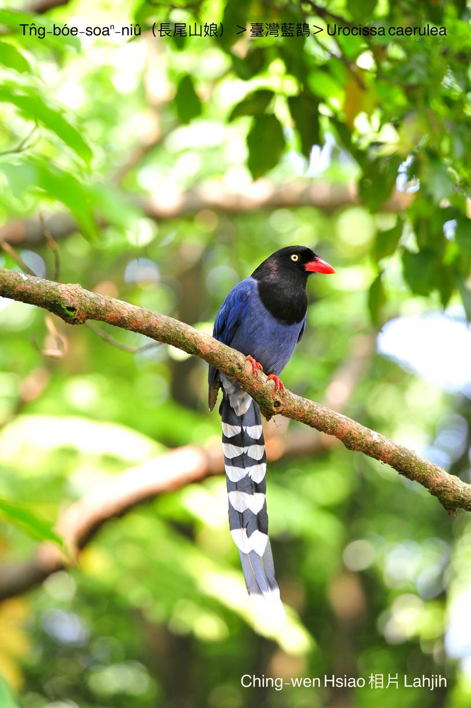
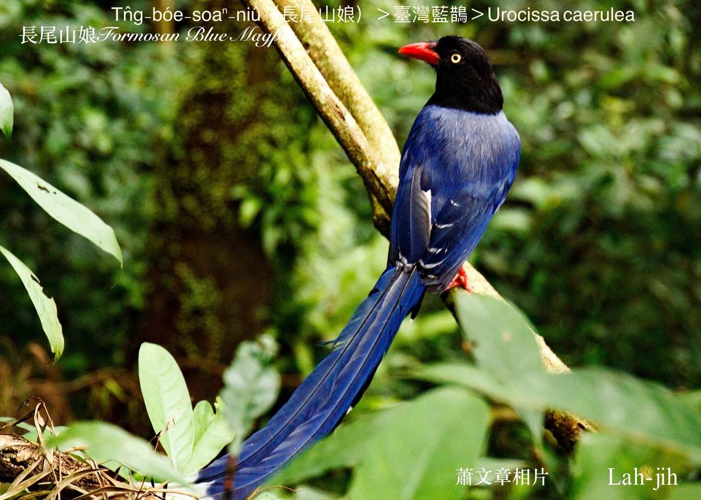
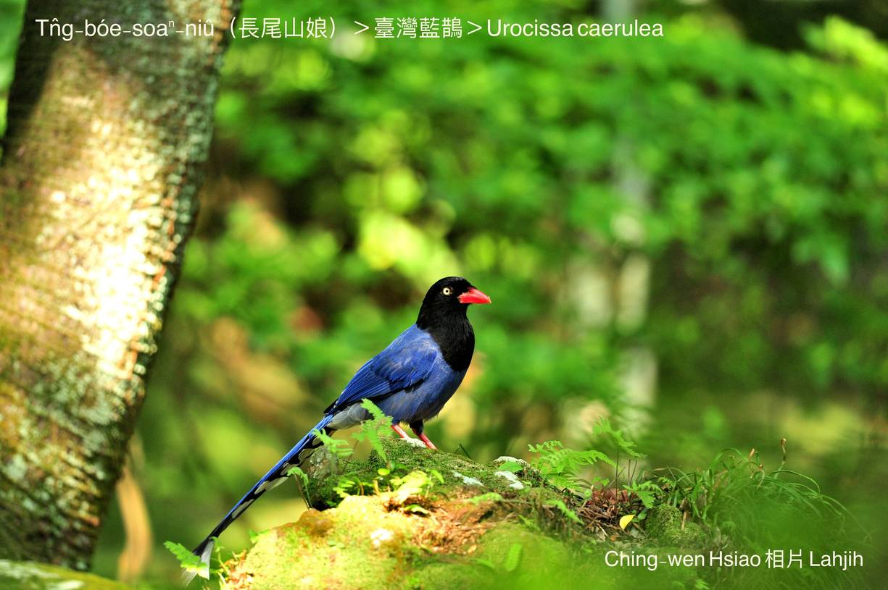
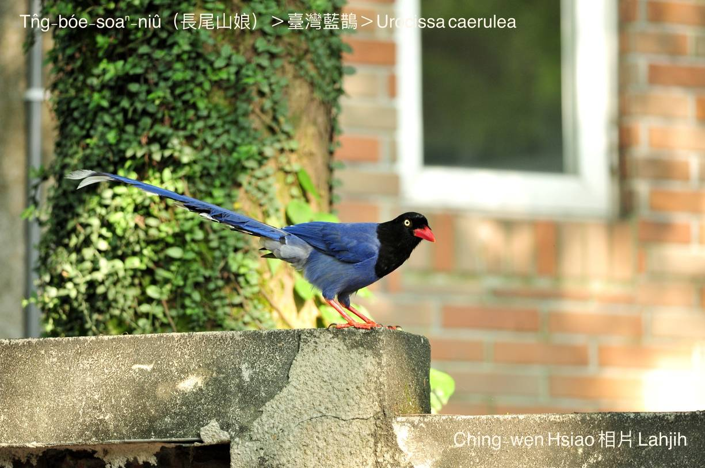
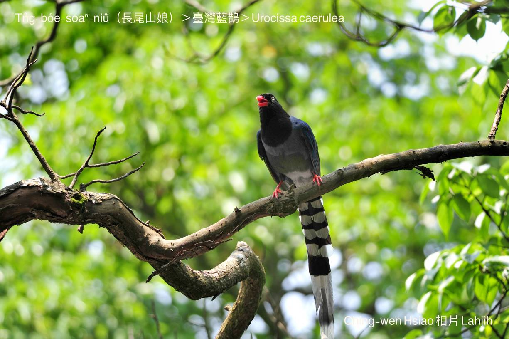
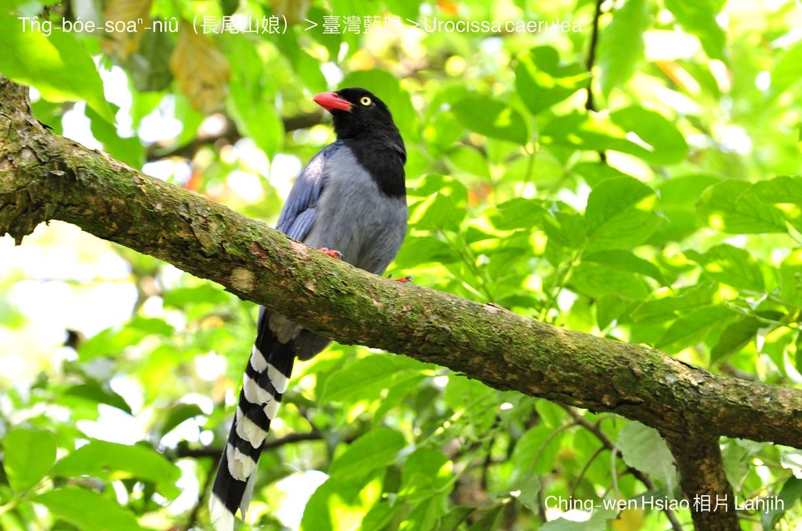
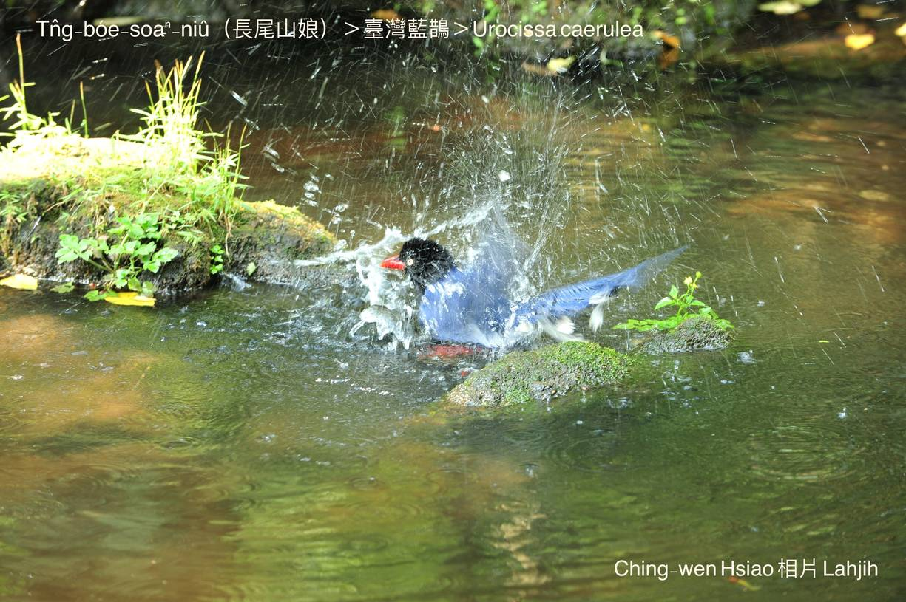

#### 39. A Kho『鴉科』

|台灣名|中譯名|學名|
|Tn̂g-bóe-soaⁿ-niû（長尾山娘）|臺灣藍鵲|Urocissa caerulea|

# 39-3. Tn̂g-bóe-soaⁿ-niû（長尾山娘）

Tn̂g-bóe-soaⁿ-niû，俗稱山娘á，紅嘴pe、紅腳骨、金藍色身軀，頭、ām烏色，尾長長烏插白、金藍花紋，非常súi，tī低山區樹林頂面，三五隻七八隻排一列，ùi山坪向山坑á直線飛行，排成一chōa長尾陣，chiâⁿ做美麗隊伍。
 
Tn̂g-bóe soaⁿ-niû本性兇惡，háu聲噪人耳，雜食性，食大型蟲thōa、細隻鳥仔、鳥仔-kiáⁿ kap鳥仔卵、野鼠、杜定、蛙類，koh-khah hèng食木瓜hit款果子。做siū tī原始雜木林，一siū生4~6隻鳥仔-kiáⁿ，鳥仔-kiáⁿ孵出了後，親鳥特別pháiⁿ，兇kài-kài，kā頭殼ām-kún ê羽毛kek chhàng-chhàng，háⁿ敵人侵入。

# 【Tâi-oân Chiáu-á Liām Koa-si】

### **Tn̂g-bóe-soaⁿ-niû Hiong-kài-kài**

Sin chhēng khóng-sek-i, thâu moa o͘-ām-kin

Tn̂g-bóe-liu, âng-kha-kut, tiám-ian-chi

Kò͘-siú khiā-ke hiong-kài-kài

Ūi-tio̍h kò͘-kiáⁿ pháiⁿ-sí-sí

Hô-hâi thoân-kiat tio̍h o̍h i

### 【註解】

|詞|解說|
|噪人耳|Chhò-lâng-hīⁿ，『擾人清靜』。|
