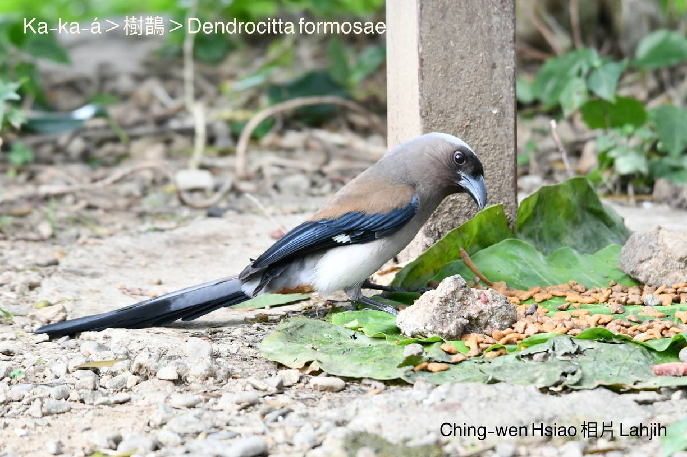
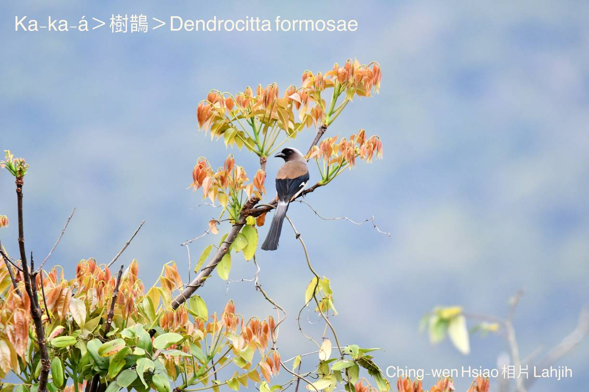
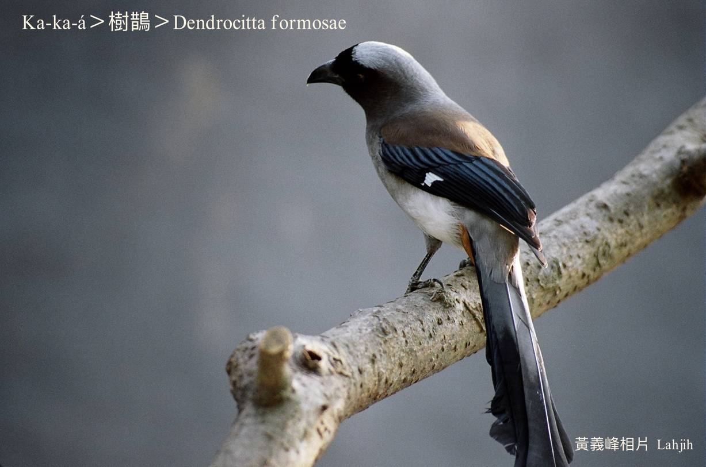
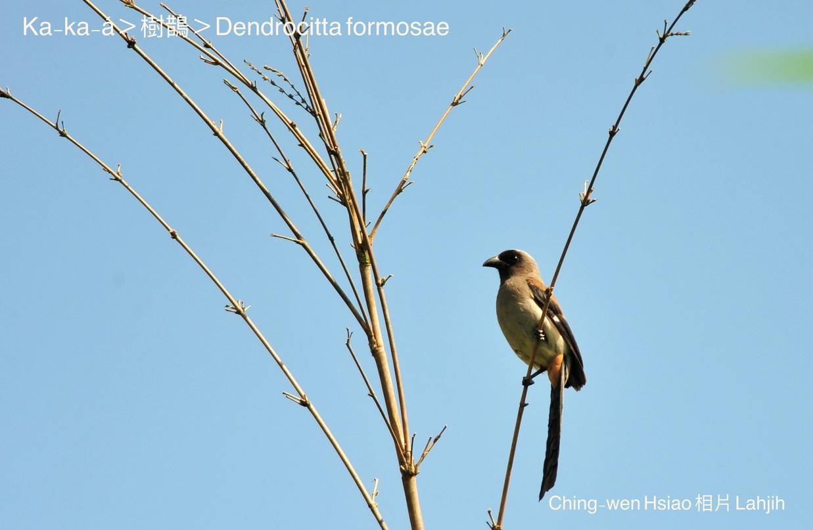
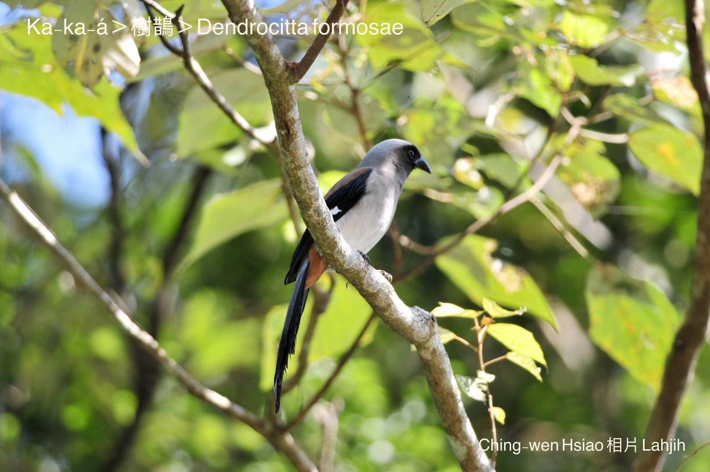
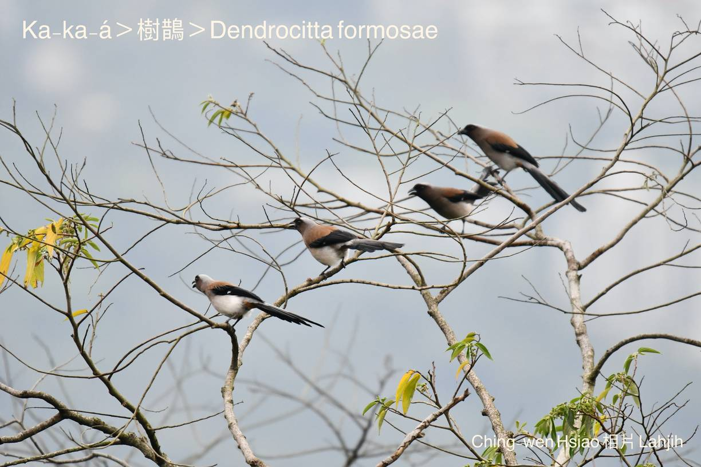

#### 39. A Kho『鴉科』

|台灣名|中譯名|學名|
|Ka-ka-á（咖咖á）|樹鵲|Dendrocitta formosae|

# 39-4. Ka-ka-á（咖咖á）

Ka-ka-á háu聲「kā-kă~kan-ná kan-nā」真好聽，因為聲音chiok大聲，有時soah感覺chiok噪人耳。

Ka-ka-á to̍h是用i ê háu聲號名。

Ka-ka-á生活tī低山ê雜木林上、中層，飛行chiâⁿ慢。頭殼ām-kún niau鼠á色、目khang嘴pe o͘-phú色、翼股淺ka-pi色chhap o͘-nâ色、尾溜長長mā o͘-nâ色，sui-bóng m̄是真影目，m̄-ku ná看ná súi。

Ka-ka-á嘴pe lio̍h-lio̍h-á鉤鉤chiok有力，cha̍p-chhò食，嘴形粗厚有力，略略á彎，kap一般鵲鳥kāng款是雜食性，蟲thōa、爬蟲類、兩棲類、果子、漿果lóng ài食。做siū tī大欉ê樹á尾溜iap-thiap ê樹椏內。

Ka-ka-á亞種是台灣特有種在地鳥，四界lóng有chiâⁿ普遍，公園學校時常出現，除了chhōe食洗浴，真罕得tī土腳活動。

# 【Tâi-oân Chiáu-á Liām Koa-si】

### **Ka-ka-á Ū Hêng-ui**

Kóng-ōe chho͘-khì, háu tio̍h chin tōa-siaⁿ

Ka~á, ka~á, si̍t-chāi chhò-lâng-hīⁿ

Chhiáⁿ lí mài kiàn-koài, mài siūⁿ-khì

He sī pē-bó seⁿ-chiâⁿ 

M̄-sī goán ài háu kah chiah pháiⁿ-thiaⁿ

Chhiáⁿ lín lâi him-sióng goán ê thé-keh kap bīn-chhiuⁿ

Chhùi-pe kau-kau, thé-keh ióng-ióng, chin ū hêng-ui

### 【註解】

|詞|解說|
|噪人耳|Chhò-lâng-hīⁿ，『擾人清靜』。|
|影目|Iáⁿ-ba̍k。|
|爬蟲類|Pê-thâng-lūi，reptiles, Reptilian。|
|兩棲類|Lióng-chhe-lūi，amphibious animals。|
|漿果|Chiuⁿ-kó。|
|樹椏|Chhiū-oe。|

