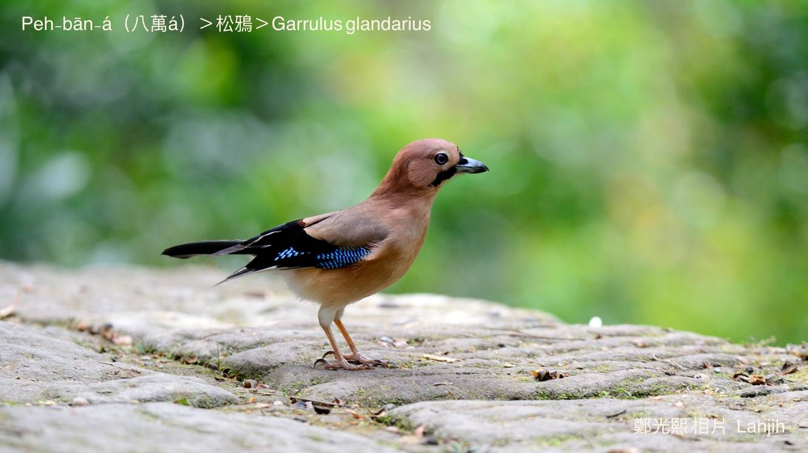
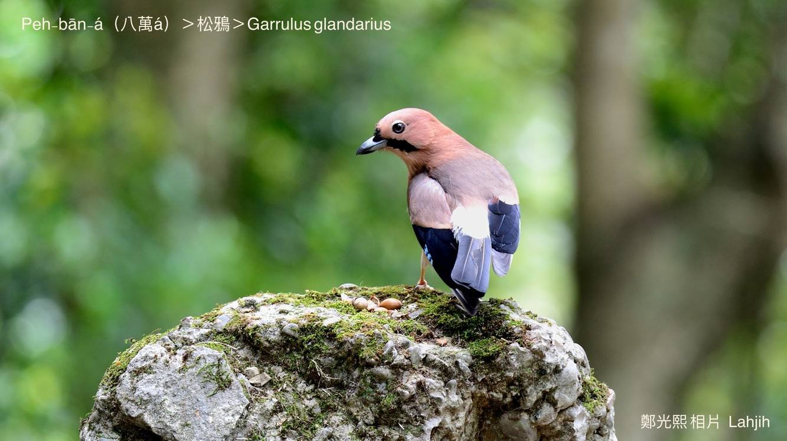
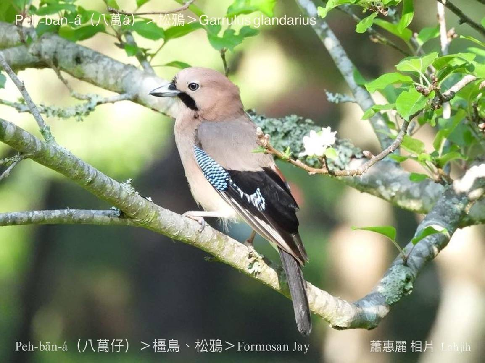
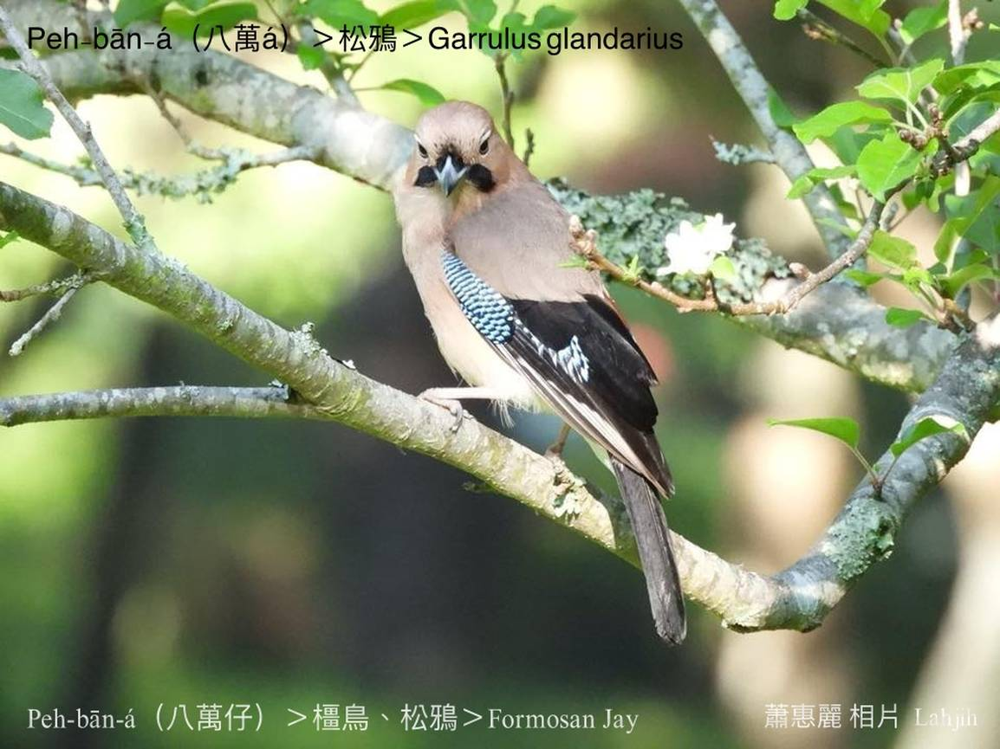
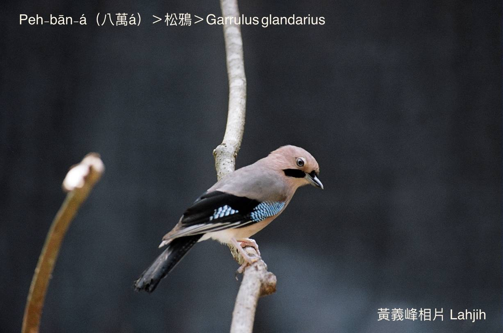
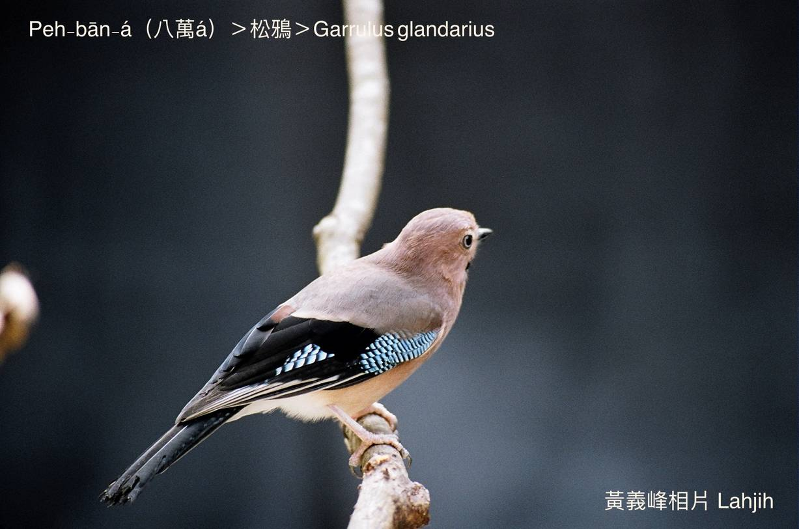
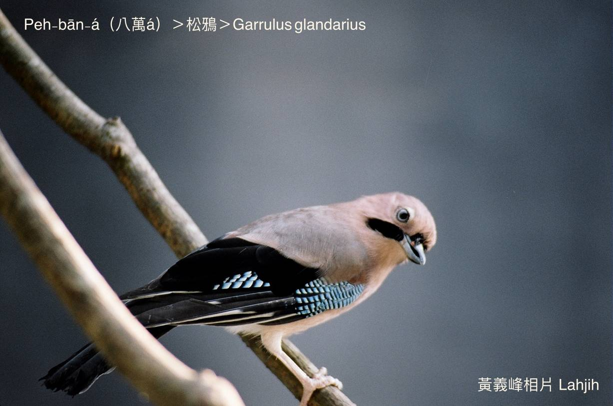
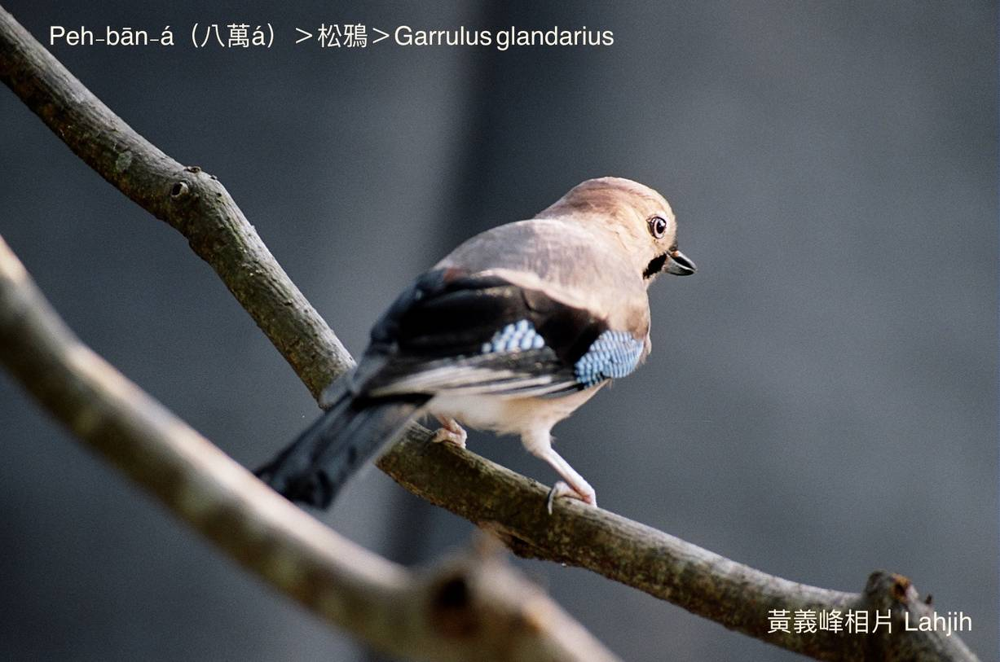

#### 39. A Kho『鴉科』

|台灣名|中譯名|學名|
|Peh-bān-á（八萬á）|松鴉|Garrulus glandarius|

# 39-5. Peh-bān-á（八萬á）

Peh-bān-á，下ām雙旁有長形向下斜ê烏斑，ná像nn̄g-phiat-chhiu，mā chiâⁿ sêng bâ-chhiok jí-á「八萬」ê八--字，m̄-chiah ka號做八萬á。

Peh-bān-á，tī台灣分布tī中海拔山區到3000公尺山區，peh-bān-á kap其他鴉科鳥類kāng-khoán cha̍p-chhò食，大隻thâng-thōa、hō͘-koài、pê-thâng-lūi，hām植物性ê漿果、果子lóng boeh食，有時mā-ē食鳥仔卵kap鳥仔-kiáⁿ。

Peh-bān-á嘴pe邊兩撇八字鬚、目chiu、翼股尾、尾溜是烏色，chhun--ê ê羽毛是淺咖啡色，háu聲kă kă kă粗粗sau聲sau聲，tī台灣是普遍在地鳥，mā是台灣特有亞種。

# 【Tâi-oân Chiáu-á Liām Koa-si】

### **Peh-bān-á Nn̄g Phiat Chhiu**

Peh-bān-á peh-bān-á nn̄g phiat chhiu

Chhiáⁿ-mn̄g lí kám-ē poa̍h-kiáu

Ná-ē hō-chò "Peh-bān-á"

Poa̍h-kiáu sian m̄-thang

Nn̄g phiat chhùi-chhiu chiâⁿ bê-lâng

Peh-bān-á Peh-bān-á chiâⁿ bê-lâng

### 【註解】

|詞|解說|
|nn̄g-phiat-chhiu|兩撇鬚。|
|bâ-chhiok jí-á|『麻將』。|
|thâng-thōa|昆蟲。|
|hō͘-koài|雨蛙。|
|pê-thâng-lūi|『爬蟲類』。|
|漿果|Chiuⁿ-kó。|

