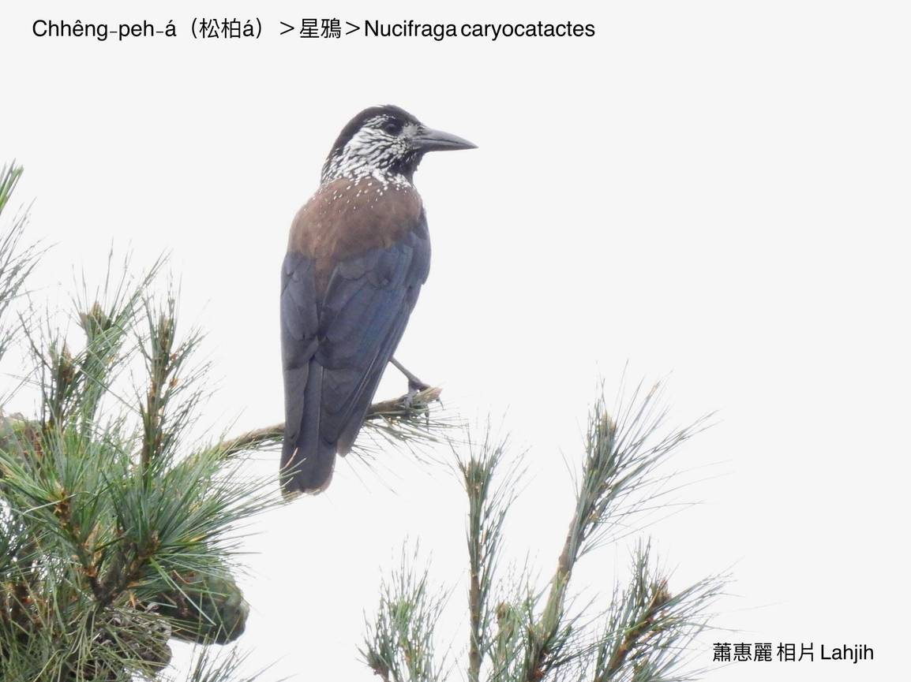
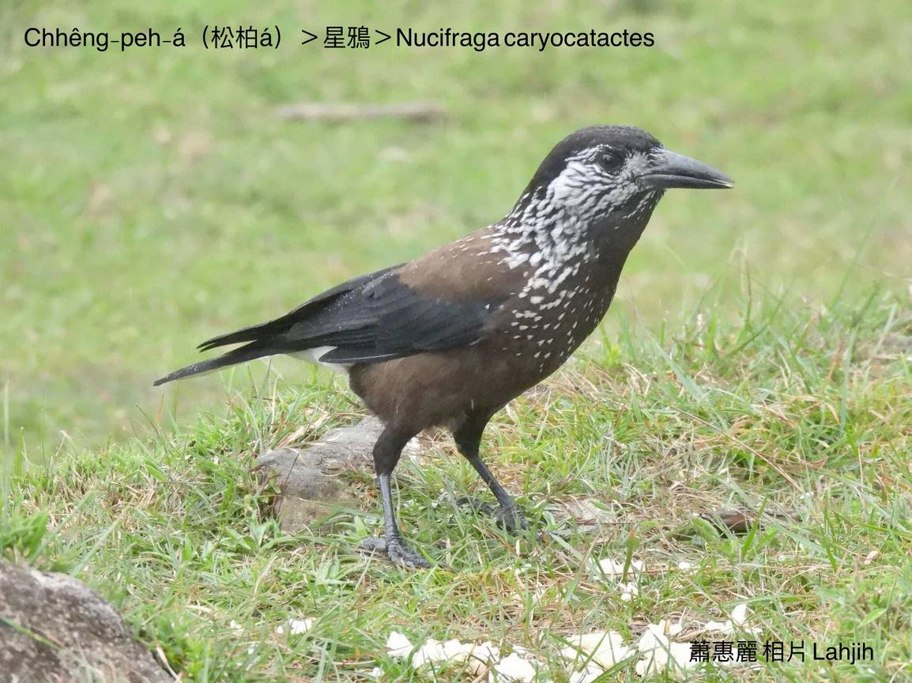
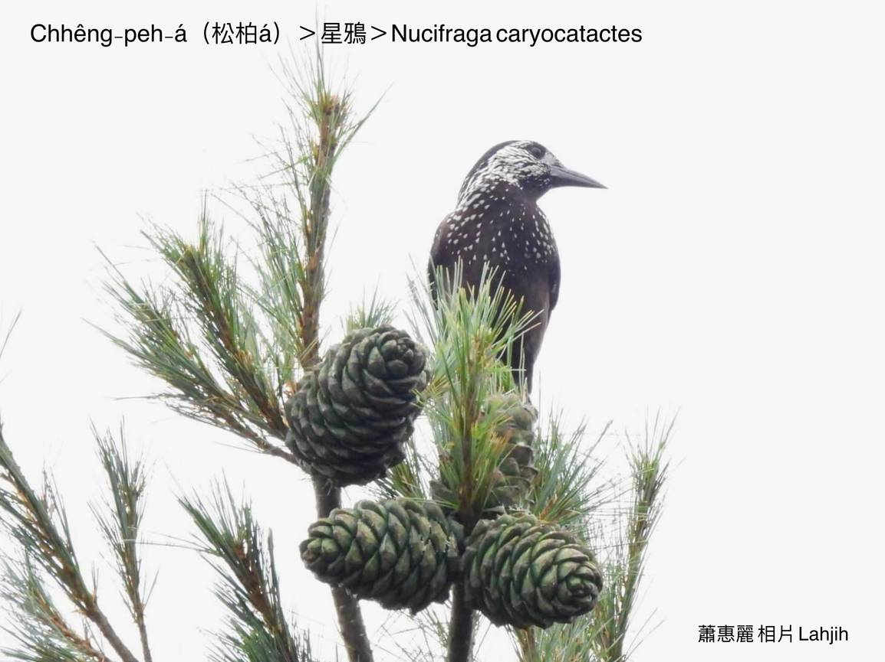
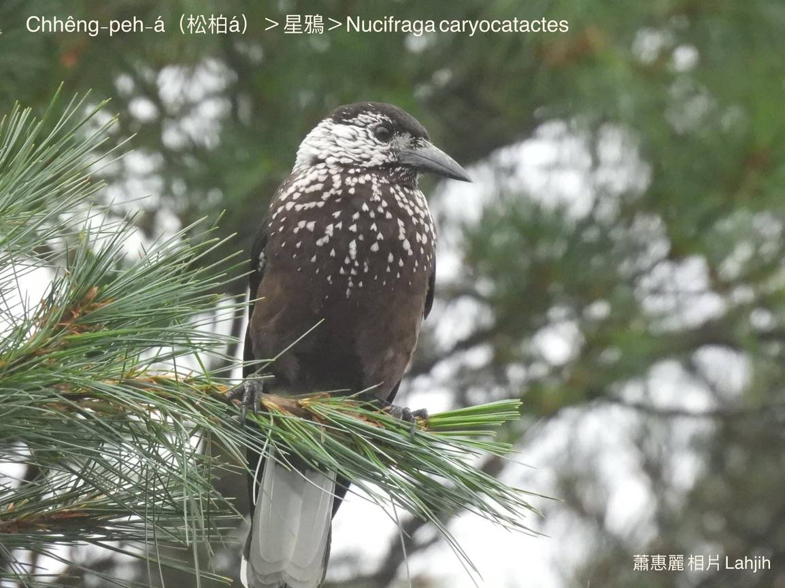
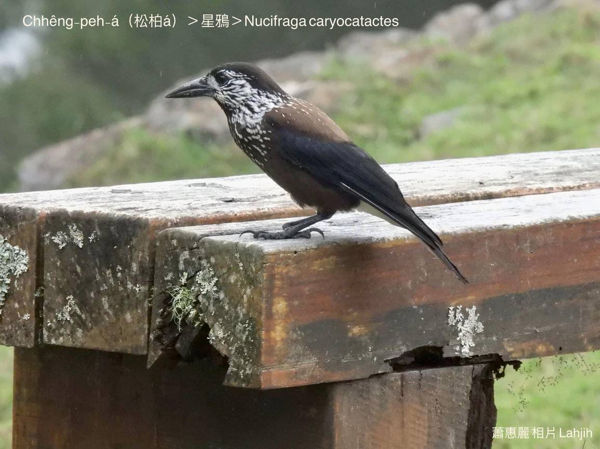
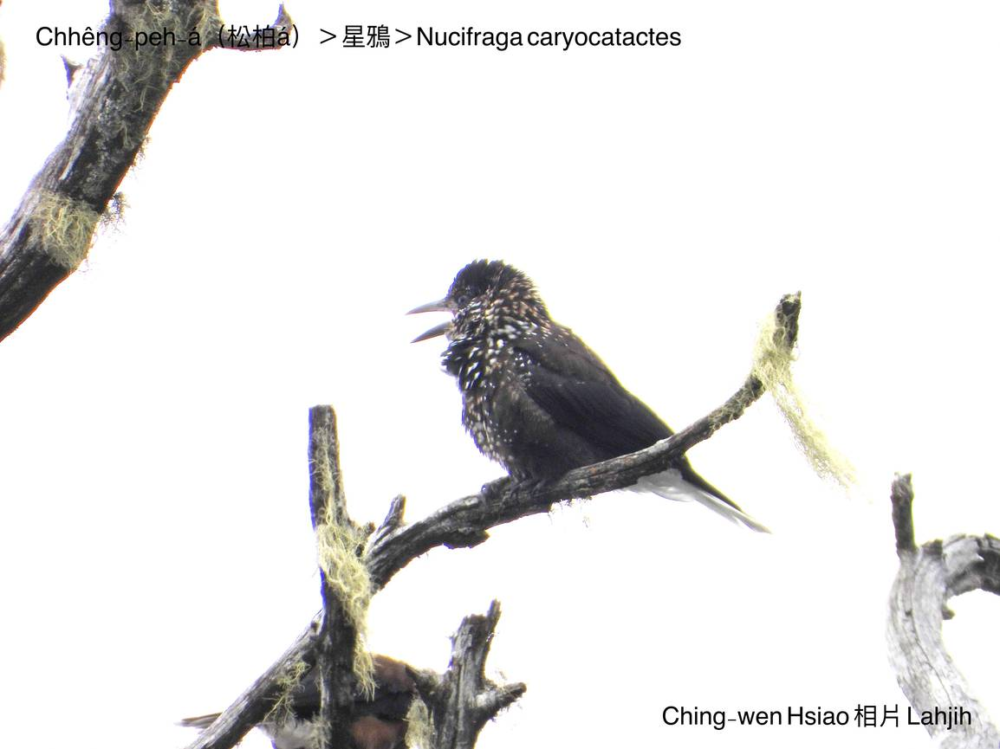
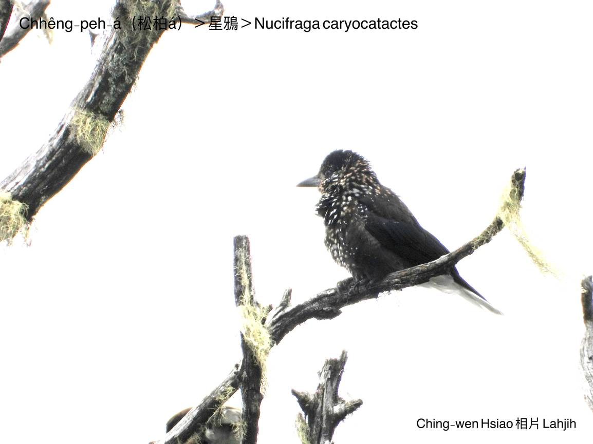
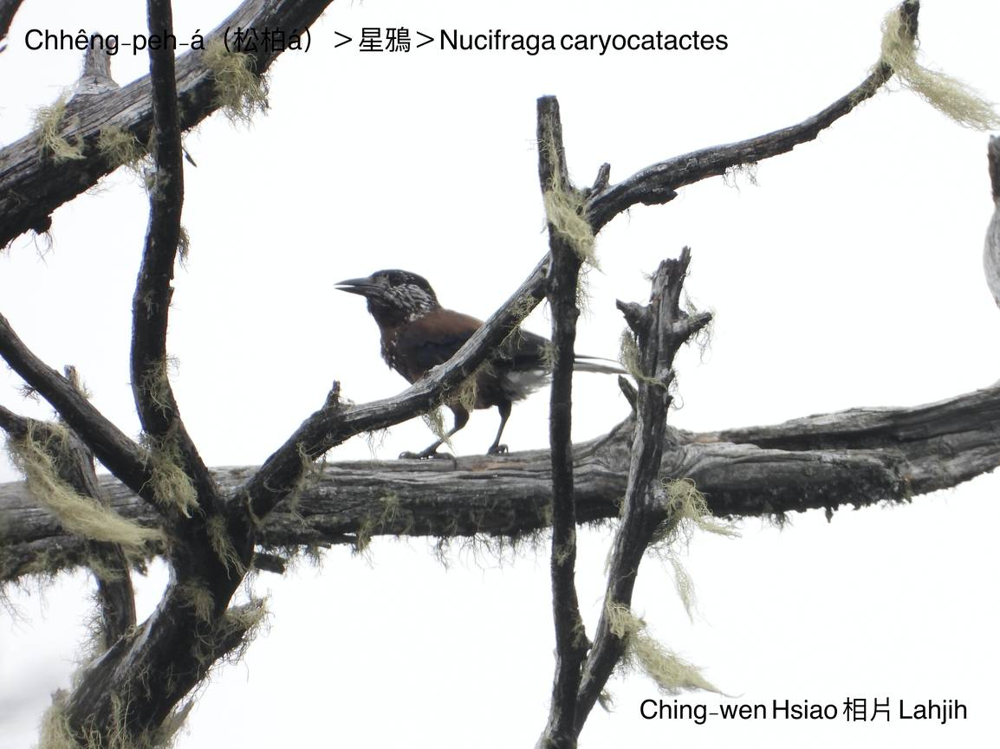
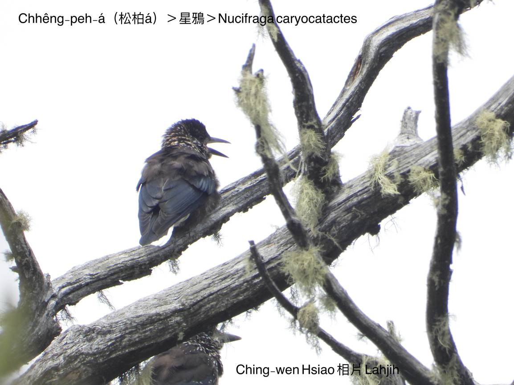
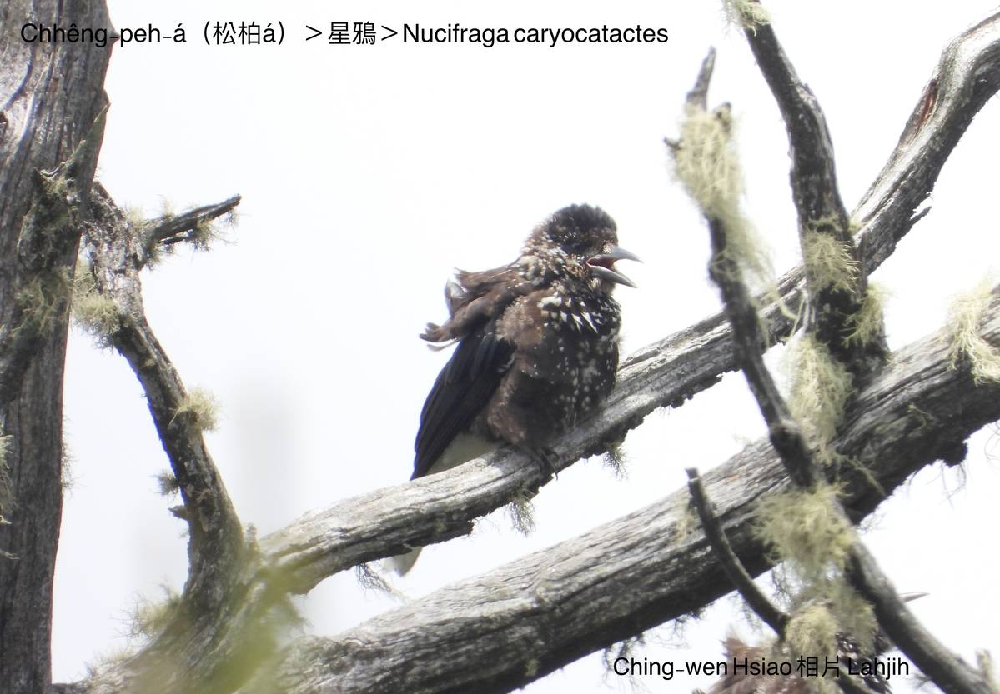

#### 39. A Kho『鴉科』

|台灣名|中譯名|學名|
|Chhêng-peh-á（松柏á）|星鴉|Nucifraga caryocatactes|

# 39-6. Chhêng-peh-á（松柏á）

Chhêng-peh-á大部分歇tī『華山松』樹林內，食『華山松』種子內底ê仁，『華山松』to̍h是chhêng-peh-á樹，所以kā chit款鳥á號名松柏á。

Chhêng-peh-á是台灣特有亞種在地鳥，生活tī海拔2000~3500公尺附近ê溫帶林至亞寒帶ê各種松樹林，寒天nā到，chiah搬徙到海拔1000公尺附近bih寒，生活tī原始松樹林，mā做siū tī hia，háu聲比烏鴉á khah低音，粗聲單單無變化，siāng hèng食chhêng-peh-á籽，mā ài食蟲thōa kap幼蟲、爬蟲類、鳥á-kiáⁿ、卵。

Chhêng-peh-á頭殼、翼股hām尾溜是烏色，身軀身coffee color咖啡色，面、ām-kún、khim-heng lóng是白點花ná天星。

# 【Tâi-oân Chiáu-á Liām Koa-si】

### **Chhêng-peh-á Khòaⁿ Thiⁿ-chhiⁿ**

Chhêng-peh-á ún-ki tī koân-soaⁿ bóe-liu

Sin chhēng pe̍h-tiám-hoe ú-i

Ji̍t--sî chia̍h chhêng-peh-á chí

Àm-sî him-sióng thiⁿ-chhiⁿ gia̍p-gia̍p-sih

Chhêng-peh-á siau-iâu chū-chāi hoaⁿ-hí

### 【註解】

|詞|解說|
|chhêng-peh-á樹|松柏á樹，『華山松』。|
|爬蟲類|Pê-thâng-lūi。|
|khim-heng|襟胸。|
|gia̍p-gia̍p-sih|Ia̍p-ia̍p-sih，Lahjih lāu-su ê腔口是gia̍p-gia̍p-sih，『閃爍』。|

