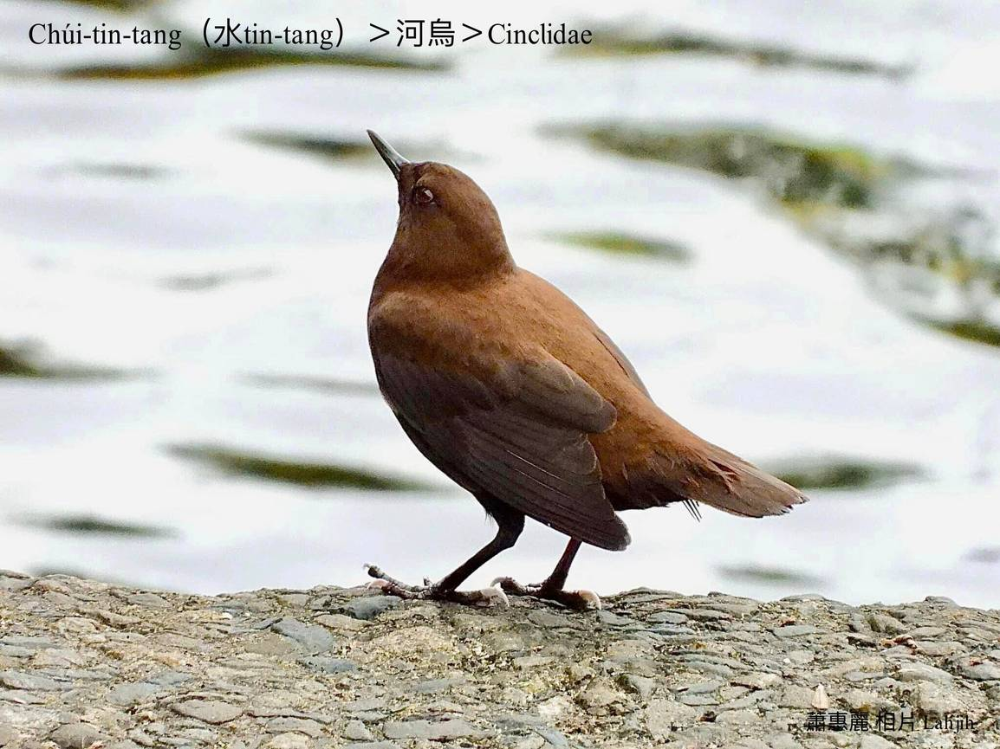
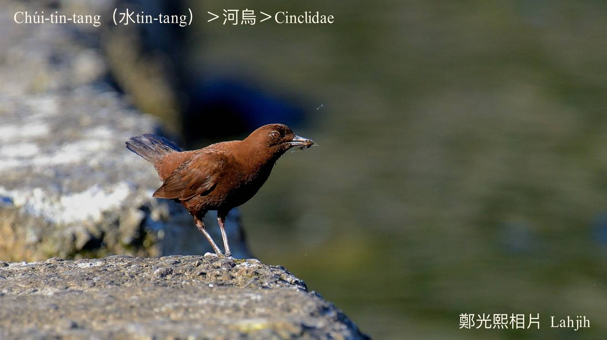
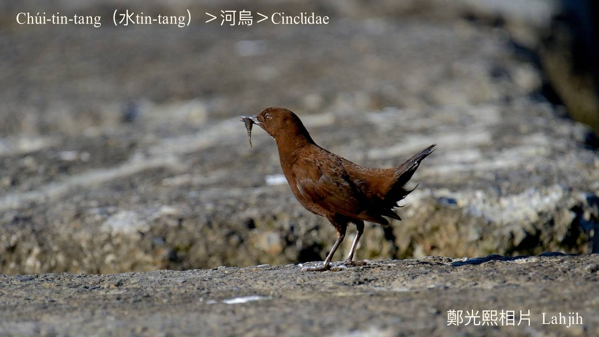
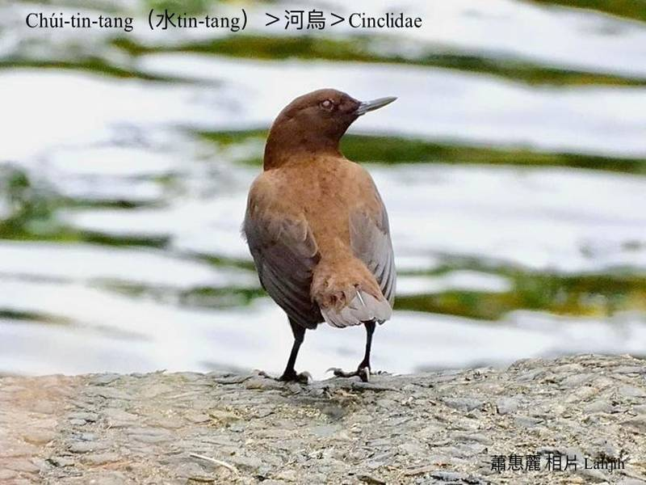
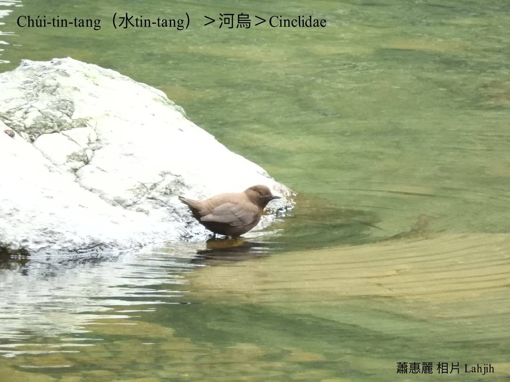
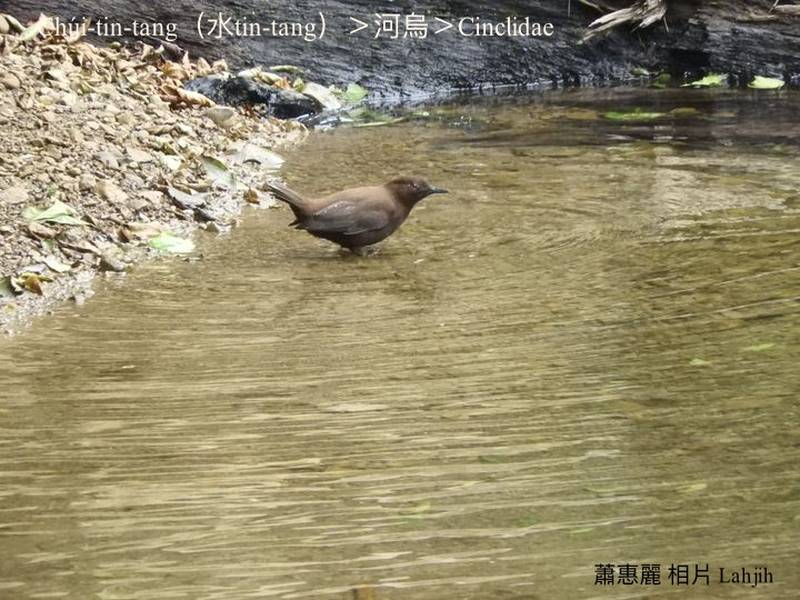
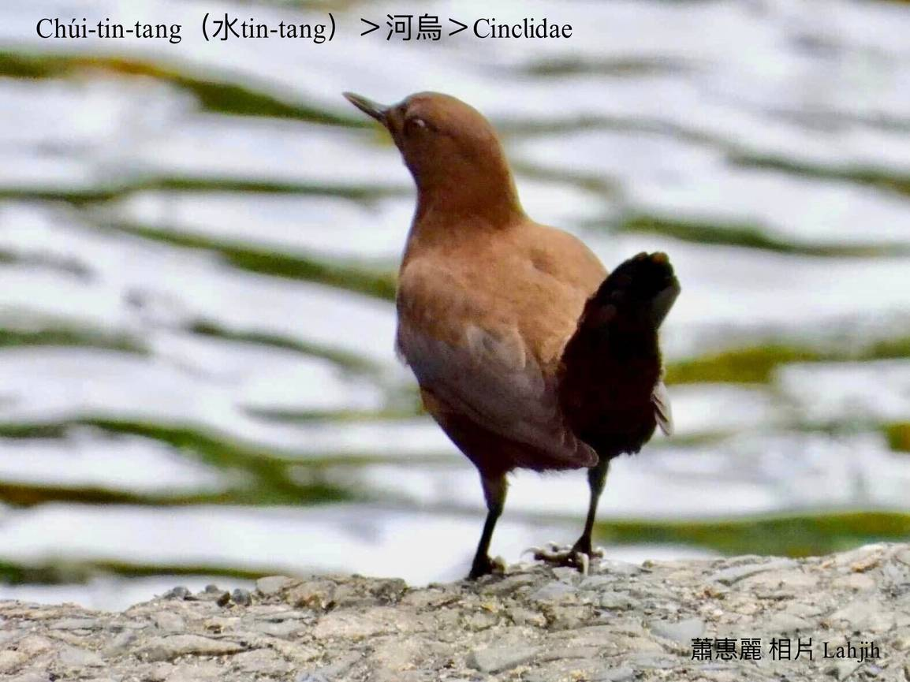

#### 40. Hô-o͘ Kho『河烏科』

|台灣名|中譯名|學名|
|Chúi-tin-tang（水Tin-tang）|河烏|Cinclidae|

# 40-1. Chúi-tin-tang（水Tin-tang）

Chúi-tin-tang，生活tī坑溝á有水流ê清氣水溪谷附近，khiā tī溪á邊、石頭頂chhōe食活動，用伊ê生活環境來號名，是鄉土味真重ê坑溝水鳥，chúi-tin-tang kài kó͘-chui chiok好聽。

Chúi-tin-tang ē tah水面直線飛行，速度chiâⁿ-kín，ná飛ná ki~，幼聲hiáng-liāng，ká-ná leh表演特技--leh。時常歇tī水邊石頭頂，尾á khiàu-khiàu，兩ki腳不sám時khut--leh khut--leh，chiâⁿ sim-sek kó͘-chui，有時ē無張無持cho̍k--落-去水底，比水鳥koh-khah gâu泅水，koh ē-hiáu tī chhoah流坑溝á用雙翼chhàng-chúi-bī，a̍h是水內步lián行路。

Chúi-tin-tang ê腳爪無像一般雁鴨有蹼，m̄-koh ē-tàng tī水內活動，時常tī石頭頂用嘴pe kō尾椎ê油脂腺來抹羽毛，hō͘羽毛khah bē bak tâm--去。

Chúi-tin-tang tī chhoah流區chhōe食ê時間khah chē，因為chhoah流所在khah有水生昆蟲kap魚蝦a̍h是水底昆蟲thang食。

# 【Tâi-oân Chiáu-á Liām Koa-si】

### **Chúi-tin-tang Kó͘-chui Oa̍h-tāng**

Khòaⁿ lí tiām-tiām khiā, m̄-chai-iáⁿ lí ū gōa gâu gōa liú-lia̍h

Khòaⁿ lí tián kang-hu, chiah-chai lí ū gŏa-nī khiàng ê pún-sū

Phi chúi-bīn, ná poe-chìⁿ

Cho̍k lo̍h-khì chúi-té, koh ē chhàng-chúi-bī

Nn̄g ki kha, bô-sî-êng, ná-chhiūⁿ leh thiàu ke-bú

Chúi-tin-tang, kó͘-chui ū-kàu oa̍h-tāng

### 【註解】

|詞|解說|
|蹼|Pok。|
|ke-bú|『街舞』。|

