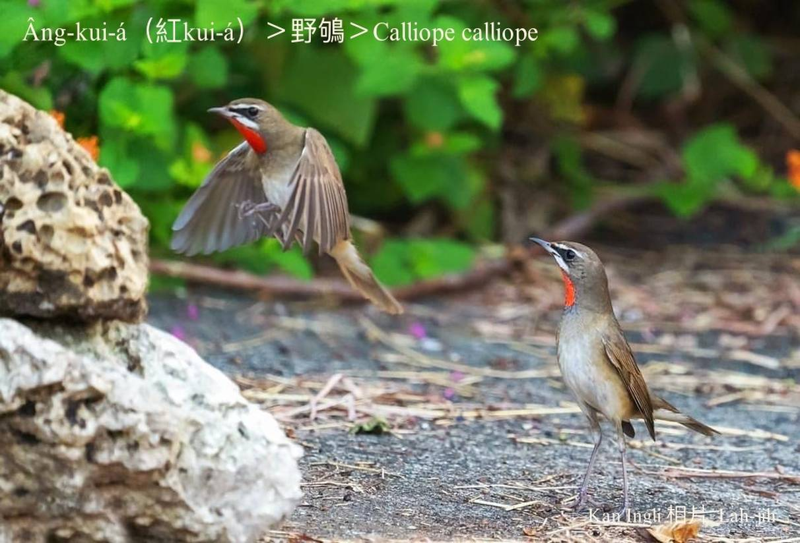

#### 41. Tong Kho『鶇科』

|台灣名|中譯名|學名|
|Âng-kui-á（紅Kui-á）|野鴝|Calliope calliope|

# 41-1. Âng-kui-á（紅Kui-á）

Âng-kui-á，白phú色身軀，phú色chhap淺咖啡黃翼股，腳lò-lò，ba̍k-chiu嘴pe烏色，ba̍k-chiu頂下有ná粗目眉ê白sûn，siāng-kài明顯影目，to̍h是公鳥ê ām-kui有一跡真大跡紅kòng-kòng ê羽毛，是非常豔麗ê深紅色。

Âng-kui-á to̍h是日本名野鴝ê台灣在地名。

Âng-kui-á生湠tī東北亞，寒--人南移東南亞各所在，每年秋天飛來台灣避冬，tòa到隔轉年四--月，算是普遍ê過冬鳥，活動tī低海拔ê山地kap平地，bih tiàm低欉ê樹林內，tī地面chhōe食，警戒心chiâⁿ重，罕得看著in ê形影。

Âng-kui-á háu聲「kí koaiⁿ kí koaiⁿ」koân-im hiáng-liāng，鳥友聽聲to̍h-ē發現伊ê形影。

#### 【補充說明】

『頸子』台語講ām-kún，ām-kún前面nâ-âu-kńg所在號做ām-kui，『甲狀腺腫』台語to̍h是大ām-kui。

# 【Tâi-oân Chiáu-á Liām Koa-si】

### **Âng-kui-á M̄-sī Tōa-ām-kui**

Âng-kui-á, âng-kui-á, lí boeh khì tó-ūi

Thiⁿ-khì chiâⁿ-léng 

Boeh lâi-khì Tâi-oân khòaⁿ kong-kéng

Tâi-oân, Tâi-oân, hó-só͘-chāi

Thiⁿ-khì bē-léng, bē-kôaⁿ, hó seng-oa̍h

Pài-thok mài kā gún lia̍h

Goán chiah bē kiu-kiu lun-lun, bih-tiàm chhiū-á-lāi

### 【註解】

|詞|解說|
|野鴝|Iá-kî。|
|影目|Iáⁿ-ba̍k。|

