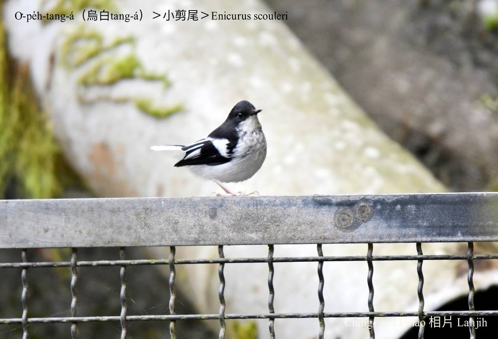

#### 41. Tong Kho『鶇科』

|台灣名|中譯名|學名|
|O͘-pe̍h-tang-á（烏白Tang-á）|小剪尾|Enicurus scouleri|

# 41-3. O͘-pe̍h-tang-á（烏白Tang-á）

O͘-pe̍h-tang-á，烏chhap白ê鳥毛，嘴pe、āu-khok、尾烏烏，翼股烏色kha-chiah-phiaⁿ一jiah白sûn，頭額、腹肚下kap兩支腳白siak-siak，chit種打扮kài sêng現代流行烏白配色穿插，好看pháiⁿ看在人kah-ba̍k。

O͘-pe̍h-tang-á是山溪á細隻鳥，大細kap âng-bóe-tang-á差不多，是地勢koân-kē垂直分布khah普遍ê鳥類，tī海拔3600m ê高山，老濃溪源頭玉山國家公園有伊ê腳跡，tī大安溪中游溪邊，四角林林場海拔500m所在，mā有伊ê形影。大部分單獨行動，順山溪á邊沿路chhōe食。

O͘-pe̍h-tang-á khah kah-ì tī清氣chhoah流所在活動，尾溜時常chhiūⁿ鉸刀鉸布án-ne剪--leh，剪--leh，親像chit款ku-mo͘ kah-ì山坑清氣水ê水鳥ná來ná少，o͘-pe̍h-tang-á是giōng-boeh斷種ê台灣亞種，hèng食水中細尾thâng-thōa。

# 【Tâi-oân Chiáu-á Liām Koa-si】

### **O͘-pe̍h-tang-á Sî-kiâⁿ O͘-pe̍h Chhēng**

O͘-pe̍h chhap-cha̍p o͘-pe̍h chhēng

Chhoàn chhēng lóng-sī o͘-pe̍h sek

Hèng chia̍h thâng-thōa tī kheⁿ-kau-á

Ài chheng-khì koh káⁿ mō͘-hiám tī chhoah-lâu

Ū-kàu ku-mo͘ o͘-pe̍h-tang-á

### 【註解】

|詞|解說|
|垂直|Tūi-ti̍t，plumb。|
|kah-ba̍k|Kah-ì ê意思。|

