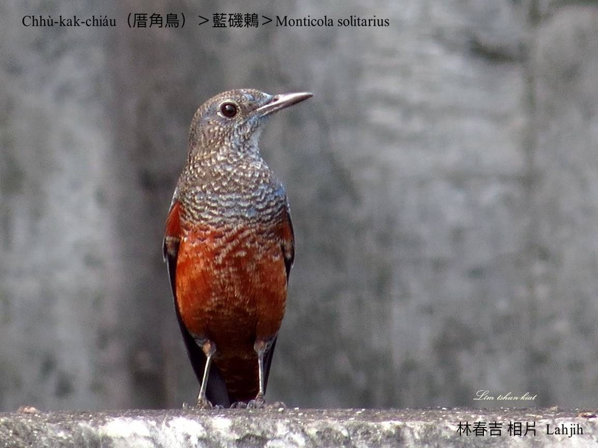
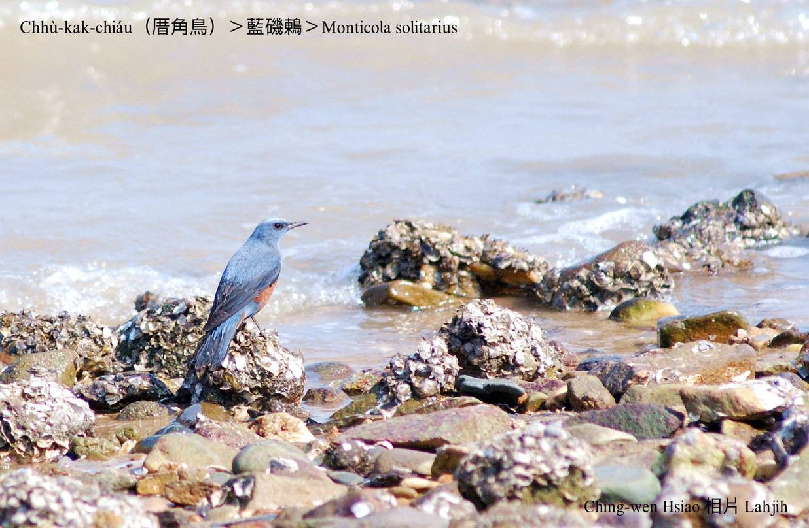
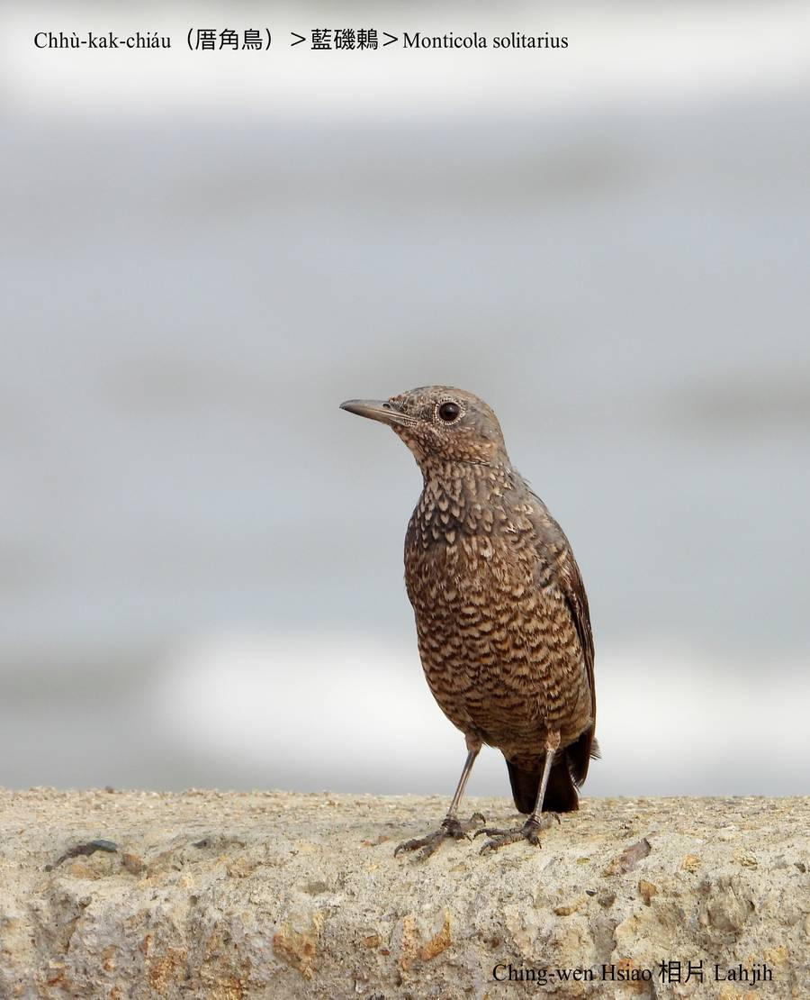
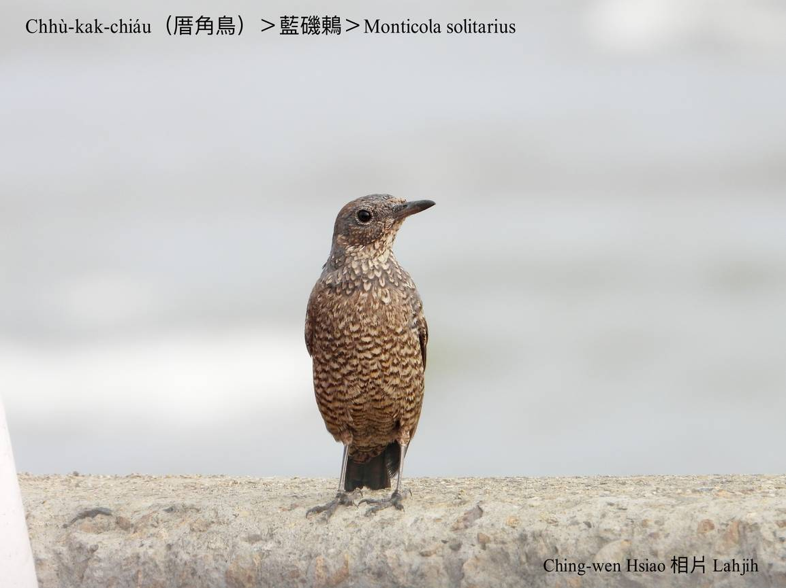
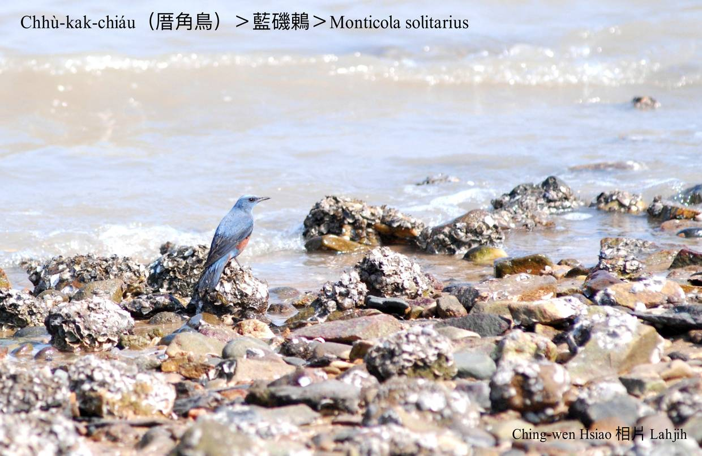
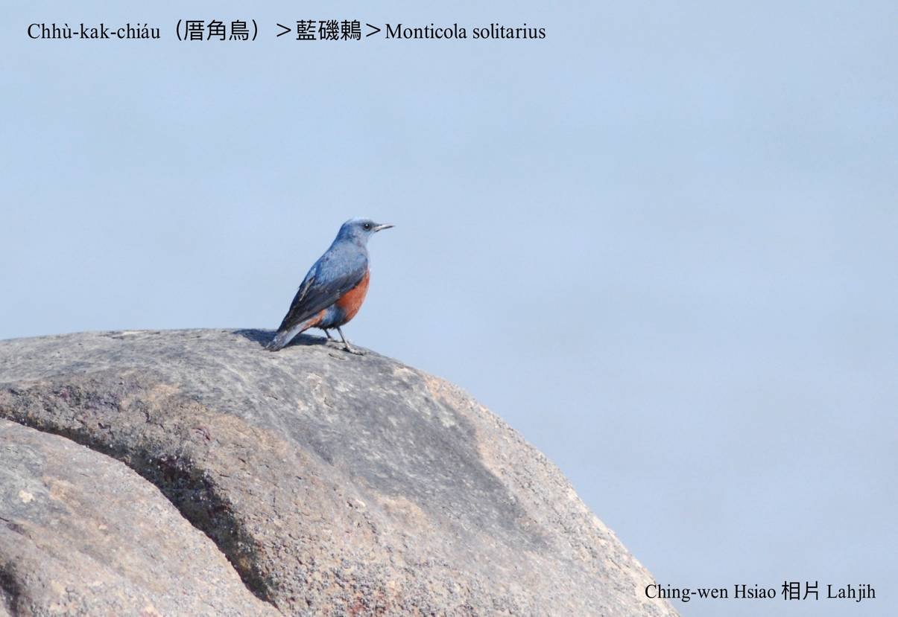
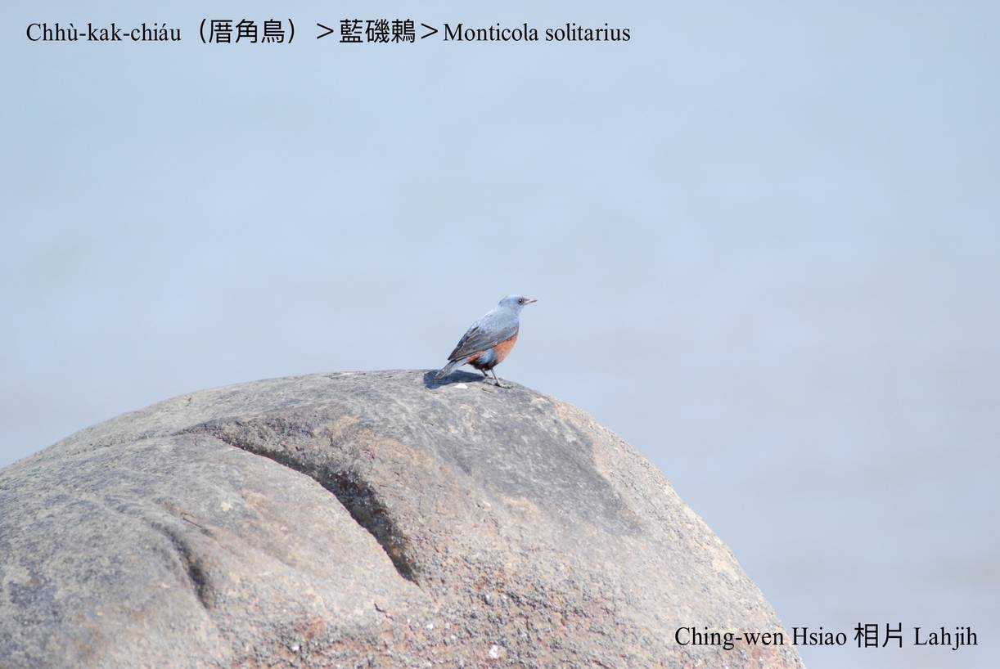
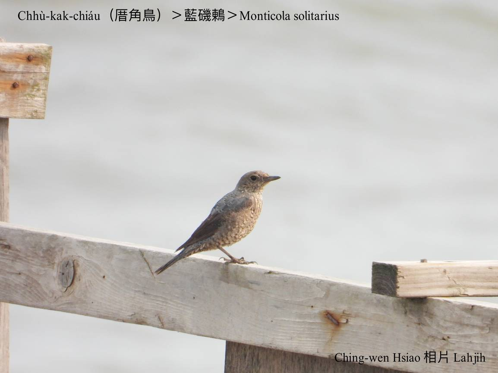

#### 41. Tong Kho『鶇科』

|台灣名|中譯名|學名|
|Chhù-kak-chiáu（厝角鳥）|藍磯鶇|Monticola solitarius|

# 41-4. Chhù-kak-chiáu（厝角鳥）

Chhù-kak-chiáu m̄是chhù-chiáu-á，chhù-chiáu-á to̍h是chhek-chiáu-á hèng食粟，是台灣在地鳥。Chhù-kak-chiáu是hāu-niáu，秋去春來，每年一定飛轉來做人客，做siū tī厝角，m̄-chiah hō͘人號做chhù-kak chiáu，chiâⁿ有鄉土味。

Chhù-kak-chiáu chiok愛khiā tiàm厝角頭a̍h-sī石頭頂，thèng-hāu báng-thâng出現chiah突然lia̍h食。

Chhù-kak-chiáu ê鳥公頭、尾、翼股lóng是chiâⁿ-súi kng-iāⁿ金藍色，pak-tó͘咖啡紅，put-chí-á súi。鳥母色水khah素，不過花紋chiâⁿ súi。

Chhù-kak-chiáu是hāu-niáu，mā有chi̍t-kóa是在地鳥，kah-ì單獨討食，平洋高山lóng有伊ê跤跡。

# 【Tâi-oân Chiáu-á Liām Koa-si】

### **Chhù-kak-chiáu M̄ Chia̍h-chhek**

Thiaⁿ ho͘ hó-sè, goán sī chhù-kak-chiáu

M̄-sī chhù-chiáu-á, mā m̄-sī chhek-chiáu-á

Sui-bóng goán mā-sī chin-ài tòa-tī chhù-kak-thâu

M̄-koh tī pêⁿ-iûⁿ, chin hán-tit khòaⁿ-tio̍h goán kiâⁿ-ta̍h

Mā bē kā lín thau-chia̍h chhek

### 【註解】

|詞|解說|
|hāu-niáu|『候鳥』。|

