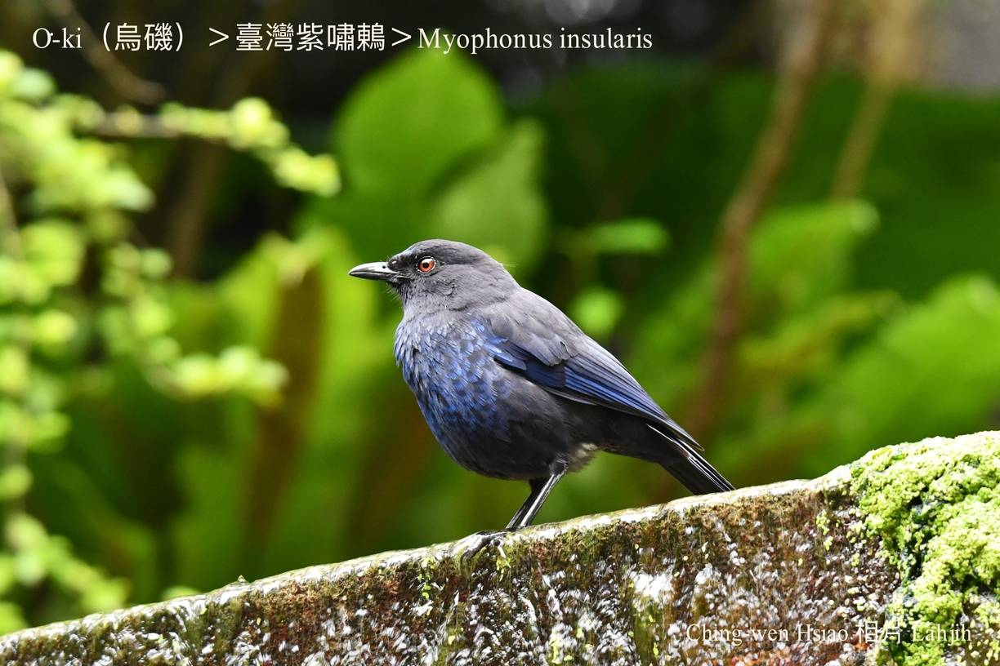
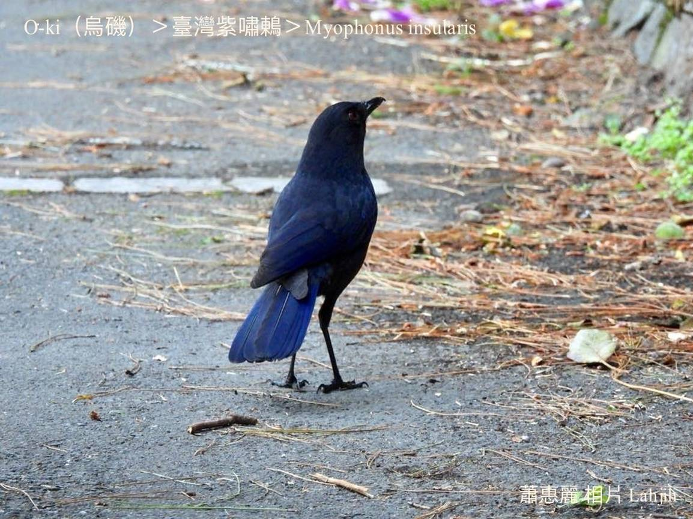
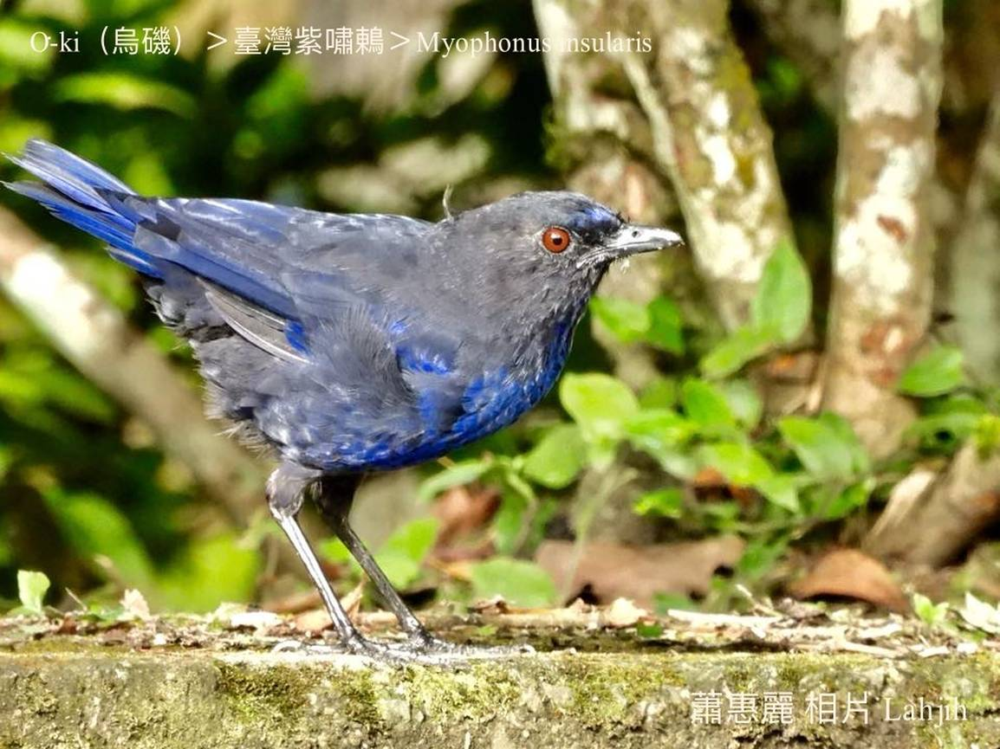
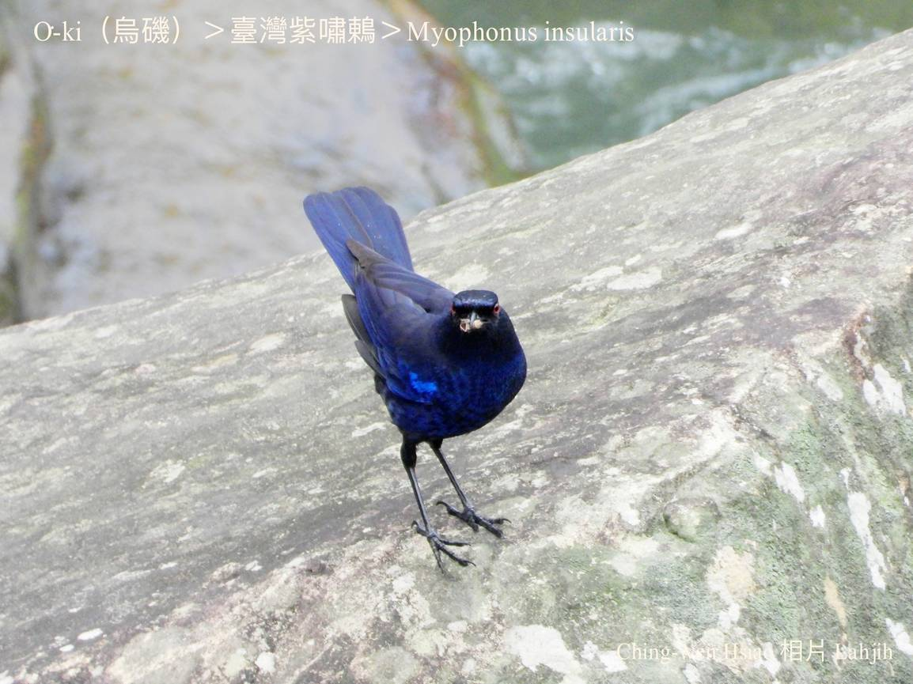
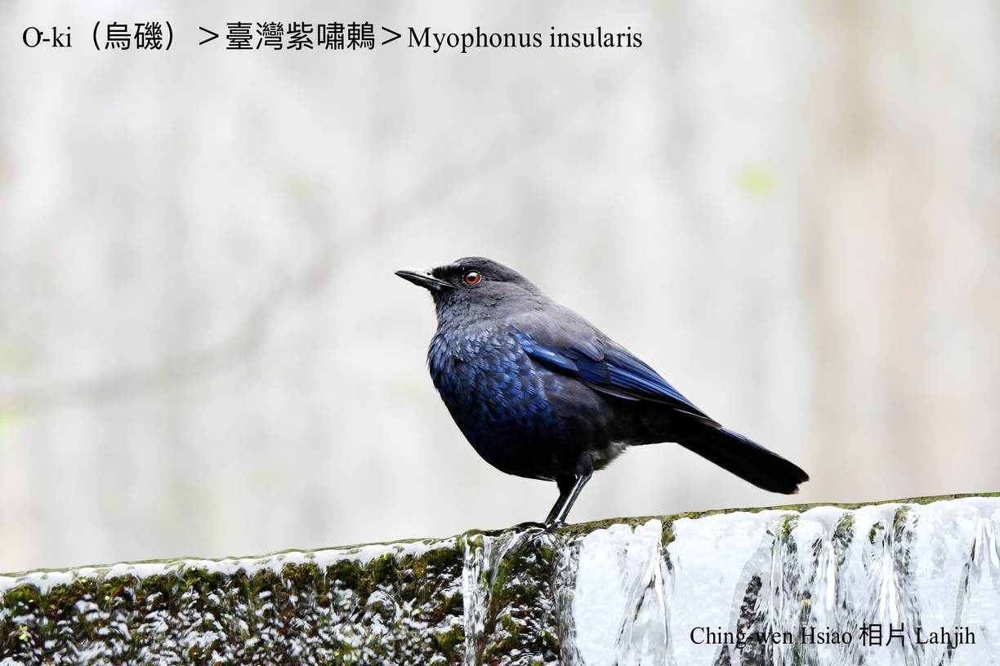
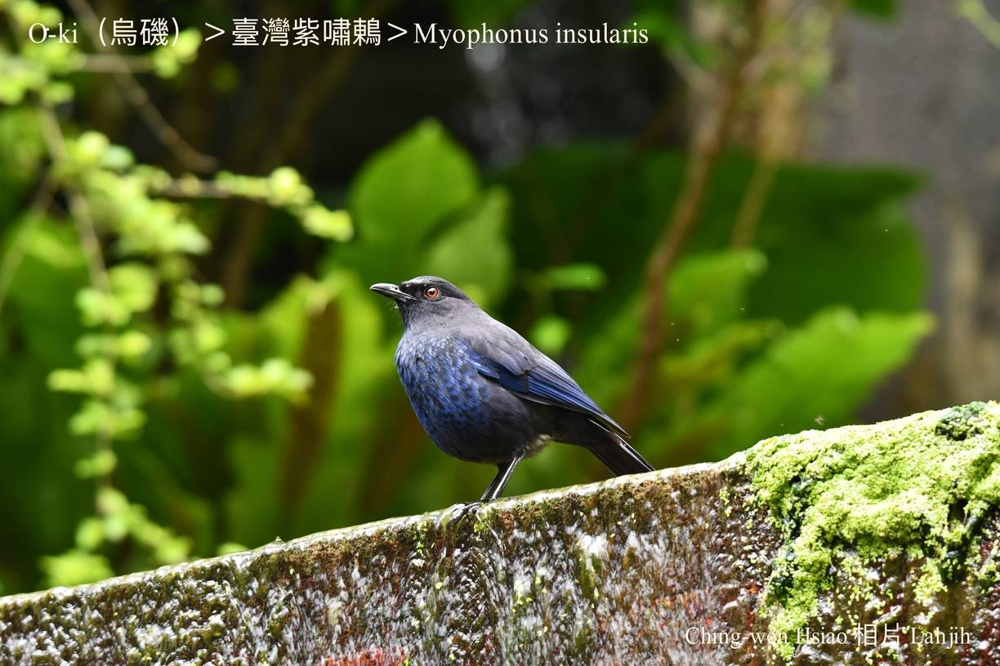
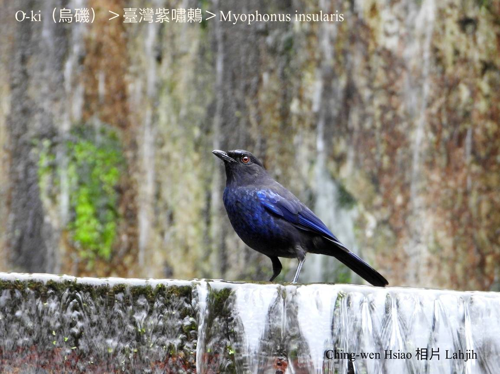
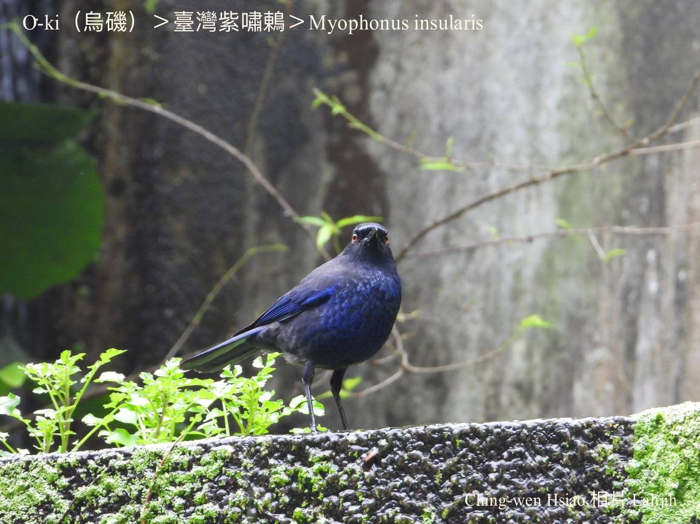
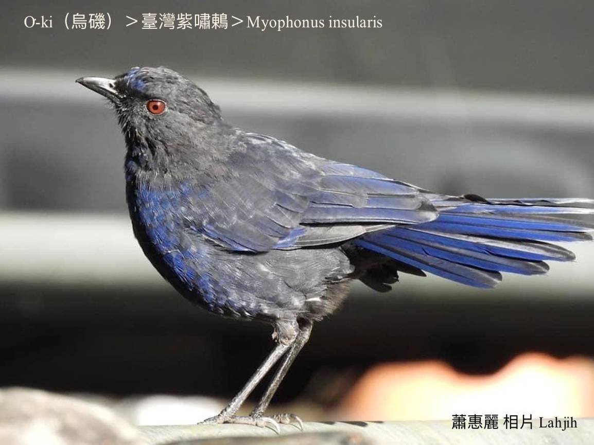
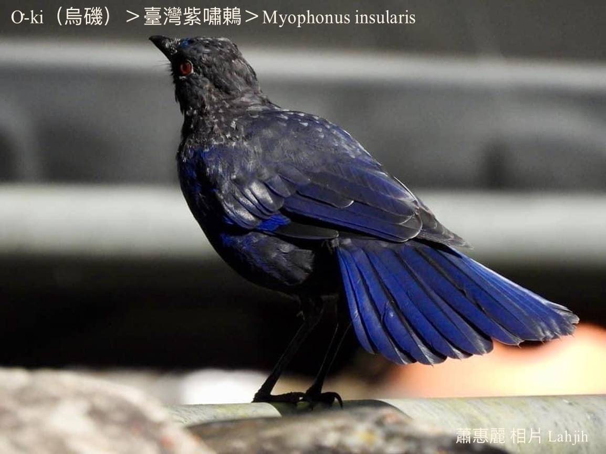

#### 41. Tong Kho『鶇科』

|台灣名|中譯名|學名|
|O͘-ki（烏磯）|臺灣紫嘯鶇|Myophonus insularis|

# 41-5. O͘-ki（烏磯）

O͘-ki kui身軀ê鳥毛屬深藍茄á色，遠遠看烏金烏金ná像khóng色，頭殼ām-kún khah暗色，chiâⁿ súi。活動tī山溪á水邊，a̍h是水面ê石頭頂。

O͘-ki公鳥母鳥lóng kāng色，分布tī中、低海拔山區，是普遍ê台灣特有種在地鳥，有顧siū顧kiáⁿ ê本能。

O͘-ki kah-ì tiàm溪á邊àm-sàm樹林所在討食，hèng食tō͘-kín、爬蟲類、sì-kha-á、thâng-thōa、細尾魚蝦。

O͘-ki叫聲有時chhiūⁿ kho͘-si-á，有時ki-ki叫ē牽聲，chiâⁿ特別。

# 【Tâi-oân Chiáu-á Liām Koa-si】

### **O͘-ki Siāng Hoaⁿ-hí**

Khe-á-chúi chheng-chheng-chheng

Chio̍h-thâu tēng-tēng-tēng

Thiàu-koân thiàu-kē, poe-lâi poe-khì

Siāng hoaⁿ-hí, to̍h sī lí o͘-ki

Chi̍t sin o͘-kim o͘-kim ná nâ-pó-chio̍h

Chim-chiok khòaⁿ, goân-lâi sī khóng-sek

Kho͘-si-á koh gâu ki

Goân-lâi to̍h-sī lí o͘-ki

### 【註解】

|詞|解說|
|tō͘-kín|『蚯蚓』。|
|sì-kha-á|『青蛙』，frog。|
|爬蟲類|Pê-thâng-lūi。|

