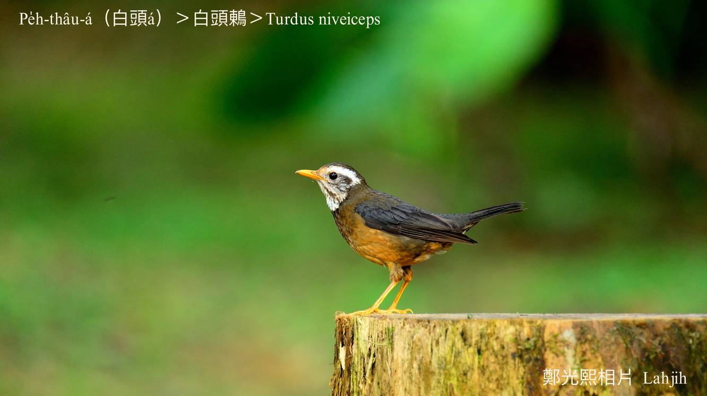
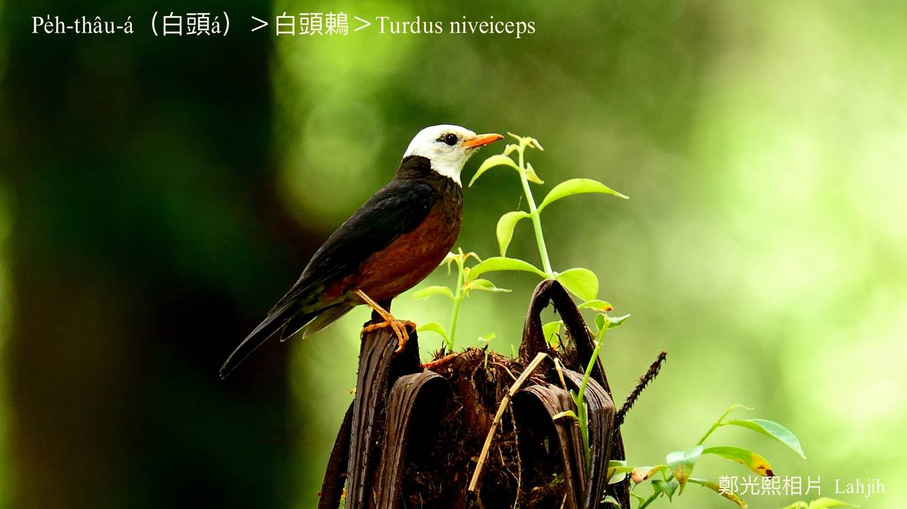

#### 41. Tong Kho『鶇科』

|台灣名|中譯名|學名|
|Pe̍h-thâu-á（白頭á）|白頭鶇|Turdus niveiceps|

# 41-6. Pe̍h-thâu-á（白頭á）

Pe̍h-thâu-á，公鳥ê頭、ām-kún羽毛完全是白色--ê，大部分歇tī中海拔山區闊葉林a̍h是針闊葉混合林內，tī樹林中、上層ê所在活動、chhōe食，警戒心重，看tio̍h人隨時bih入去樹林內，chiâⁿ oh發現。食昆蟲、幼蟲、樹籽、漿果、幼葉á。

Pe̍h-thâu-á已經列入珍貴罕有ê保育類，是台灣特有亞種在地鳥，主要hioh-siū tī中海拔山區，jú來jú少jú oh發現。

### 【註解】

|詞|解說|
|漿果|Chiuⁿ-kó。|

