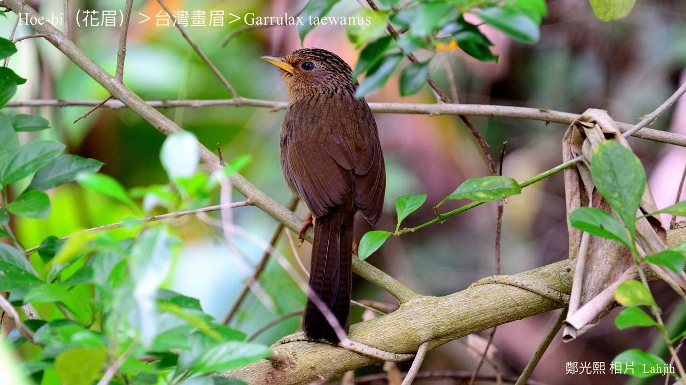
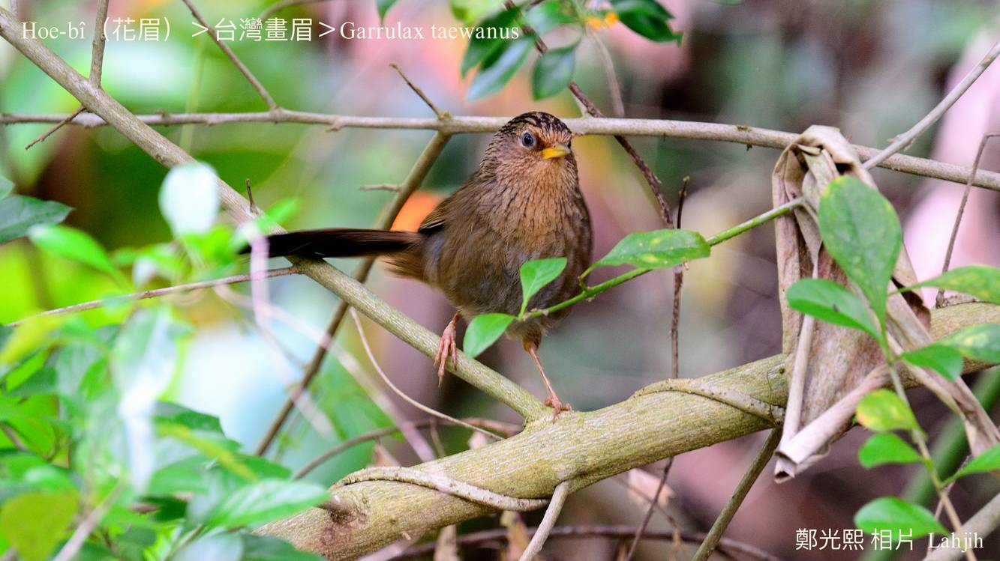
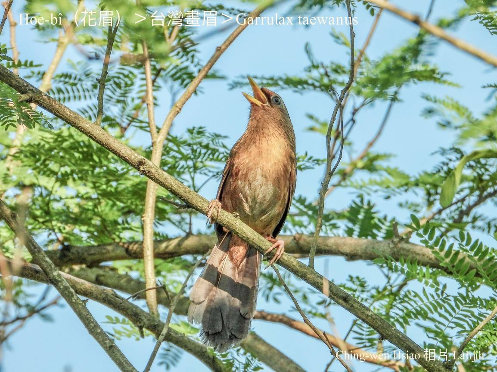
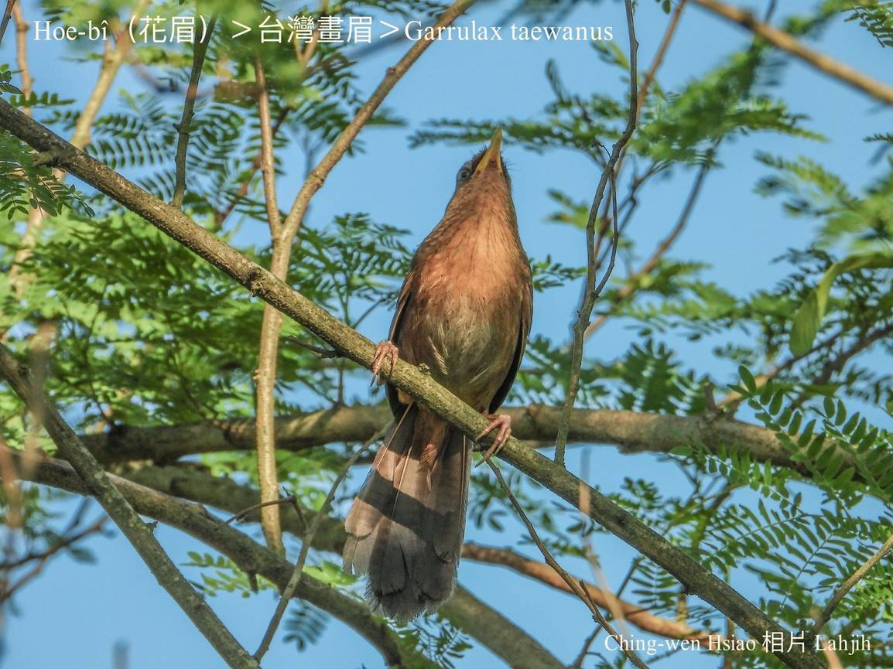
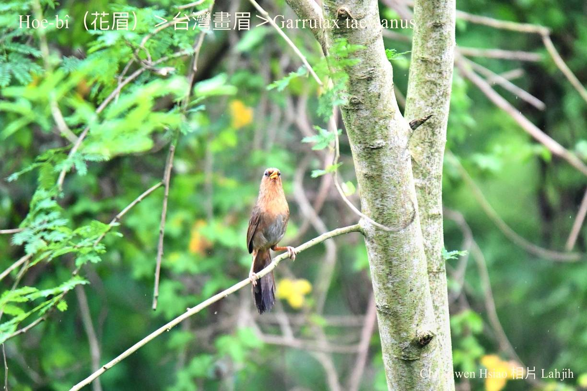
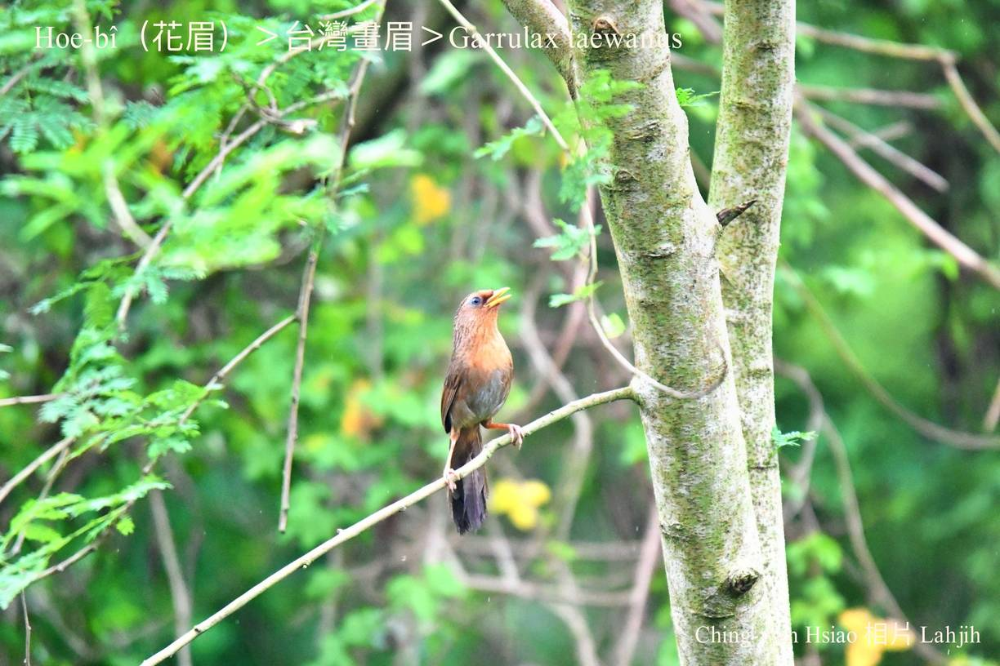
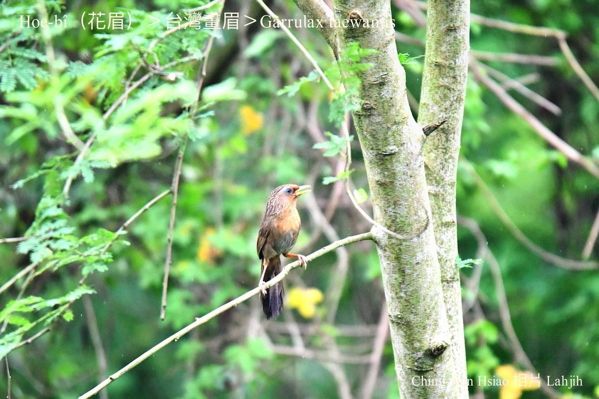
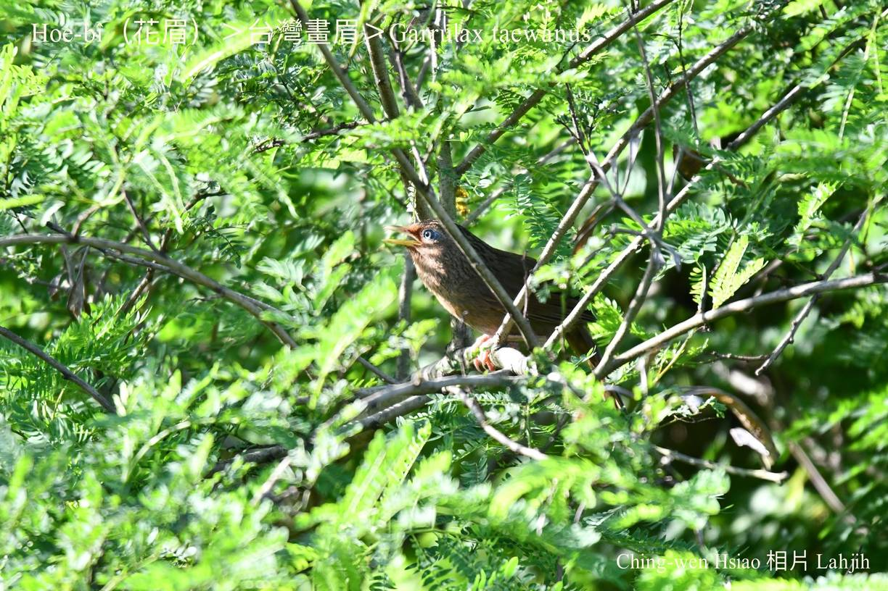
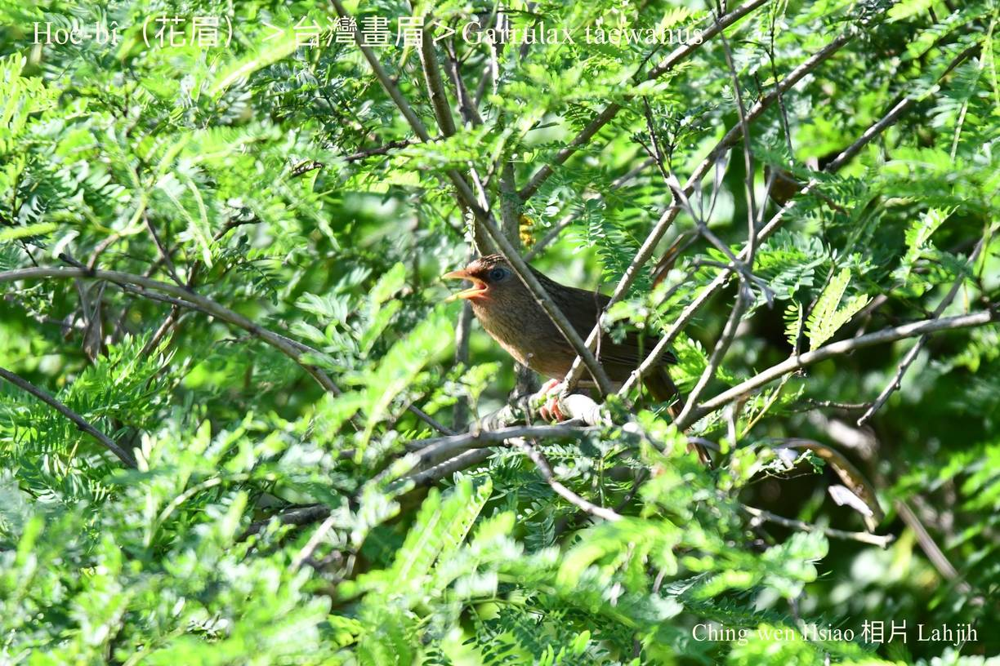

#### 42. Hoe-bî Kho『畫眉科』

|台灣名|中譯名|學名|
|Hoe-bî（花眉）|台灣畫眉|Garrulax taewanus|

# 42-1. Hoe-bî（花眉）

Hoe-bî kui身ê羽毛是chhó-kan-á色，有烏咖啡色幼條á chōa，m̄-koh無白目眉，所以台灣人ka hō做hoe-bî，並m̄是『畫眉』。

Hoe-bî，翼短無gâu飛，mā飛bē遠，兩支腳骨活跳硬chiāⁿ，時常歇tiàm密chiuh-chiuh ê細欉樹林、林投a̍h是藤á內。早當時ê台灣，林投是防風林，四界lóng有，hoe-bî時常出現tī hit內面，所以古早有「林投hoe-bî」ê俗稱。

Hoe-bî無kài gâu飛，mā無艷色影目ê色水，m̄-koh chiok gâu háu，háu-siaⁿ有時ná kho͘-si-á，有時ná唱歌，有時ná leh chhiùⁿ RAP，變化多端（changeable）非常好聽，mā因為án-ne soah hō͘人lia̍h來關tī chiáu-lang-á內做thit-thô-mi̍h。

Hoe-bî食昆蟲kap幼蟲、果子、漿果做主食，生湠、做siū tī旺欉ê樹林內，用雜草、樹根、樹葉做碗形ê siū。

台灣Hoe-bî m̄是kài普遍ê在地鳥，是台灣特有種，列入珍貴保育動物。

# 【Tâi-oân Chiáu-á Liām Koa-si】

### **Hoe-bî Gâu Chhiùⁿ-koa**

Tâi-oân hoe-bî gâu chhiùⁿ-koa

Ē kho͘-si-á chhiùⁿ RAP

Bih-tiàm chhiū-nâ chū-chāi tián koa-âu

Koài ka-tī siuⁿ kia̍p-chhùi

Soah hō͘-lâng koaiⁿ tī chiáu-lang-á lāi

Tián-hiān koa-siaⁿ hō͘ "lâng" thiaⁿ

Hō͘ "lâng" o-ló kah tak-chi̍h

### 【註解】

|詞|解說|
|chhó-kan-á|『用甘草醃製的橄欖』，sió-khóa n̂g-gâm ê草綠色。|
|chhó-kan-á色|Kiâm-chhài色，『類似鹹菜的顏色，鹹菜色和墨綠色差不多』。|
|chiáu-lang-á|鳥籠á。|
|漿果|Chiuⁿ-kó。|
|kia̍p-chhùi|『多嘴』。|

