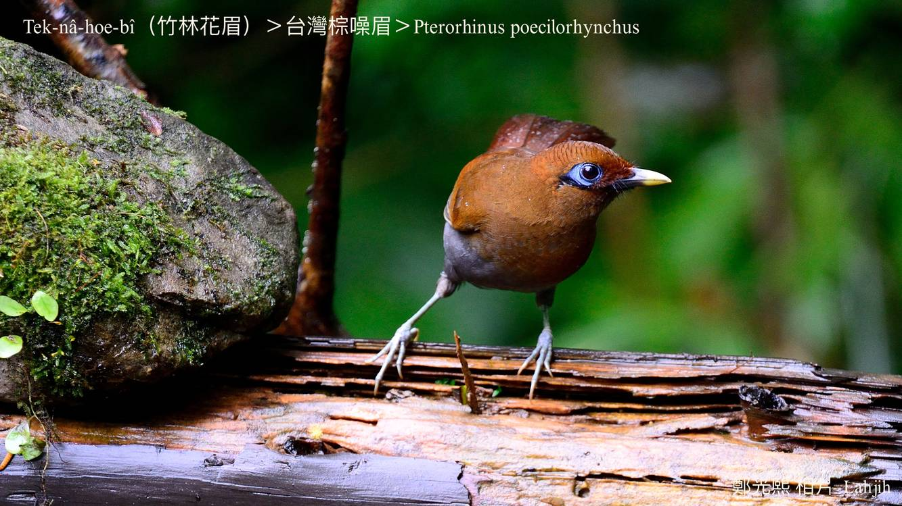

#### 42. Hoe-bî Kho『畫眉科』

|台灣名|中譯名|學名|
|Tek-nâ-hoe-bî（竹林花眉）|台灣棕噪眉|Pterorhinus poecilorhynchus|  

# 42-2. Tek-nâ-hoe-bî（竹林花眉）

Tek-nâ-hoe-bî主要歇tī竹林，是hoe-bî宗親，háu聲有變化，有時kho͘-si-á，有時捲舌，有時kō͘ ki--ê，聲音nńg-lio̍h bē噪人耳，不過khah輸hoe-bî--tām-po̍h-á。

Tek-nâ-hoe-bî mā號做竹鳥，分布tī中、低海拔山區，時常三五隻、七八隻做夥chhōe食，是Hoe-bî科khah大型ê鳥類，生性驚人無膽，所以真oh接近，羽毛是紅赤牛á色，腹肚是火灰茄á色，ba̍k-kho͘ kheng chi̍t khong藍色，非常súi。食昆蟲、幼蟲、樹蛙，mā食植物ê幼芽、漿果。

Tek-nâ-hoe-bî是台灣特有亞種在地鳥，一年四季lóng看ē-tio̍h，因為生做真súi koh háu聲好聽，容易hō͘人lia̍h去飼a̍h是賣錢。

# 【Tâi-oân Chiáu-á Liām Koa-si】

### **Tek-nâ-hoe-bî Chin Bí-lē**

Sui-bóng koa-siaⁿ su goán chhin-tông hoe-bî

M̄-koh góa hàn-chháu khah-hó khah iáⁿ-ba̍k

Chhiah-gû-á sek ú-mn̂g hām tōa-lúi ba̍k-chiu

Soah siâⁿ "lâng" kā goán lia̍h

Súi sī thian-seng Bí-lē bô chōe

Lóng-sī "lâng" ê leh hoān-chōe

### 【註解】

|詞|解說|
|噪人耳|Chhò-lâng-hīⁿ，『擾人清靜』。|
|漿果|Chiuⁿ-kó。|
|nńg-lio̍h|柔軟。|

