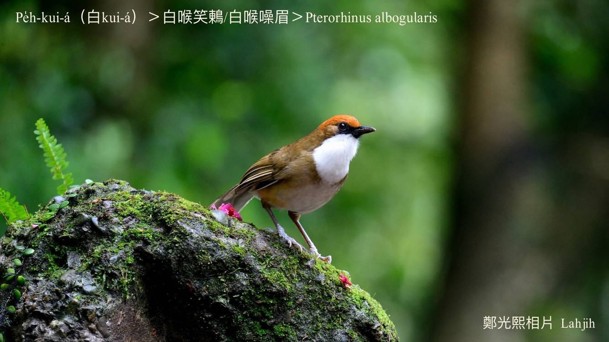
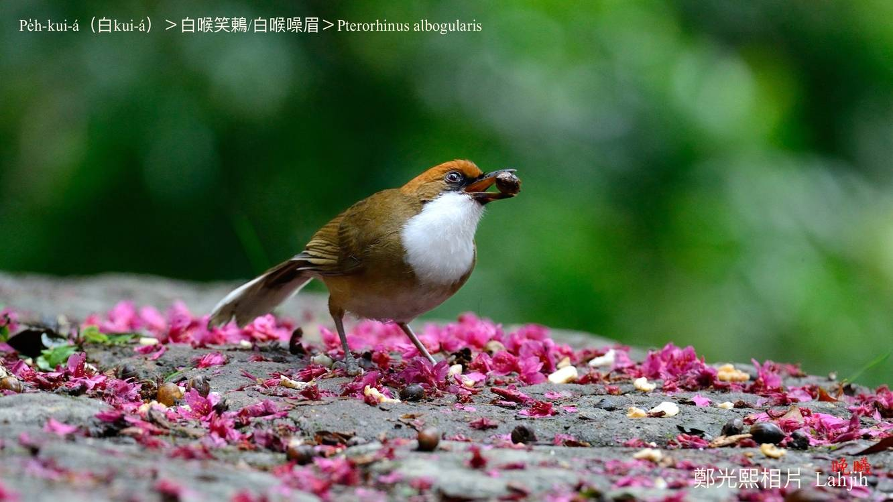

#### 42. Hoe-bî Kho『畫眉科』

|台灣名|中譯名|學名|
|Pe̍h-kui-á（白Kui-á）|白喉噪眉|Pterorhinus albogularis|  

# 42-3. Pe̍h-kui-á（白Kui-á）

Pe̍h-kui-á ê ām-kui nâ-âu所在，明顯ê有一chhop真大chhop白色羽毛，非常影目，是台灣特有亞種珍貴鳥類，分布tī平地到2500公尺山間ê闊葉林內，m̄是普遍ê在地鳥。

Pe̍h-kui-á歇tī闊葉林a̍h是溪á邊廬竹á林，tī樹頂跳來跳去chhōe食，bē飛siuⁿ遠，mā bē驚人。愛食昆蟲、幼蟲、樹蛙，mā愛食植物ê幼芽、漿果。

Pe̍h-kui-á頭殼赤牛á紅色，身軀咖啡phú，háu聲kài sêng gín-á群同齊ê笑聲，大聲有夠吵。

# 【Tâi-oân Chiáu-á Liām Koa-si】

### **Pe̍h-kui-á Tha̍k Iù-tī-hn̂g**

Pe̍h-kui-á chhēng pe̍h-sek ām-sê

Hoaⁿ-hoaⁿ-hí-hí boeh tha̍k-chheh

Tha̍k tah-ūi

Tha̍k iù-tī-hn̂g

Iù-tī-hn̂g chin hó-sńg

lāu-su kóng chhiò-khoe

Goán to̍h khih-khih-chhiò

### 【註解】

|詞|解說|
|漿果|Chiuⁿ-kó。|
|ām-sê|圍tī嬰á頷頸下kha來sîn nōa ê圍巾。|

