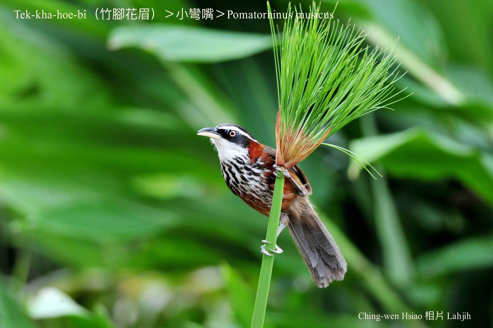
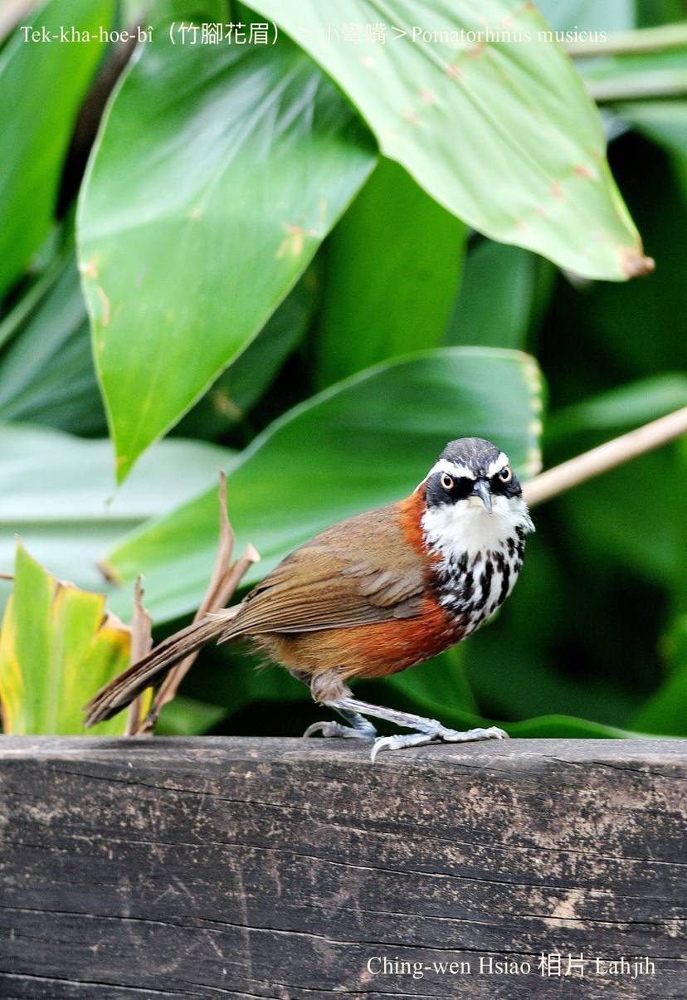
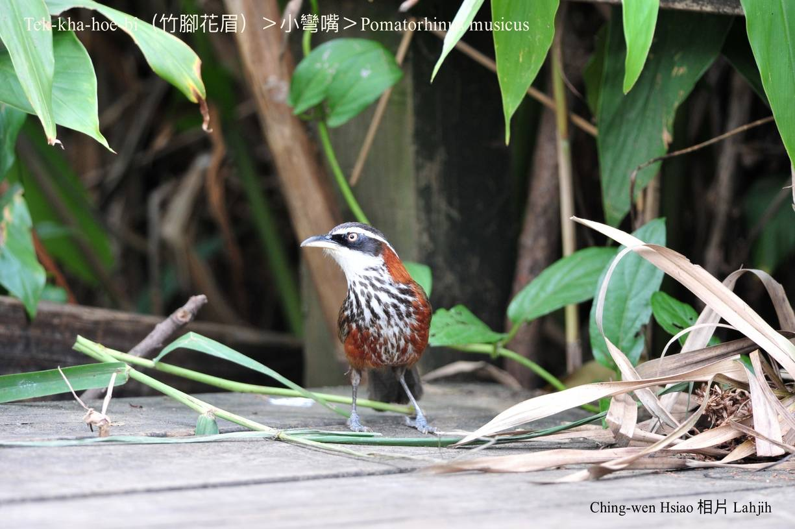
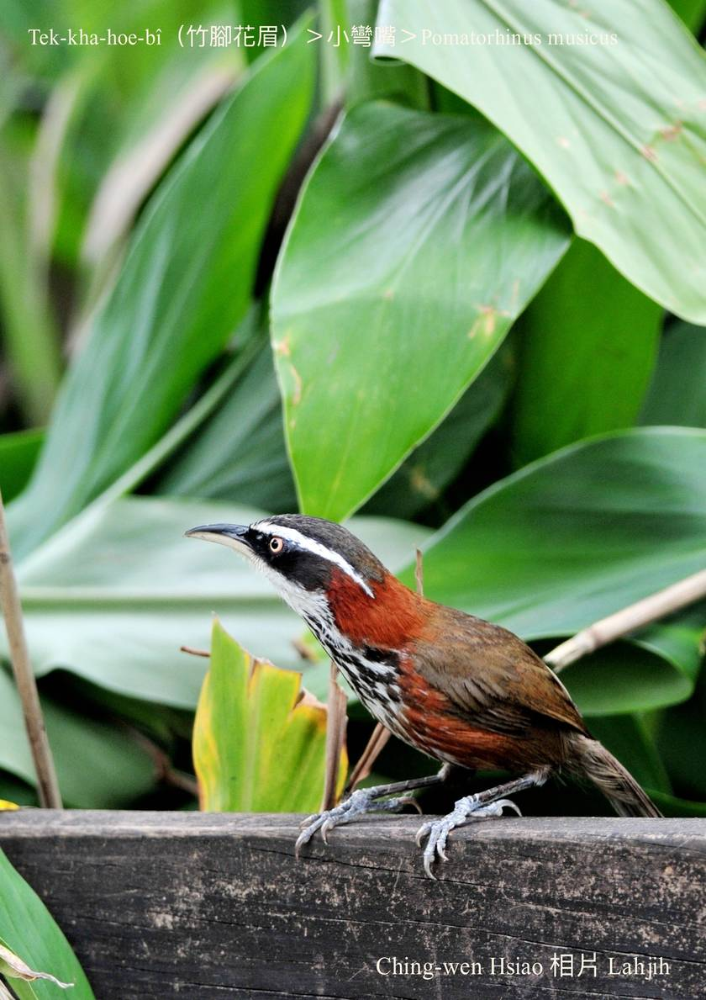
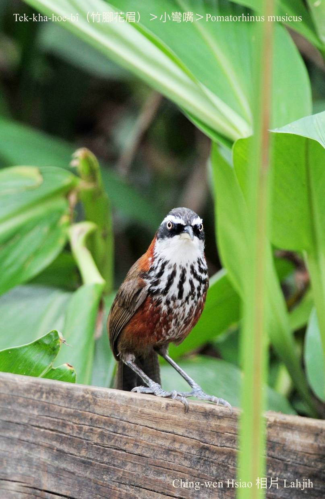
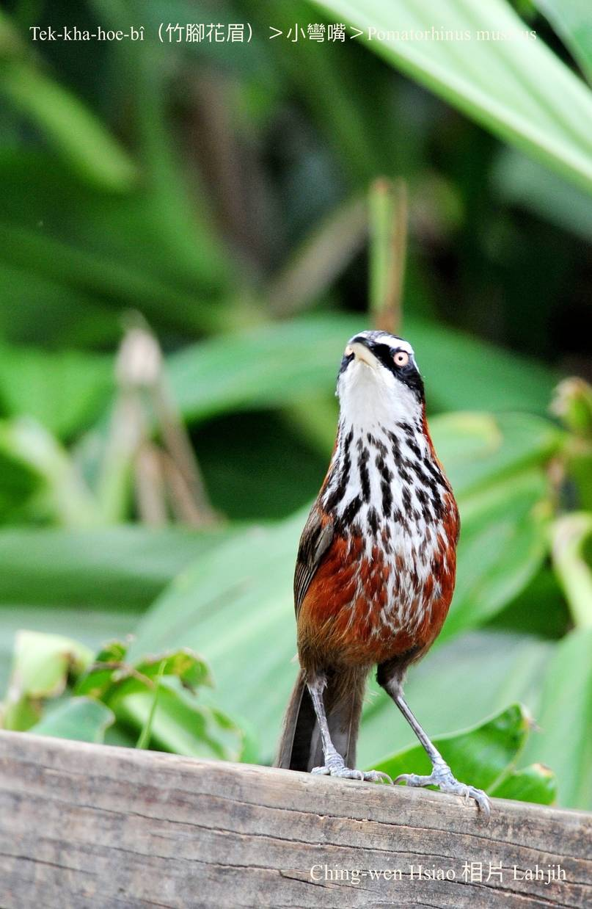
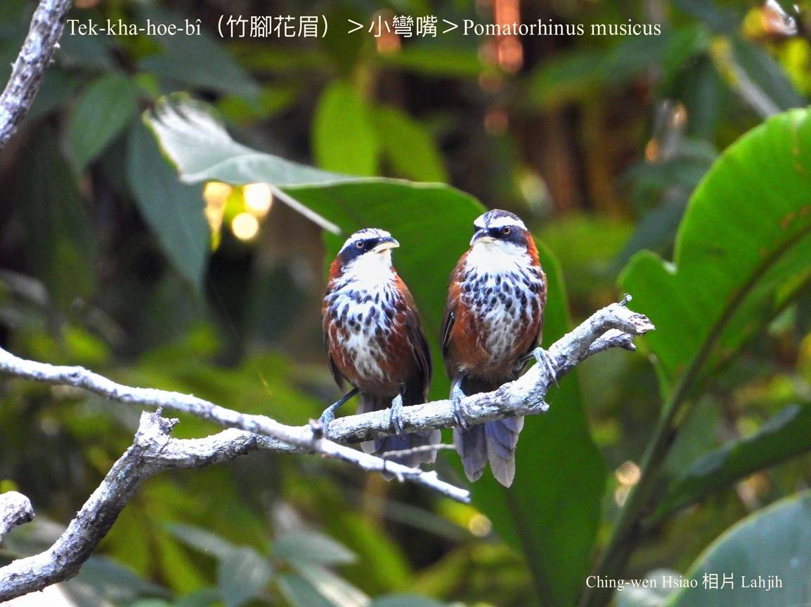
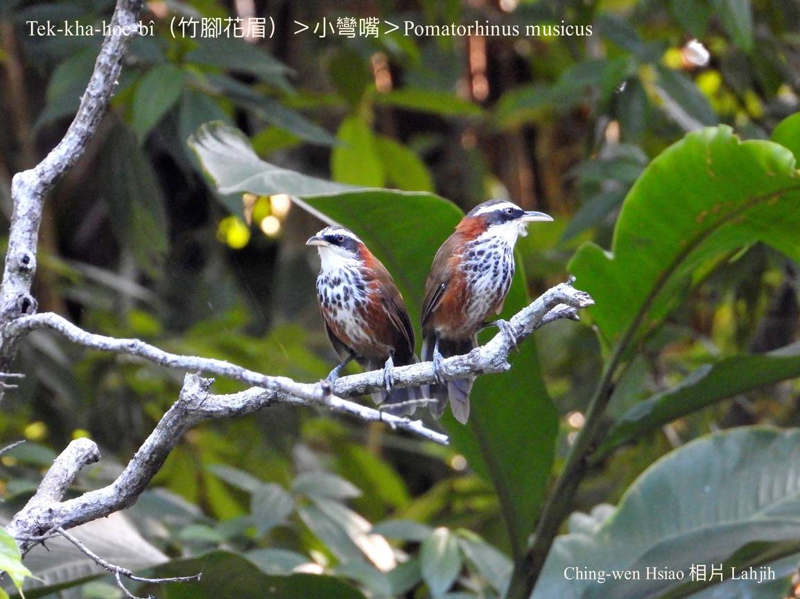
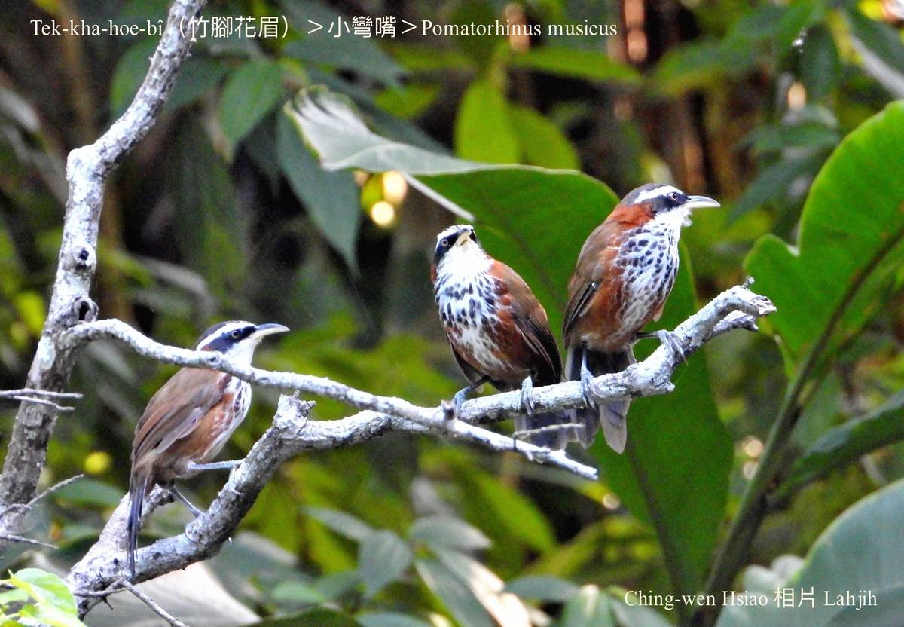

#### 42. Hoe-bî Kho『畫眉科』

|台灣名|中譯名|學名|
|Tek-kha-hoe-bî（竹腳花眉）|小彎嘴|Pomatorhinus musicus|  

# 42-4. Tek-kha-hoe-bî（竹腳花眉）

Éng-kòe咱tau竹圍厝地真闊，四kho͘圍除了刺竹模iáu有燈藍á花籬笆。He燈藍á花籬笆時常出現一種鳥仔tiàm hia跳來跳去，記智中原來to̍h是tek-kha-hoe-bî。

Tek-kha-hoe-bî khah早chiok-ài tī刺竹圍、燈藍á花籬笆內面chhōe食、做siū、生湠。因為伊ê頭殼面容hoe-pa-lí-niau ná布袋戲尪á ê奸臣，hō͘人叫做奸臣á鳥。
 
Tek-kha-hoe-bî kap人tòa鬥陣，m̄驚人，khiok是chiâⁿ巧chiâⁿ精，動作活跳，身軀koh有白斑，嘴pe sió-khóa鉤鉤，tī竹腳出入chiâⁿ影目、chiâⁿ súi。低山區ê雜木á林、草phō內，mā有伊ê腳跡，是普遍ê在地鳥。

# 【Tâi-oân Chiáu-á Liām Koa-si】

### **Tek-kha-hoe-bî Nǹg Tek-kha**

Hoe-bî chhin-chiâⁿ chin chiàⁿ chē

Kan-nā tek-kha-hoe-bî siāng ài kap lâng tòa-chò-hóe

Ta̍k-ji̍t tek-kha lî-pa lōa-lōa-sô

Ji̍t-chí kòe kah bô-hoân-bô-ló

Siáⁿ-chai jîn-lūi siuⁿ bûn-bêng,

Ūi-tio̍h khai-hoat piàⁿ keng-chè

Tek-ûi lî-pa chhò kah ta-ta-ta

Hāi gún m̄-chai boeh sóa khì tah

### 【註解】

|詞|解說|
|影目|Iáⁿ-ba̍k。|

