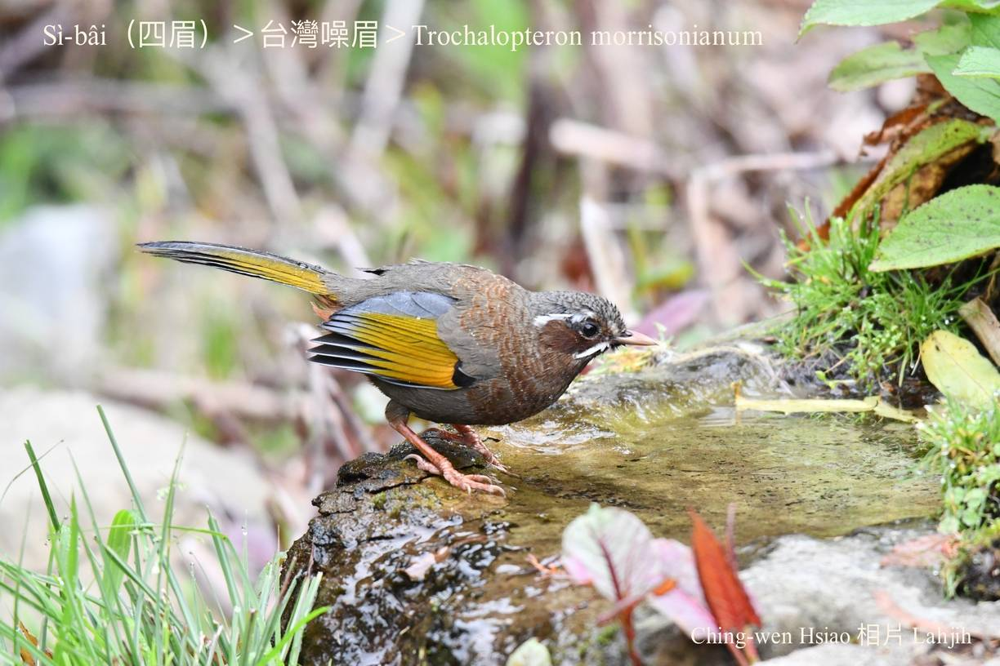
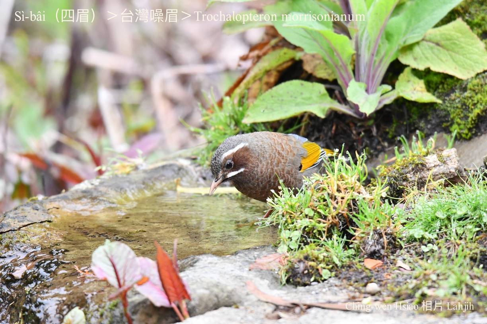
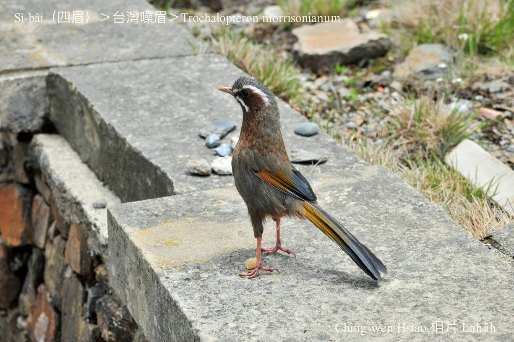
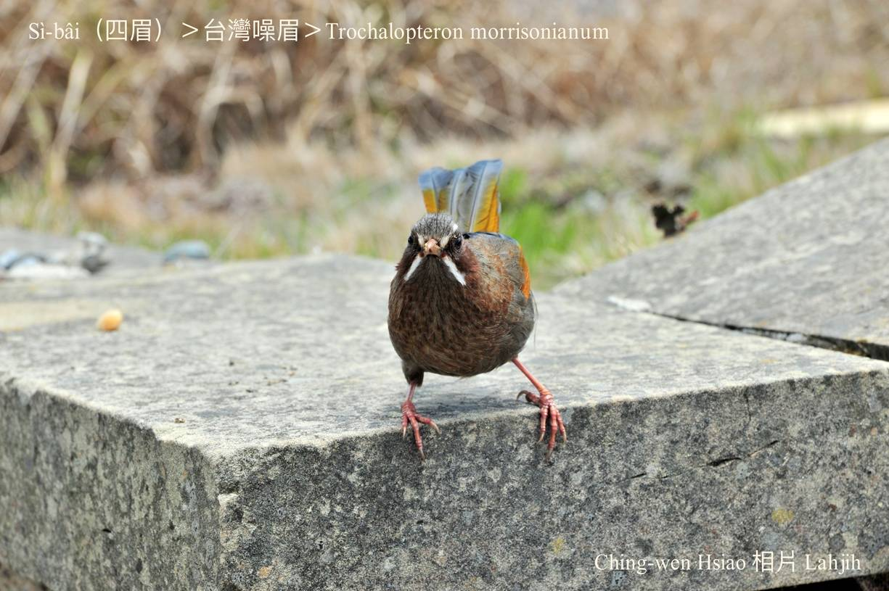
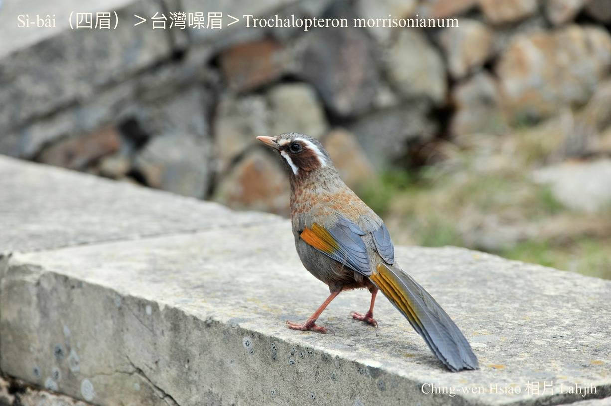
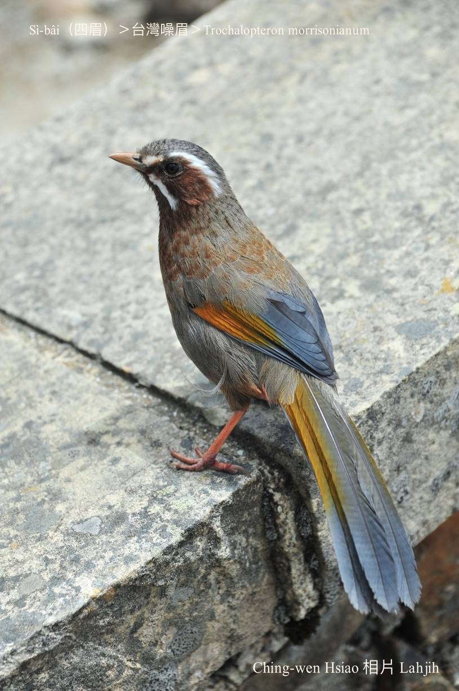
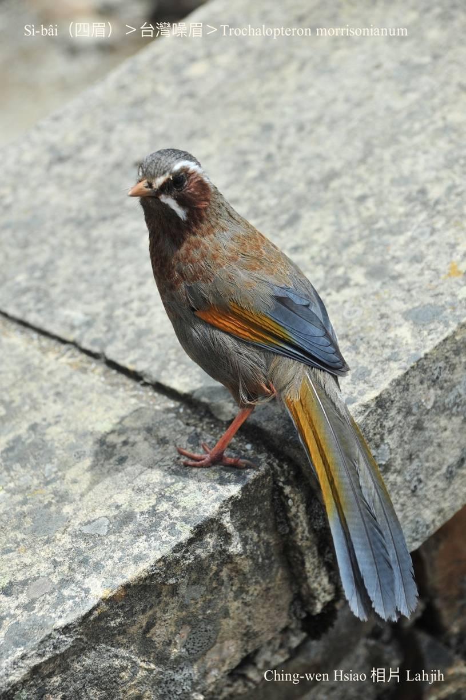
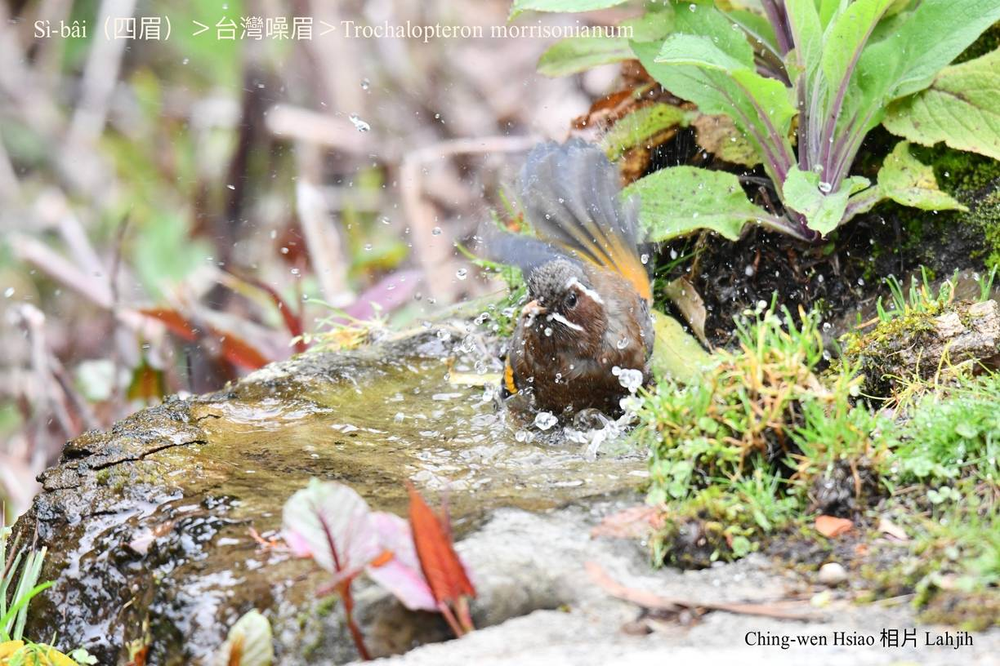
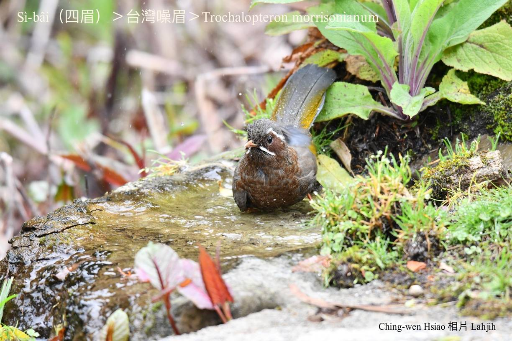
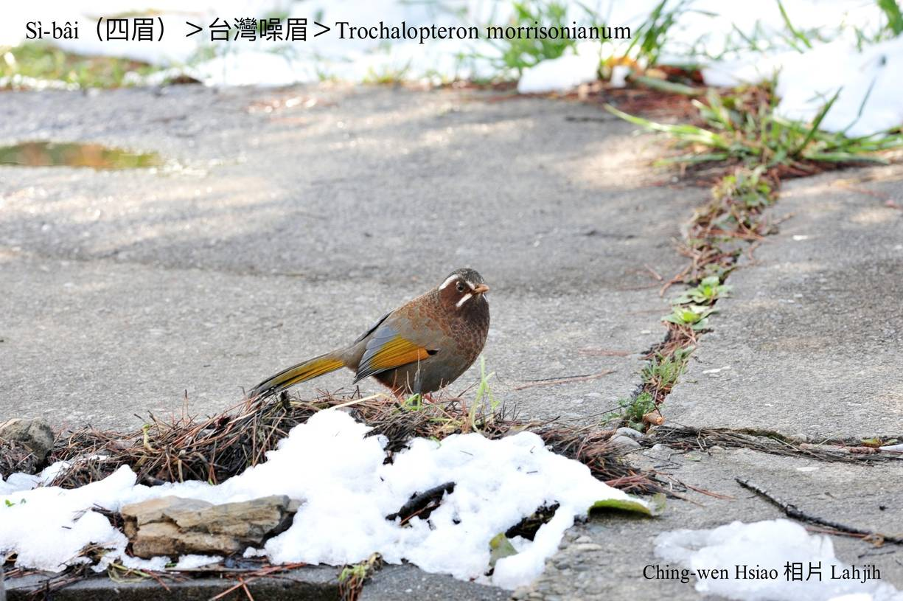

#### 42. Hoe-bî Kho『畫眉科』

|台灣名|中譯名|學名|
|Sì-bâi（四眉）|台灣噪眉|Trochalopteron morrisonianum| 

# 42-5. Sì-bâi（四眉）

Sì-bâi，簡單講to̍h是有4 kâi目眉ê意思。

Sì-bâi ê目chiu頂下有nn̄g-sûn chiâⁿ明顯ê白色羽紋，chiâⁿ做真súi ê 4 kâi目眉。聲音響亮順耳，bē噪人耳。

Sì-bâi是台灣特有種，是台灣『畫眉科』分布tī海拔siāng koân ê鳥類。Kui陣歇tī樹腳、雜草內，mā chiâⁿ-chia̍p出現tī內山厝宅ê厝邊khioh糞埽堆ê食物，háu聲優美響亮，食昆蟲、幼蟲、漿果，有時mā ē食四腳蛇。

身軀是烏鐵花chhap咖啡色花紋，翼股kap尾是烏鐵花chhap金紅幻色，無夠艷麗，m̄-koh chiâⁿ súi。Háu聲「bí-chiú--ŏ͘，bí-chiú--ŏ͘」好聽大聲bē chha̍k-hīⁿ，山友時常tī Tataka khah-chhia路邊看--tio̍h。

# 【Tâi-oân Chiáu-á Liām Koa-si】

### **Sì-bâi Khioh Piáⁿ-iù-á M̄ Chia̍h Chiú**

Bí-chiú--ŏ͘ bí-chiú--ŏ͘

Peh-soaⁿ pêng-iú bô chah chiú

Pun lí chia̍h mī-pau hām piáⁿ-iù-á

Ūi-tio̍h chia̍h

Lí to̍h cheng-phòa hia̍h

Kám m̄-kiaⁿ hō͘-lâng lia̍h-khì bē

Koaiⁿ tiàm chiáu-lang-á té

### 【註解】

|詞|解說|
|Tataka|哆哆咖，『台灣玉山山塊與東埔山塊之間的山口』。|
|khah-chhia|卡車，truck。|

