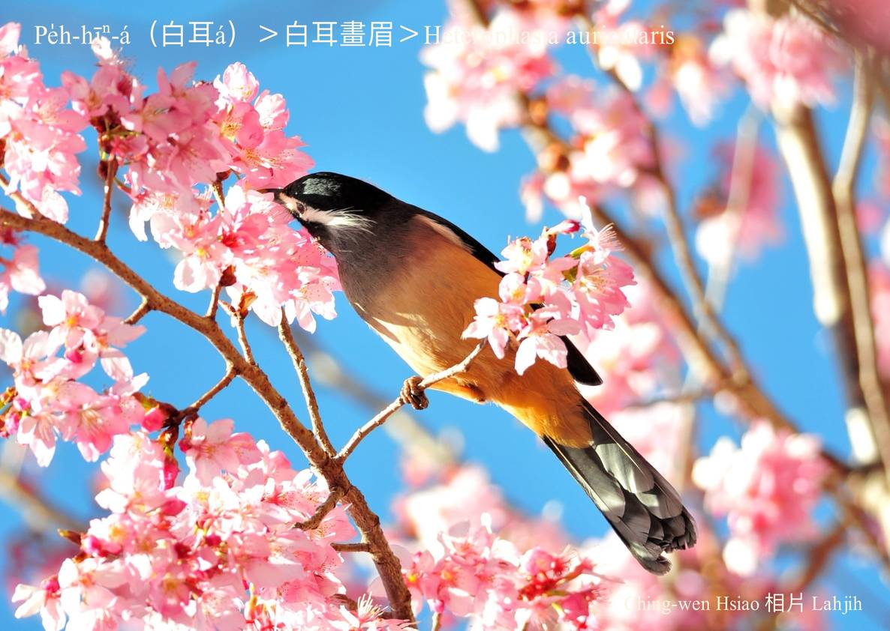
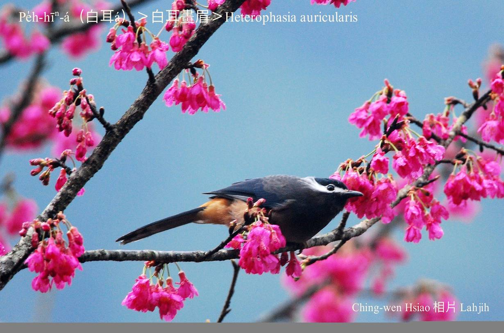
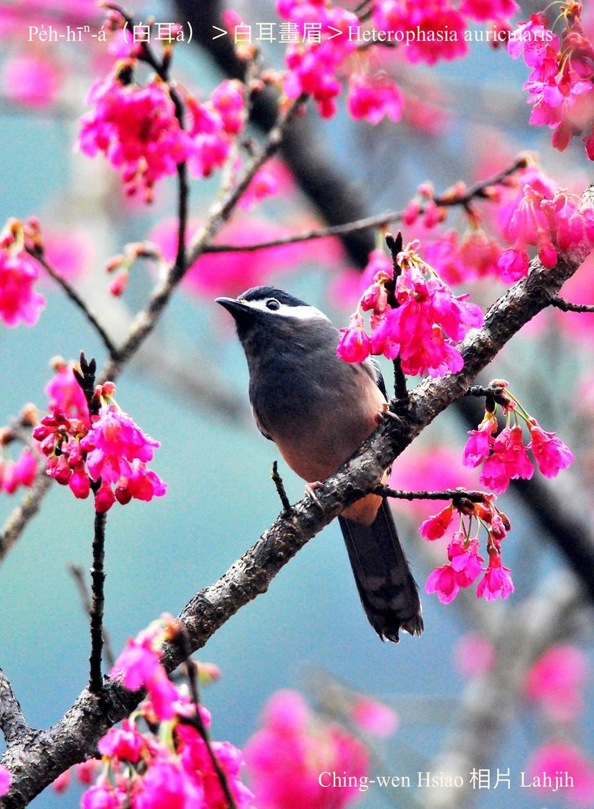
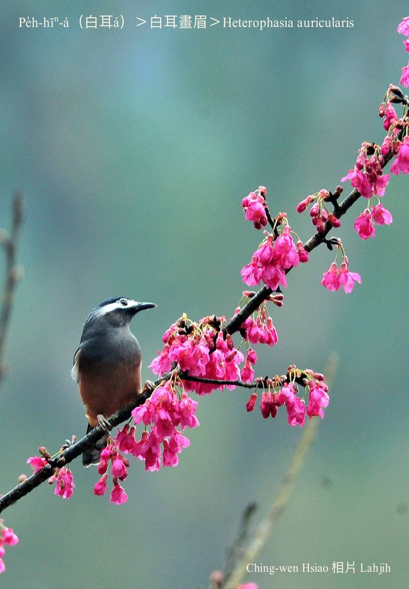
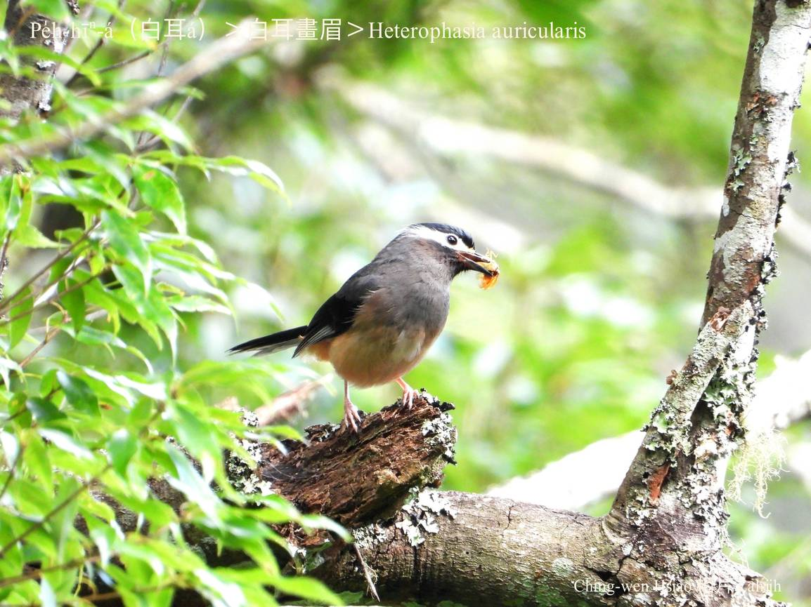
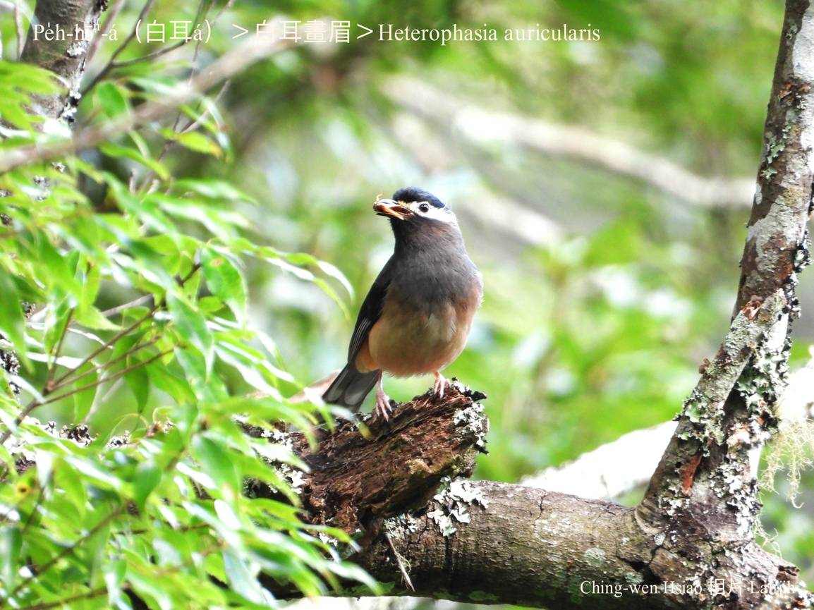
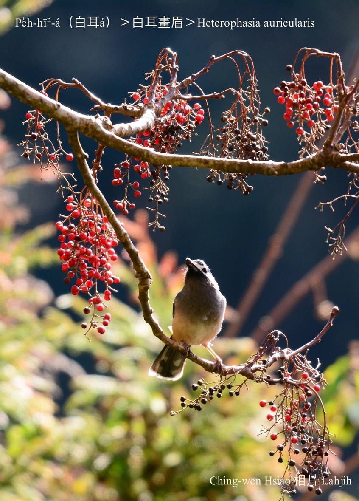
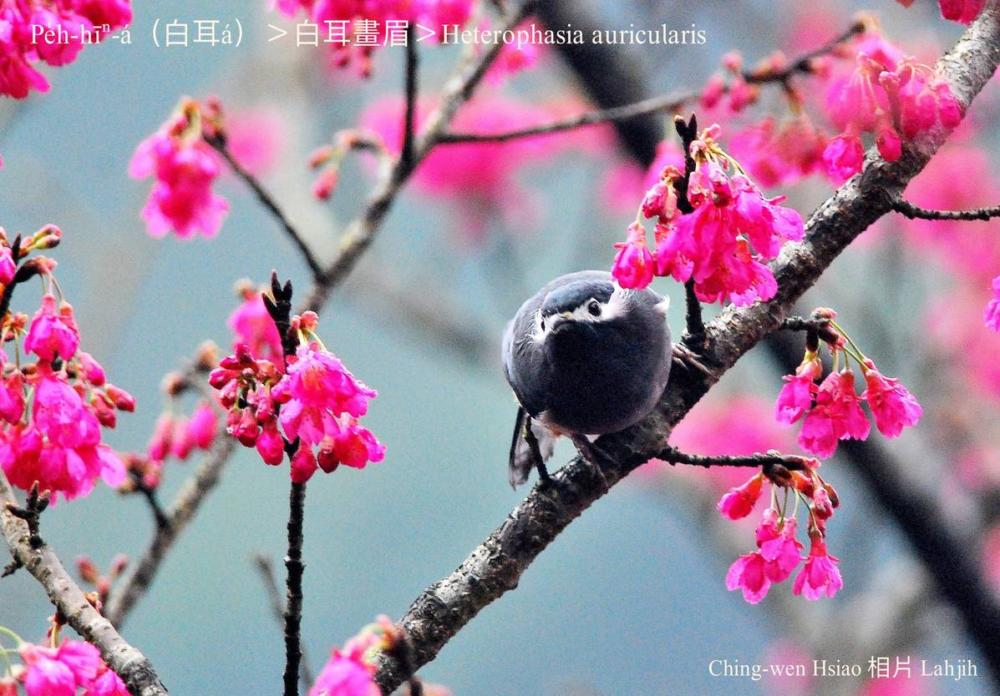

#### 42. Hoe-bî Kho『畫眉科』

|台灣名|中譯名|學名|
|Pe̍h-hīⁿ-á（白耳á）|白耳畫眉|Heterophasia auricularis| 

# 42-6. Pe̍h-hīⁿ-á（白耳á）

Pe̍h-hīⁿ-á有白色ê耳羽，非常明顯影目，ùi嘴pe連到目chiu、耳khang一直到後斗殼á hit chōa無sêng目眉ê白色鳥毛非常大jiah明顯，m̄-chiah hō͘人號做pe̍h-hīⁿ-á。除了白色耳羽，其他烏色頭殼、翼股、尾溜配phú-sek ām-kún、khim-heng hām淺咖啡紅腹肚，kāng-khoán真súi。

Pe̍h-hīⁿ-á是台灣ê特有種，分布tī中海拔山區，生活tī樹尾頂，kui群活動，háu聲優美響亮好聽ē牽聲，咱nā去溪頭thit-thô，頭一個聽tio̍h「kiuh kiuh kiŭ kiú~ kiuh kiuh kiŭ kiú~」保證是pe̍h-hīⁿ-á ê叫聲。

Tī台灣高山聽tio̍h chit khoán尾音ē牽聲ê鳥仔，ùi北美洲來ê愛鳥朋友án-ne講：無論音色a̍h是聲調，kài-sêng美國gín-á看tio̍h美女ê kho͘-si-á聲。不過nā是hō͘人phah生驚a̍h-sī tn̄g-tio̍h天敵，to̍h-ē háu「tek tek tek tek」ê警戒聲。

Pe̍h-hīⁿ-á hèng食昆蟲、幼蟲、果子、漿果kap花蜜。

# 【Tâi-oân Chiáu-á Liām Koa-si】

### **Pe̍h-hīⁿ-á Gâu Kho͘-si-á**

Pe̍h-hīⁿ-á, lí tī tó-ūi teh kho͘-si-á 

Kiàn-pái lâi kàu Khe-thâu, thâu-chi̍t-ê thiaⁿ--tio̍h-ê

To̍h-sī lí tōa-siaⁿ khan-si ê kho͘-si-á siaⁿ

Pe̍h-hīⁿ-á, lí mā-sī chi̍t chiah hoe-bî kám m̄-sī 

Siáng kā lí hīⁿ-á ōe pe̍h-sûn, ōe kah chiah-nī súi

