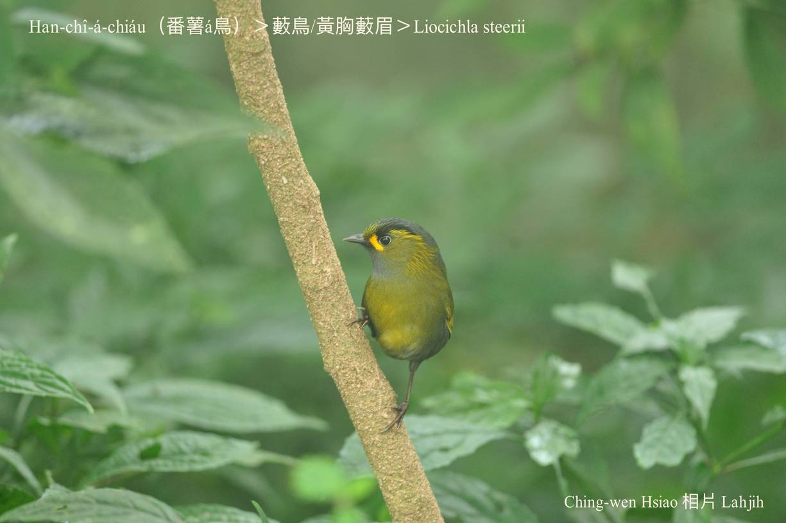
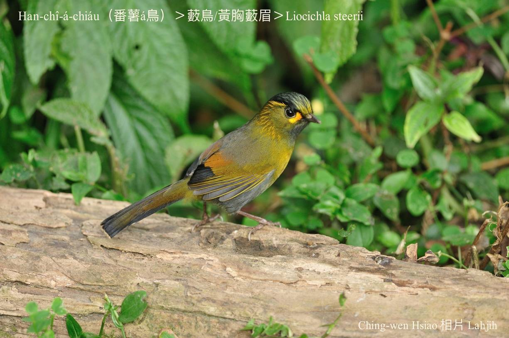
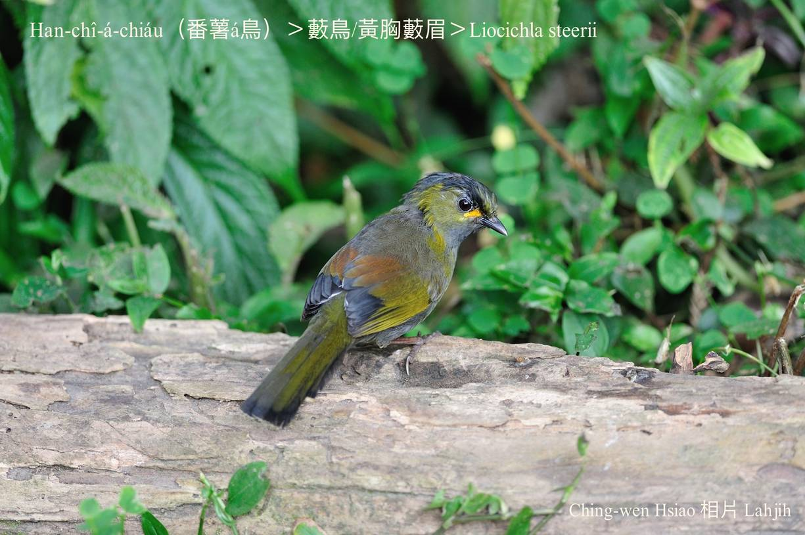
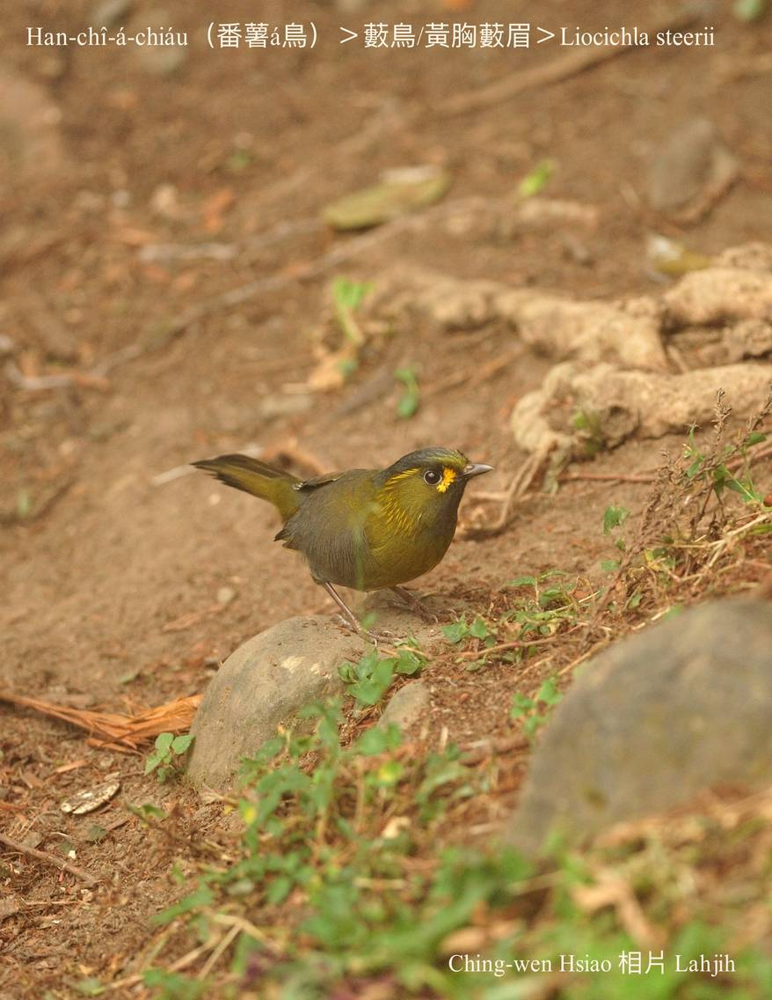
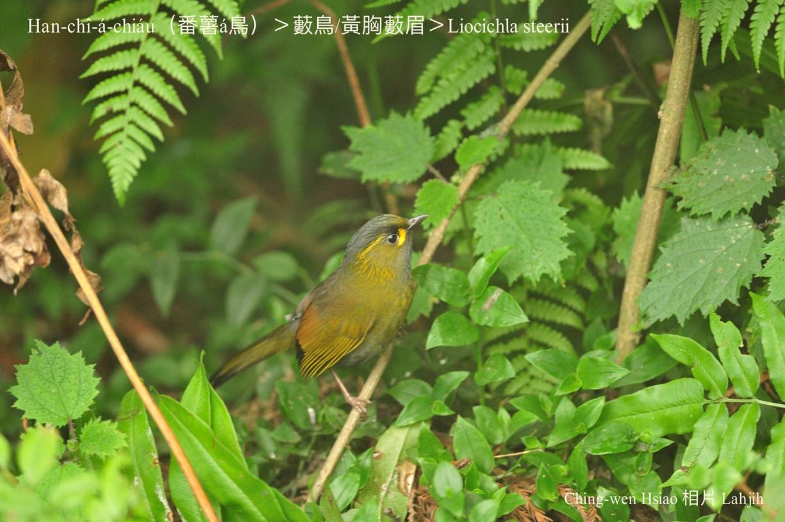
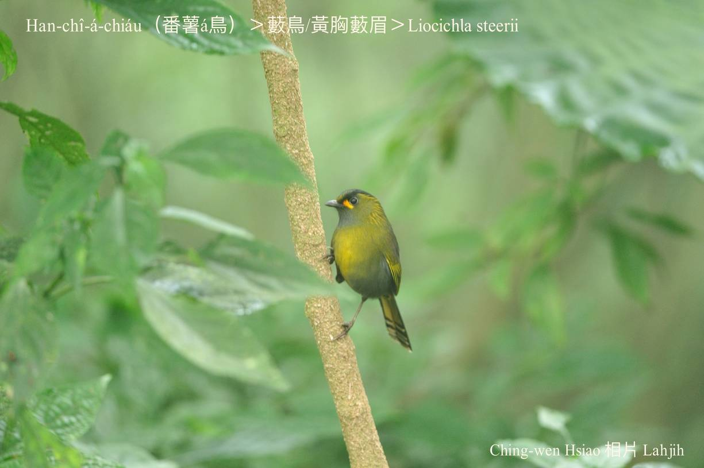
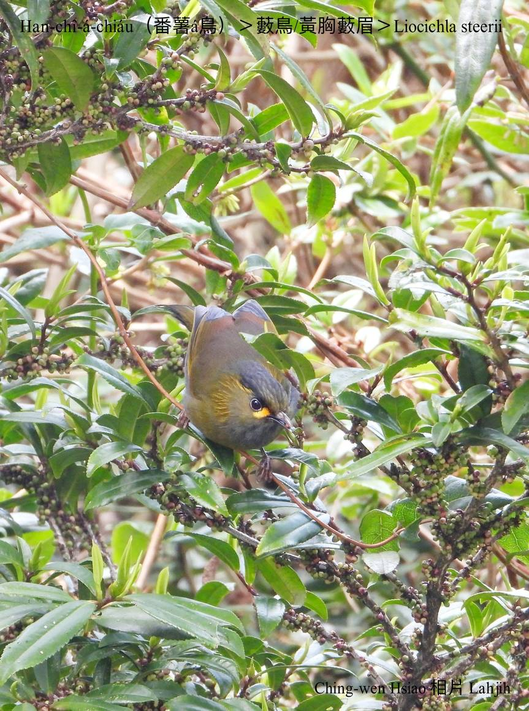
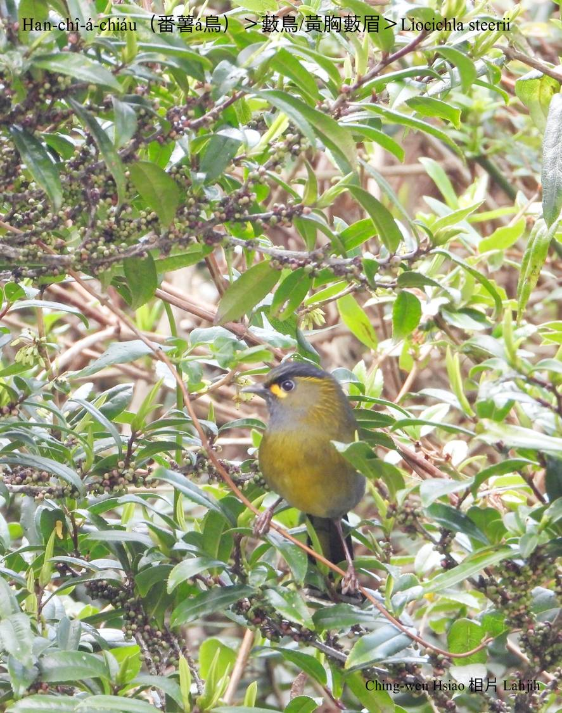
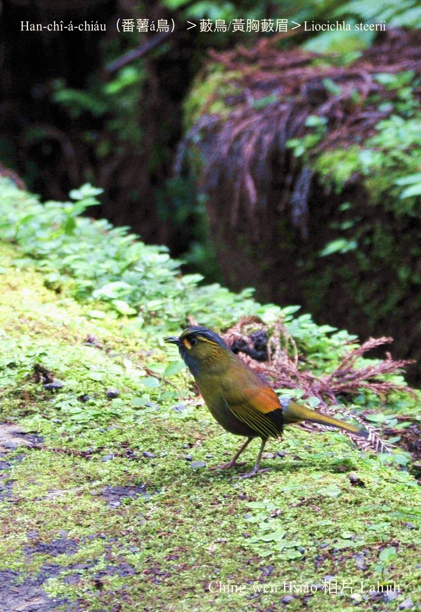

#### 42. Hoe-bî Kho『畫眉科』

|台灣名|中譯名|學名|
|Han-chî-á-chiáu（番薯á鳥）|藪鳥（黃胸藪眉）|Liocichla steerii| 

# 42-7. Han-chî-á-chiáu（番薯á鳥）

Han-chî-á-chiáu主要出入tī樹林低層所在活動，mā時常tī山坡地附近ê蕃薯園chhōe食物，所以ka號做蕃薯á鳥。

Han-chî-á-chiáu是台灣特有種在地鳥，頭、翼尾、尾溜烏phú色，chhun--ê是鹹菜色tài金黃，kui隻khòaⁿ--khí-lâi kài súi-khoán kó͘-chui，分布tī中、低海拔山區，有雜草開闊ê所在kap山溝á中。

Tī風景區，han-chî-á-chiáu ē khioh遊客soa--lo̍h-khì ê食物，m̄驚人，hèng食剌毛á蟲，是雜食性。Tī溪頭時常出現路邊樹腳跳--leh跳--leh，發出「ki~kiŭ~，ki~kiŭ~，ki~kiŭ~，ki~kiŭ~」ê叫聲，chiâⁿ好聽。

# 【Tâi-oân Chiáu-á Liām Koa-si】

### **Han-chî-á-chiáu Ài Tâi-oân**

Han-chî lo̍h-thô͘ ē tèng-kin

Ki-hio̍h nā ōng gâu seⁿ-thòaⁿ

Han-chî-chiáu-á ū Tâi-oân sim

Sio-chio han-chî hn̂g thit-thô

Kî-thāi han-chî kín tōa-tiâu

Bāng boeh Tâi-oân chhut-thâu-thiⁿ

Han-chî-á-chiáu chò-hóe lâi hoah-siaⁿ

Tâi-oân chhut-thâu-thiⁿ! Tâi-oân chhut-thâu-thiⁿ!

Tâi-oân sī lán ê

Siáⁿ-lâng lóng bián siàu-siūⁿ boeh kā lán the̍h

### 【註解】

|詞|解說|
|soa--lo̍h-khì|Chia̍h-mi̍h ê iù-á lak-lo̍h-khì。|

