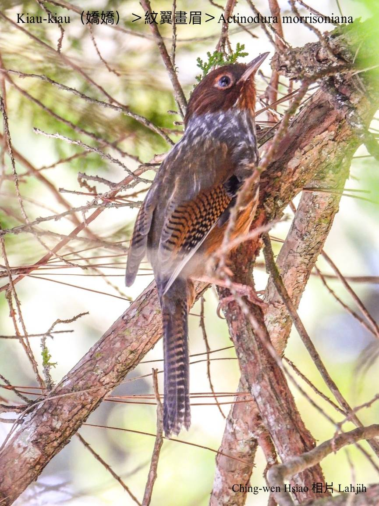
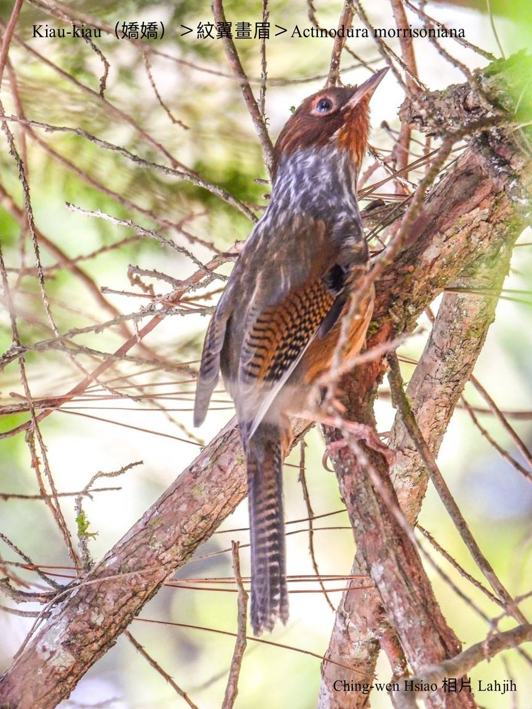
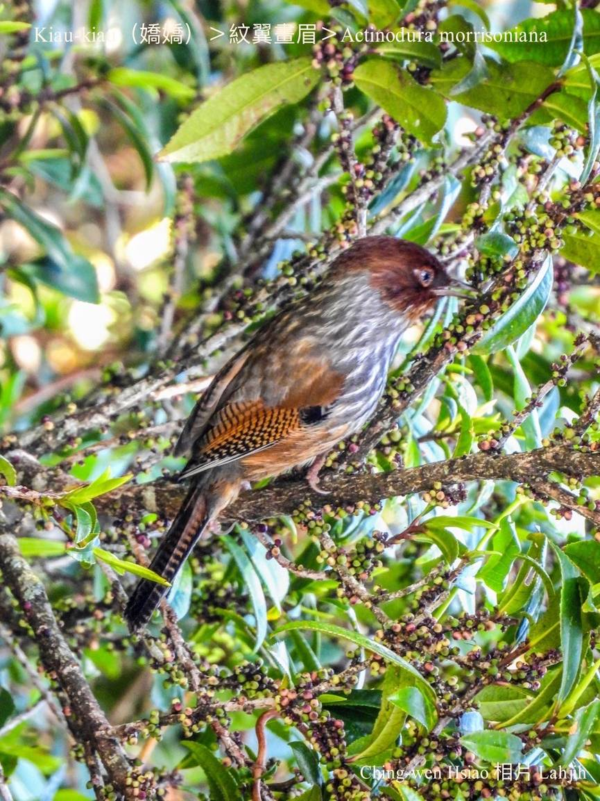
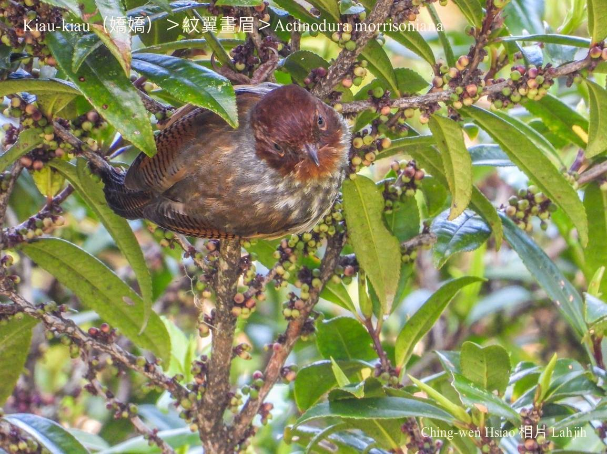
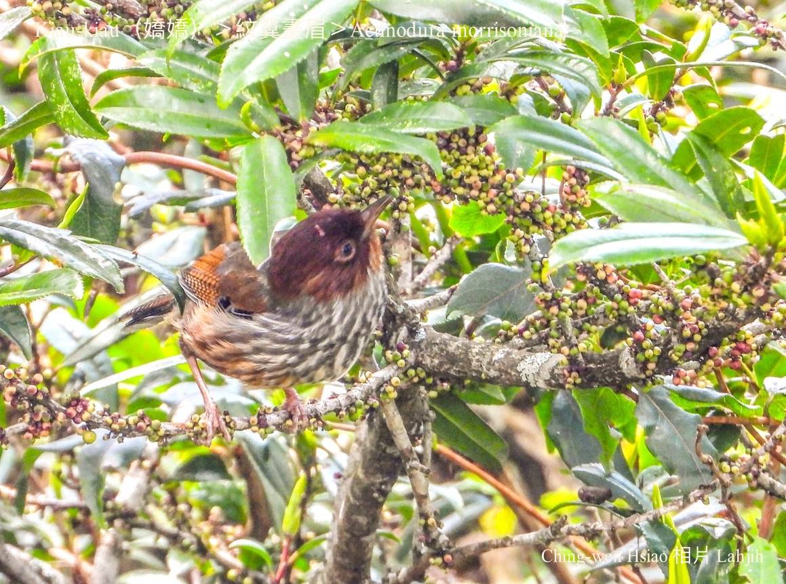
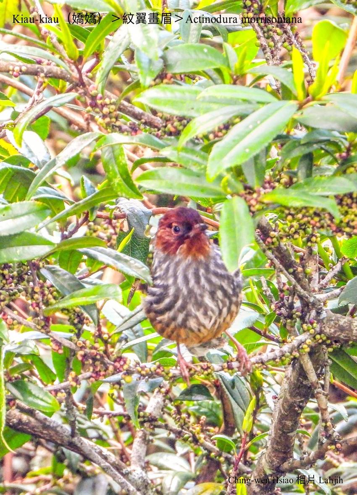

#### 42. Hoe-bî Kho『畫眉科』

|台灣名|中譯名|學名|
|Kiau-kiau（嬌嬌）|紋翼畫眉|Actinodura morrisoniana| 

# 42-8. Kiau-kiau（嬌嬌）

Kiau-kiau生做chiâⁿ古錐，鳥毛插色chiâⁿ-súi，o͘-ka-pi（black coffee）色lām淺ka-pi色koh有條á chōa花紋。細隻活潑hèng tiàm樹椏跳來跳去，有khah無愛飛行，háu-siaⁿ「kiŭ-kiú ki-ki ki-kiú ki-lí-kiú」chiok iù-jī好聽，hō͘人感覺kiau-tih-tih chiok sai-nai，m̄-chiah hō͘ Bunun kā伊號名「kiau-kiau」。

Kiau-kiau kap sì-bî kāng-khoán是分布tī高海拔山區ê代表性鳥類，出現tī針闊葉混合林內活動，寒人chiah sóa到低山區過冬，是無kài普遍ê在地鳥。

Kiau-kiau ê警覺性無koân，時常一群一群tī樹林中、頂層活動，愛食昆蟲kap幼蟲，植物ê新íⁿ幼葉a̍h是漿果。

# 【Tâi-oân Chiáu-á Liām Koa-si】

### **Kiau-kiau Ē-hiáu Tò-thâu-chai**

Kiau-kiau iau-kiau koh súi-khoán

Sió-lia̍p-chí chin sai-nai

Chhiū-oe thiàu-lâi thiàu-khì

Tò-thâu-chai m̄-kiaⁿ poa̍h-lo̍h-lâi

In-ūi kha-jiáu tò-kau-gí-á chiok lī-hāi

### 【註解】

|詞|解說|
|Bunun|『布農族』。|
|tò-kau-gí-á|倒鉤。|

