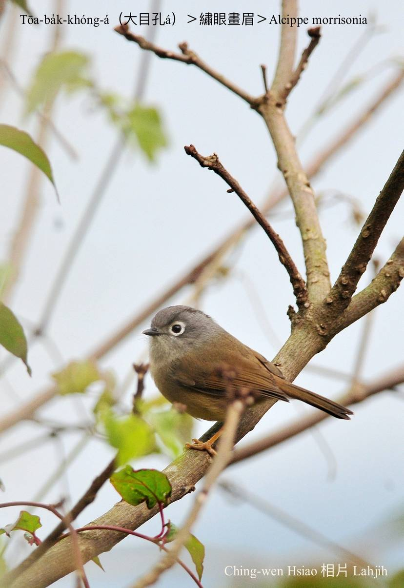
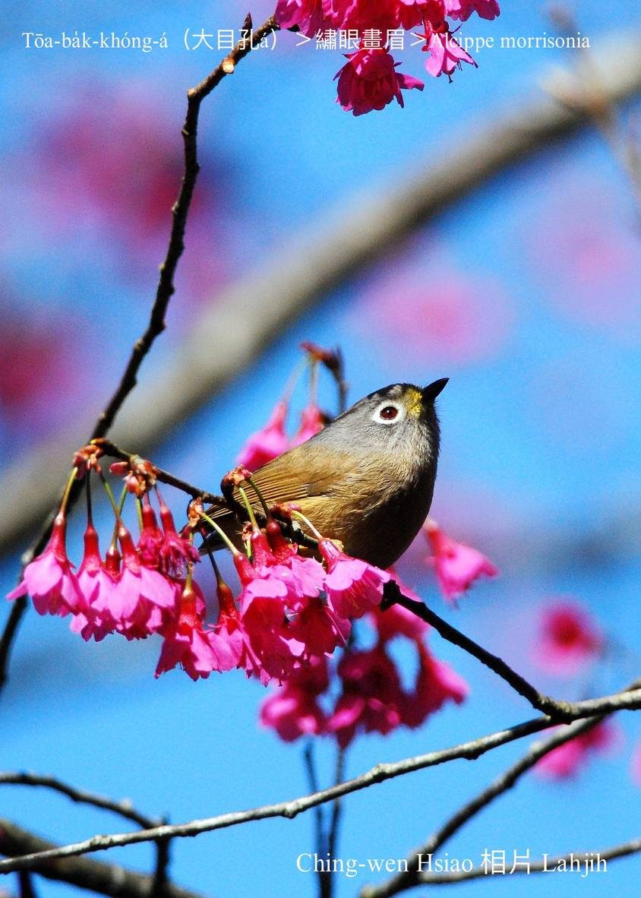
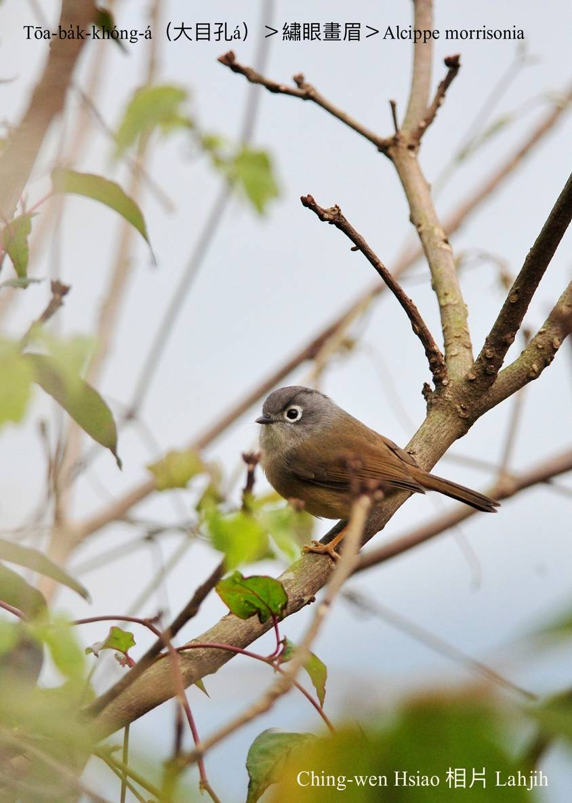
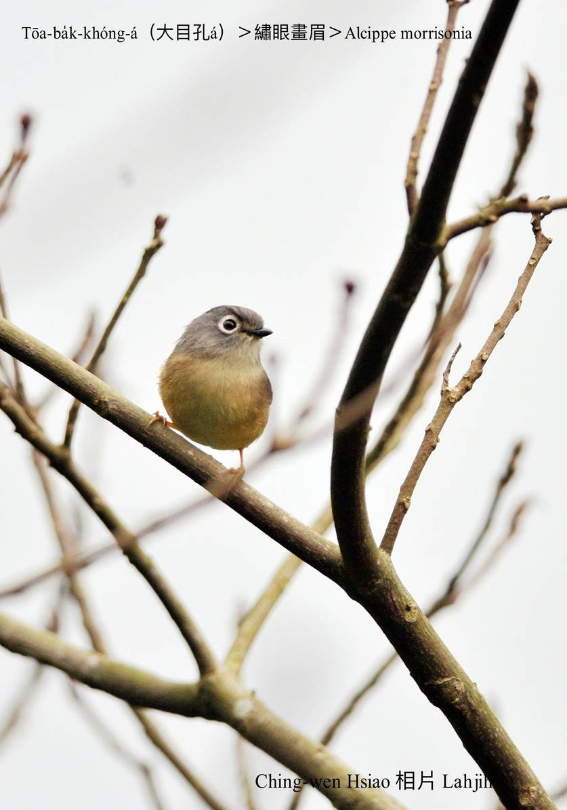
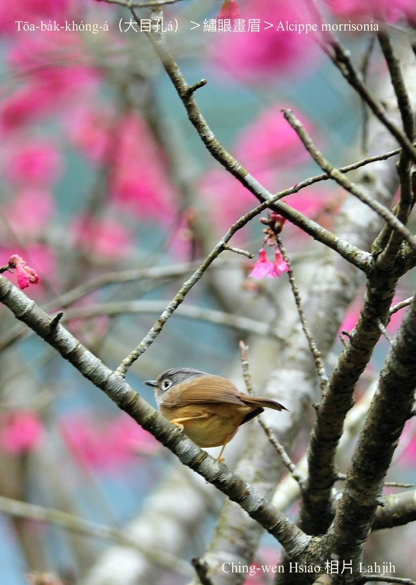

#### 42. Hoe-bî Kho『畫眉科』

|台灣名|中譯名|學名|
|Tōa-ba̍k-khóng-á（大目孔á）|繡眼畫眉|Alcippe morrisonia| 

# 42-9. Tōa-ba̍k-khóng-á（大目孔á）

Tōa-ba̍k-khóng-á hām chheⁿ-tî-á kāng-khoán目chiu大大蕊，其實m̄是in ê目chiu khang大，是in ê目chiu khong chi̍t-ê白白ê圓kho͘-á，chiah hō͘ ba̍k-khóng看--起-來ke真大蕊。

Tōa-ba̍k-khóng-á動作古錐liú-lia̍h，chiâⁿ可愛，是台灣ê特有亞種在地鳥，伊ê學名加「morrisonia」是「玉山ê」ê意思，分布tī中、低山區，時常tī低樹林、竹模、相思á林kui群活動，mā-ē hām其他小型畫眉科鳥，染布鳥lām leh chhōe食物。

Tōa-ba̍k-khóng-á hèng食昆蟲、甲蟲a̍h是幼蟲，mā-ài食漿果。Háu聲「chiú leh chit chip, chiú leh chit chip」音色sió-khóa雜雜。

# 【Tâi-oân Chiáu-á Liām Koa-si】

### **Tōa-ba̍k-khóng-á Ba̍k-chiu Tōa-tōa Lúi**

Tōa-ba̍k-khóng-á tōa-lúi ba̍k-chiu

Ōe hit khong pe̍h sûn gâu ōe-chng

Chheⁿ-tî-á kap-lí kāng-khoán tōa-ba̍k-khóng

M̄-koh i-ê sin-chhēng khah súi lí

Lí kám-bē ba̍k-kháng-chhiah

