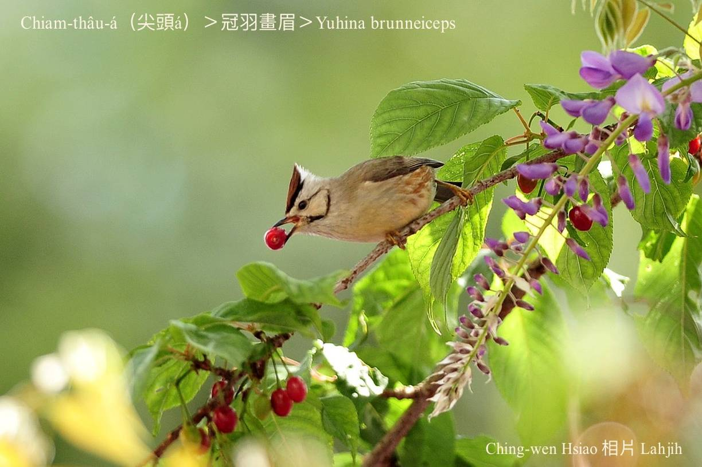
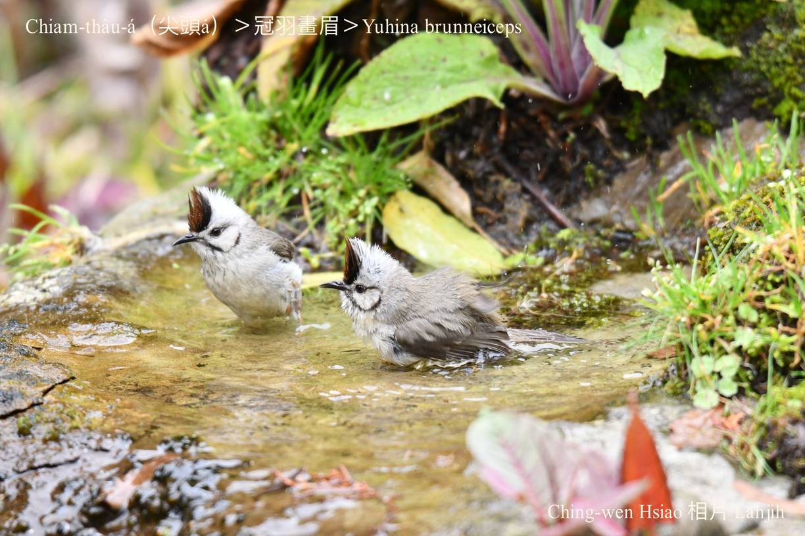
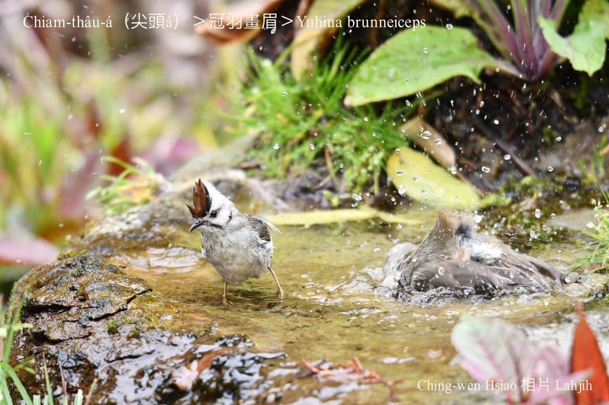
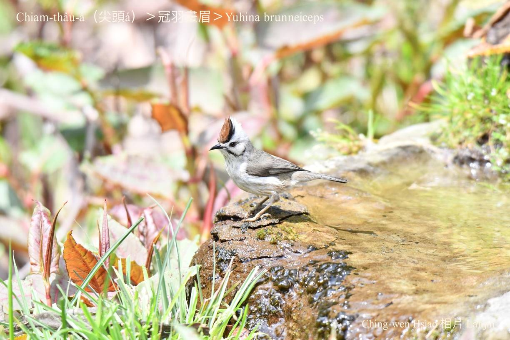
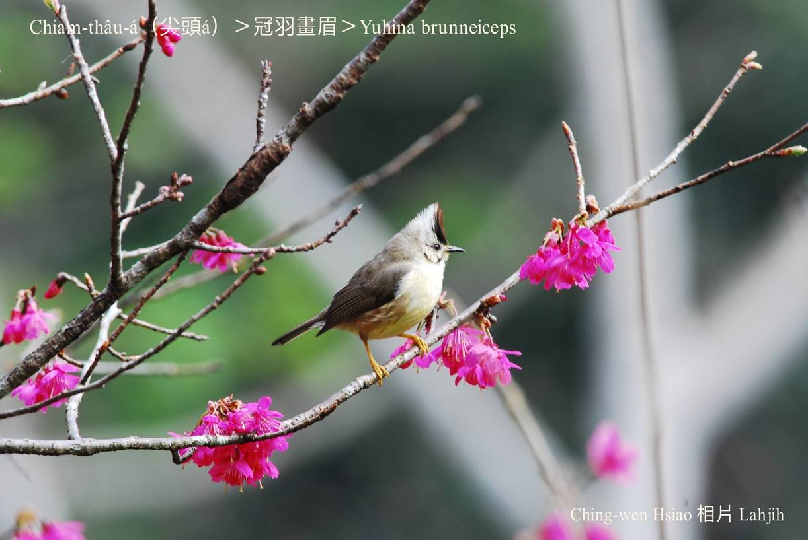
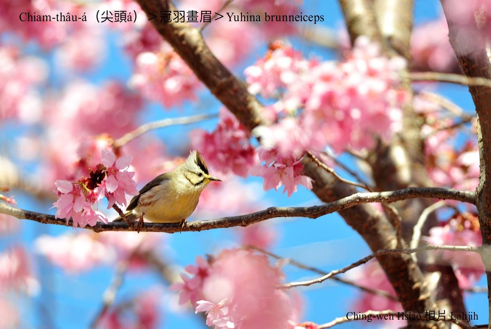

#### 42. Hoe-bî Kho『畫眉科』

|台灣名|中譯名|學名|
|Chiam-thâu-á（尖頭á）|冠羽畫眉|Yuhina brunneiceps| 

# 42-10. Chiam-thâu-á（尖頭á）

Chiam-thâu-á ê頭殼頂有giàng-giàng ê羽冠，chhàng-chhàng親像尖尖ê三角形，前面烏紅ka-pi色，後壁白色，chiâⁿ特別，翼股mā是烏紅ka-pi色，khim-heng、腹肚、腳骨是pe̍h-phú色。

Chiam-thâu-á是台灣ê特有種，kan-na台灣有，生活tī中、低海拔山區，2000~3000公尺ê山區lóng有伊ê腳跡，tòe天氣ê寒熱搬徙，是島內型垂直型搬徙ê在地鳥。四常活動tī雜木林，kui-tīn做夥tī樹林頂chhōe食，以昆蟲、漿果、果子、花蜜做主食。是台灣鳥á唯一kúi-nā對共同做siū、生卵、飼kiáⁿ、生湠ê鳥類。用草á枝、蕨類、蘚苔做材料，做碗形ê siū。

Chiam-thâu-á ê háu聲「chia̍h bí-chiú chut-bí-chiú chia̍h bí-chiú chut-bí-chiú」，聲音chiâⁿ kiat chiâⁿ gâu háu。

Hèng tiàm樹椏跳來跳去，正khiā倒鉤ná像有練khin-kang，chiok無時閒。

# 【Tâi-oân Chiáu-á Liām Koa-si】

### **Chiam-thâu-á Thâu Chiam-chiam**

Chiam-thâu-á chiam-thâu-á thâu chiam-chiam

Thâu-khak-bóe-téng mo͘ chhàng-chhàng 

Ài chia̍h kóe-chí, hoe-bi̍t, kap thâng

Chhiū-á-bóe-téng chin oa̍h-tāng

Thiàu, poe, tò-tiàu, tò-kau, bē su kâu

Chiok-ài chio-phōaⁿ chò-siū seⁿ-thòaⁿ

Hō͘-siōng chiàu-kò͘, kám-chêng sio-thàu

### 【註解】

|詞|解說|
|蕨類|Koat，kòe-niau-chháu。|
|蘚苔|Sián-tâi，chheⁿ-thî。|
|khin-kang|輕功。|
|無時閒|『一刻都不得閒』。

