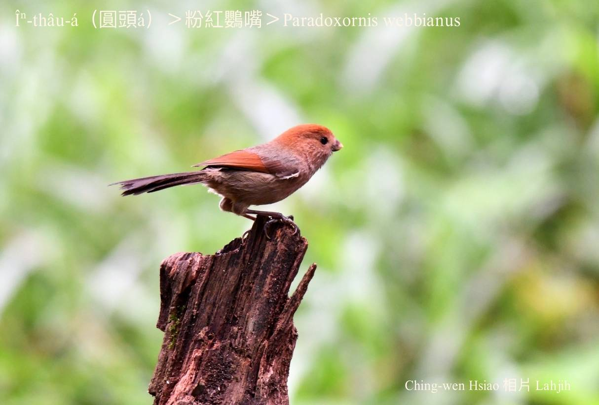
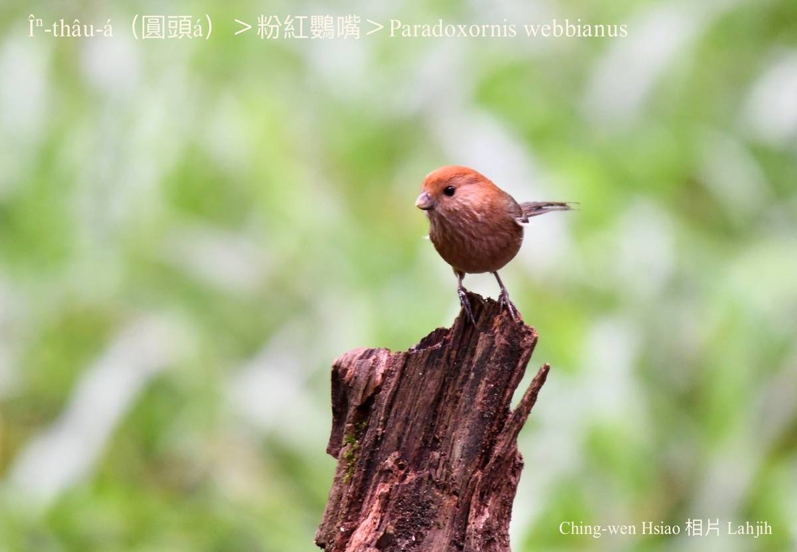
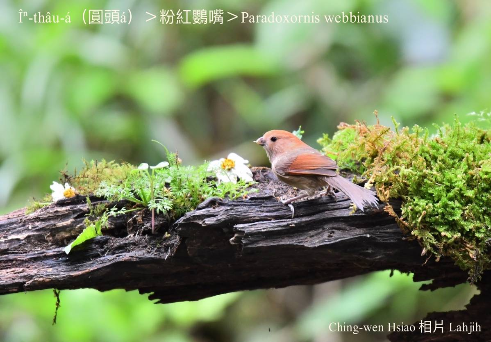
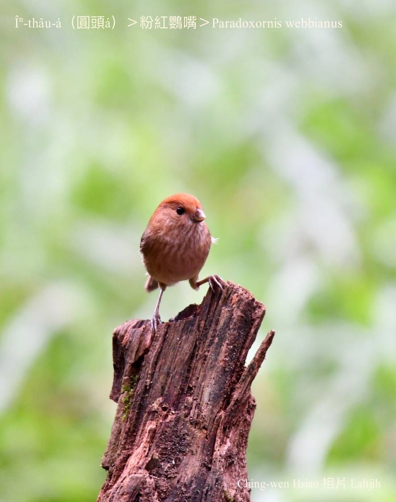
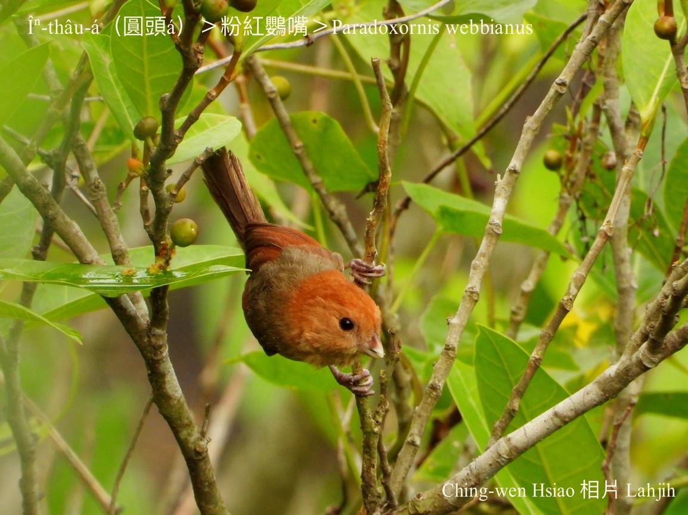
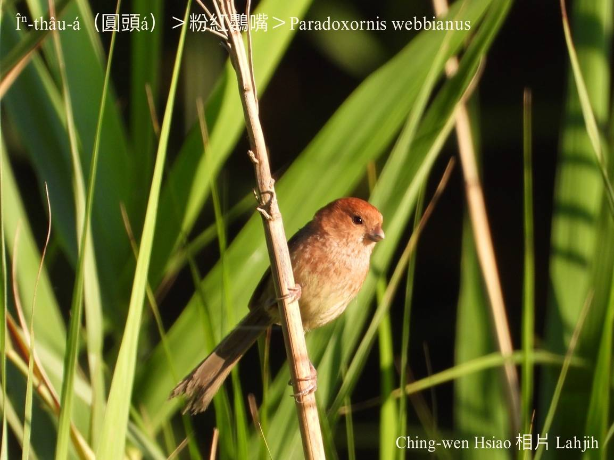
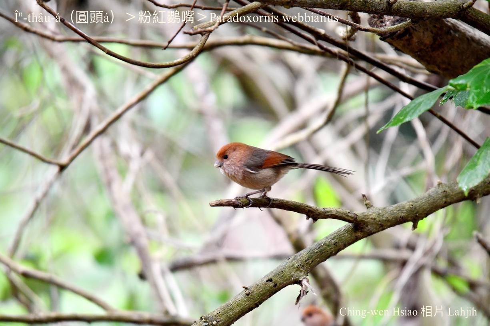
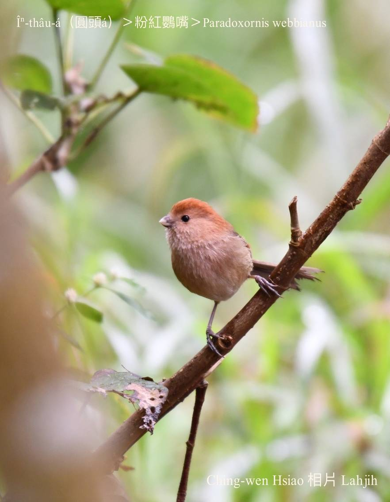
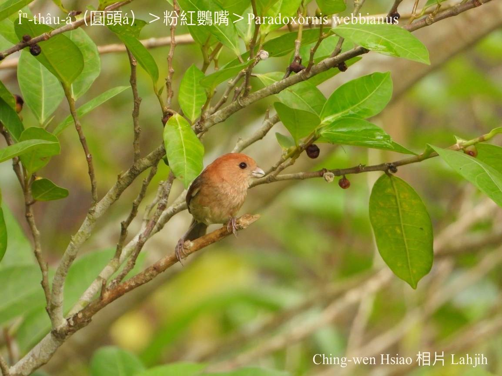
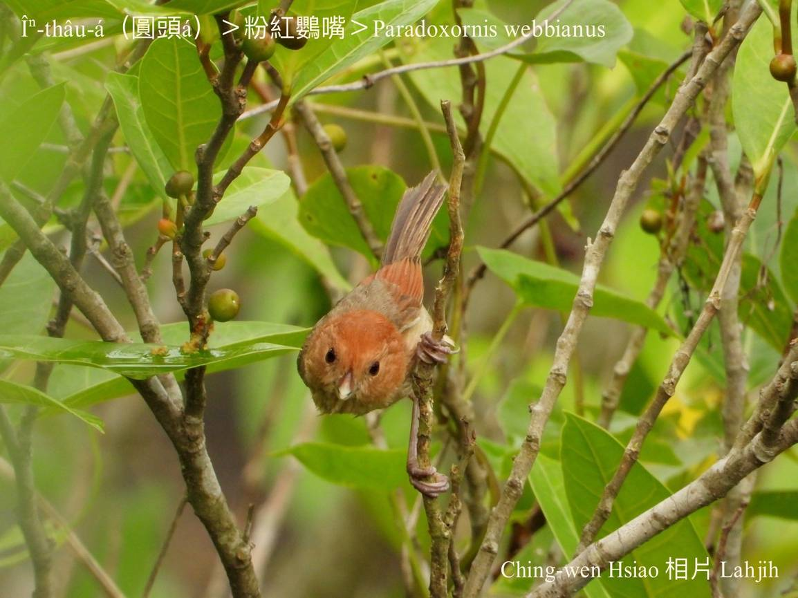

#### 43. Eng-chhùi Kho『鸚嘴科』

|台灣名|中譯名|學名|
|Îⁿ-thâu-á（圓頭á）|粉紅鸚嘴|Paradoxornis webbianus|

# 43-1. Îⁿ-thâu-á（圓頭á）

Îⁿ-thâu-á是台灣特有亞種在地鳥，山腳到中海拔山區lóng有伊ê腳跡。大部分歇tī低木林、低樹á欉a̍h是草á埔，無leh生湠期間lóng kui-tīn做夥生活，有時mā-ē kap tōa-ba̍k-khóng-á、染布鳥、山紅頭chit款細隻鳥仔lām陣活動chhōe食。Tī低樹欉、竹模、soan籐植物頂做碗型ê siū，食草á籽、漿果、幼葉kap細尾蟲á。

Îⁿ-thâu-á公母外形kāng-khoán，頭圓圓，頭殼翼股咖啡紅，khim-heng、腹肚、尾是烏鐵灰，細粒子chiok活潑活動，mā chiâⁿ有社會性做夥活動，háu聲iù-jī吵雜。

# 【Tâi-oân Chiáu-á Liām Koa-si】

### **Îⁿ-thâu-á Sìm-sìm Ki Sìm-sìm Hio̍h**

Îⁿ-thâu-á thâu îⁿ-îⁿ bóe khiàu-khiàu

Thíⁿ-thíⁿ-chiah-á sió-lia̍p-chí

Tiàm chháu-phō thiàu lâi thiàu khì

Sìm-sìm ki sìm-sìm hio̍h tián-kang-hu

Kho͘-si-á chi̍h-chiu̍h hoaⁿ-hí thit-thô 

### 【註解】

|詞|解說|
|sìm-sìm ki sìm-sìm hio̍h|韭菜葉親像枝mā親像葉，細隻鳥仔歇tiàm面頂sìm--leh sìm--leh。|
|Thíⁿ-thíⁿ-chiah-á|Thíⁿ-thíⁿ-chiah-á，tháiⁿ-tháiⁿ-chiah-á，sè-sè-chiah-á，tih-tih-chiah-á；小粒子細細隻。|
|kho͘-si-á chi̍h-chiu̍h|鳥仔叫聲。|

