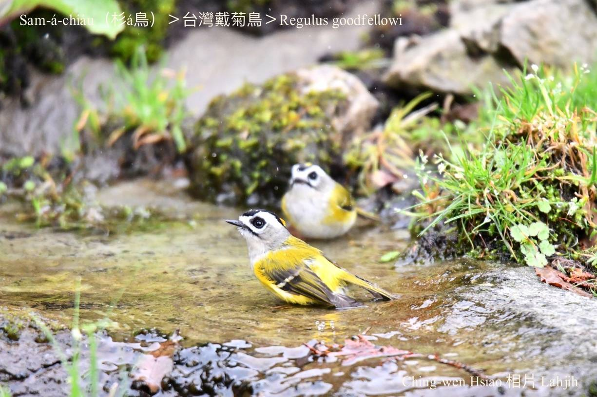
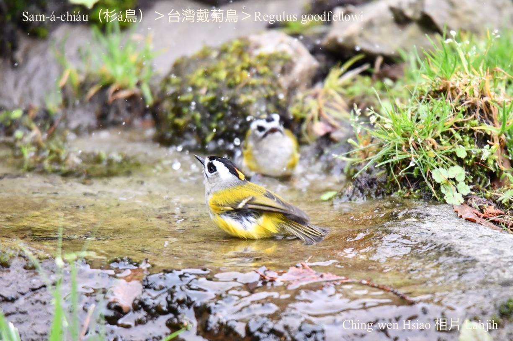
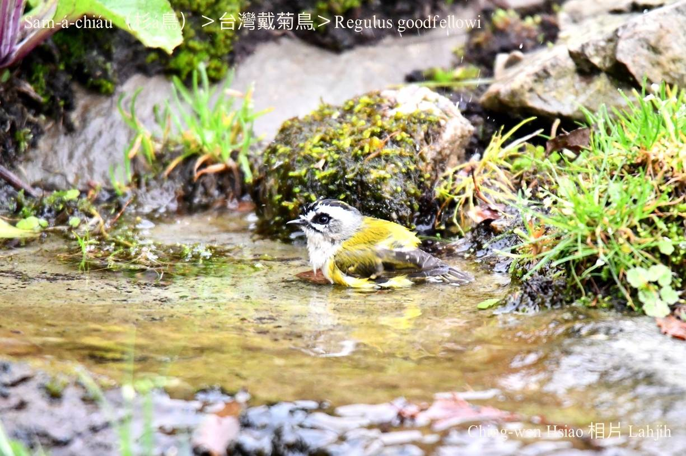
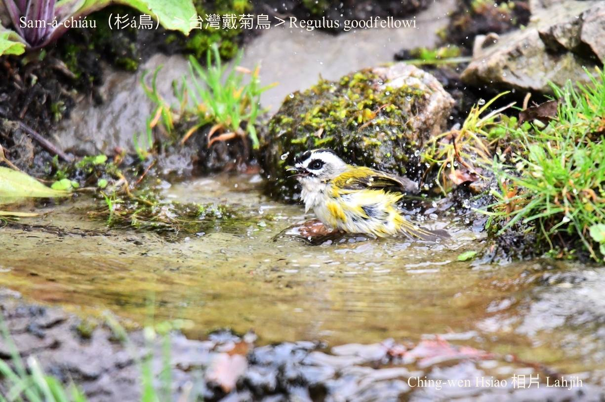
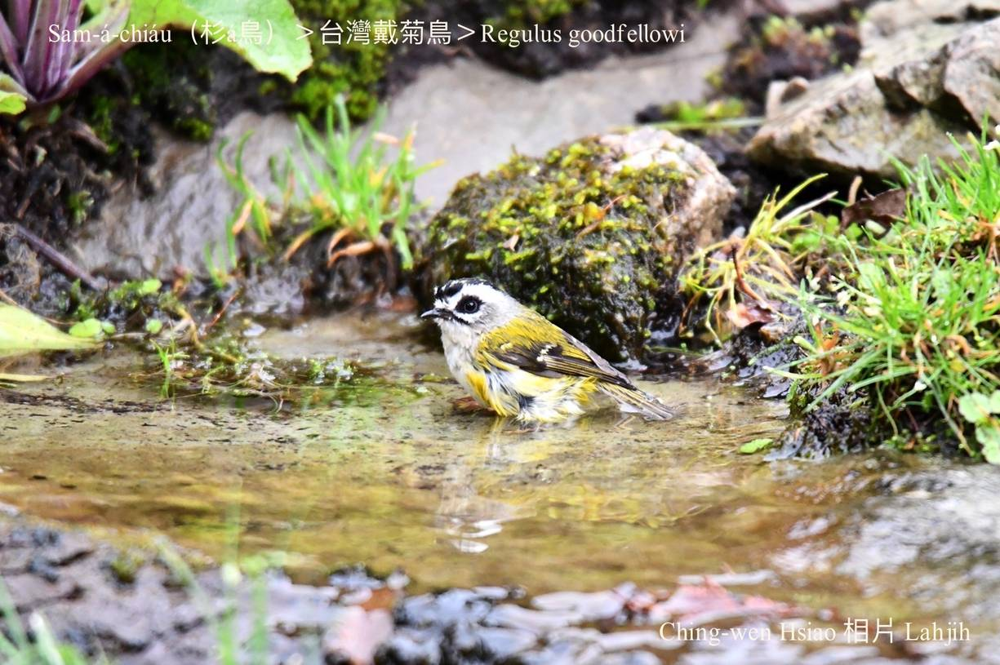
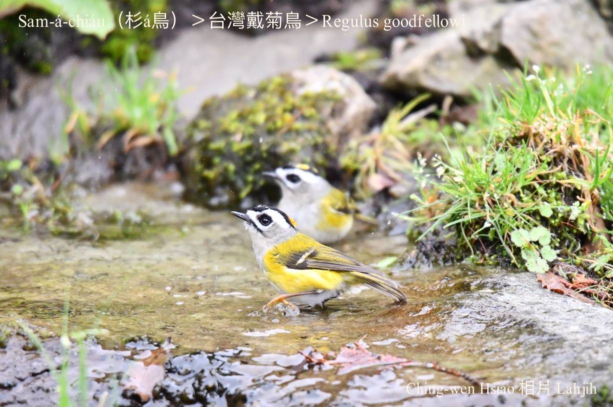
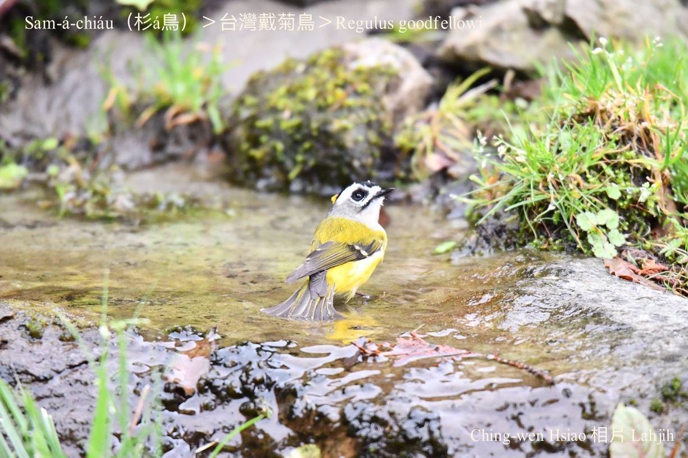
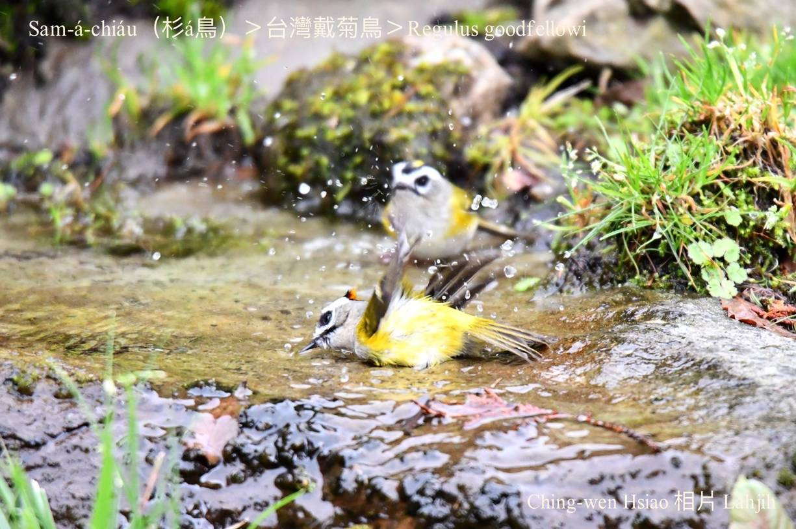

#### 44. Eng Kho『鶯科』

|台灣名|中譯名|學名|
|Sam-á-chiáu（杉á鳥）|台灣戴菊鳥|Regulus goodfellowi|

# 44-2. Sam-á-chiáu（杉á鳥）

Sam-á-chiáu分布tī高海拔山區，生活tī鐵杉a̍h是冷杉林內底，tī樹尾頂活動chhōe食。

Sam-á-chiáu tī生湠期間ē展開羽冠，真súi，平常時hō͘兩旁烏色ê羽毛khàm tiâu--leh，kan-na ē-tàng看tio̍h一sûn黃色斑紋。生性活潑，hèng食松、杉、檜木ê種子，細尾蟲á、昆蟲mā ài食。

Sam-á-chiáu生做小細細細隻á，chiok kó͘-chui。鳥公頭殼有紅柑á色羽冠，鳥母黃色khah無影目。Hèng食細隻昆蟲，真少食植物種子。Kah意hām其他小型鳥類做夥活動。
真gâu kho͘-si-á koh-ē chiuh-chiuh叫，tiàm樹枝跳koân跳kē，有夠快樂。

Sam-á-chiáu是台灣chiâⁿ普遍ê在地鳥，mā是台灣特有種，寒天時ē ùi koân山徙位到低山歇寒。

