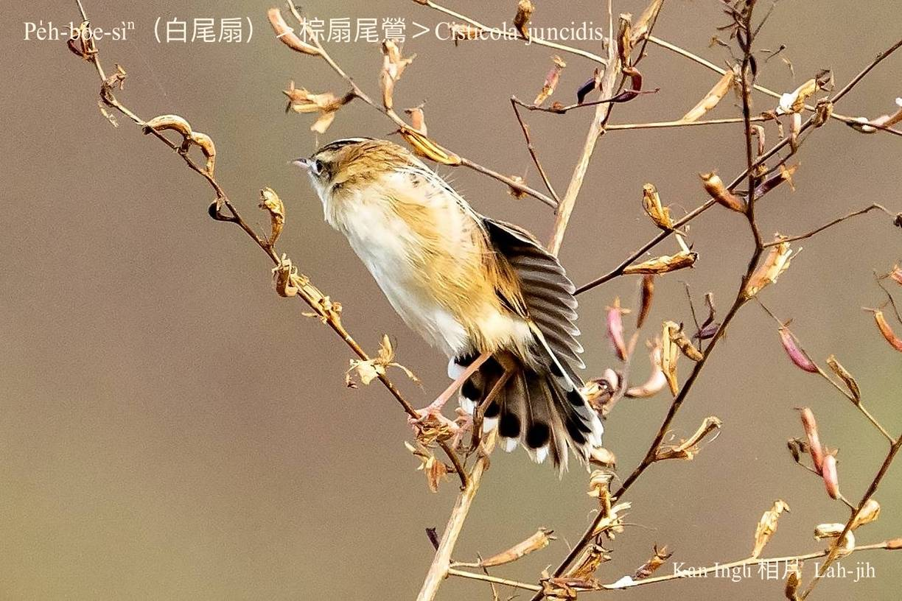
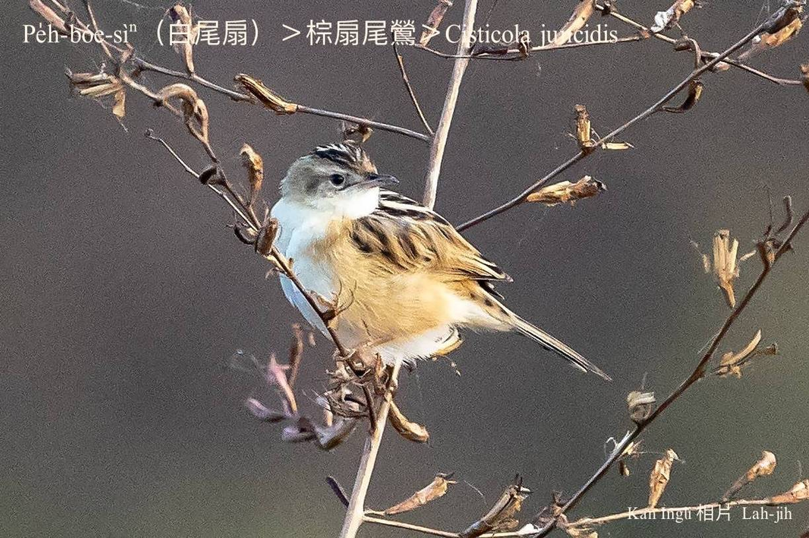

#### 44. Eng Kho『鶯科』

|台灣名|中譯名|學名|
|Pe̍h-bóe-sìⁿ（白尾扇）|棕扇尾鶯|Cisticola juncidis|

# 44-3. Pe̍h-bóe-sìⁿ（白尾扇）

Pe̍h-bóe-sìⁿ tī leh飛行ê時，ē展開伊ê尾羽，親像thián-khui一支合á扇，koh有chiâⁿ明顯ê白色斑。

Pe̍h-bóe-sìⁿ tī台灣是普遍ê在地鳥，歇tī農耕地、溪埔、路邊雜草內底，飛行路線成~~~~形，chim-mī飛chim-mī「ti-ti、ti-ti、ti-ti…」háu無停，有時ē飛chiok koân了後，chiah倒頭栽衝入去草埔內。Hèng食昆蟲、幼蟲、草籽、植物ê幼íⁿ。

### 【註解】

|詞|解說|
|合á扇|Ha̍p-á-sìⁿ，『摺扇』。|

