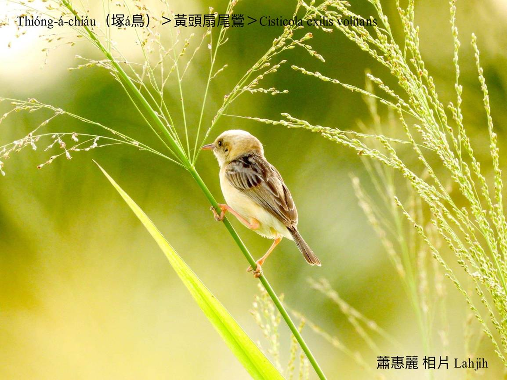
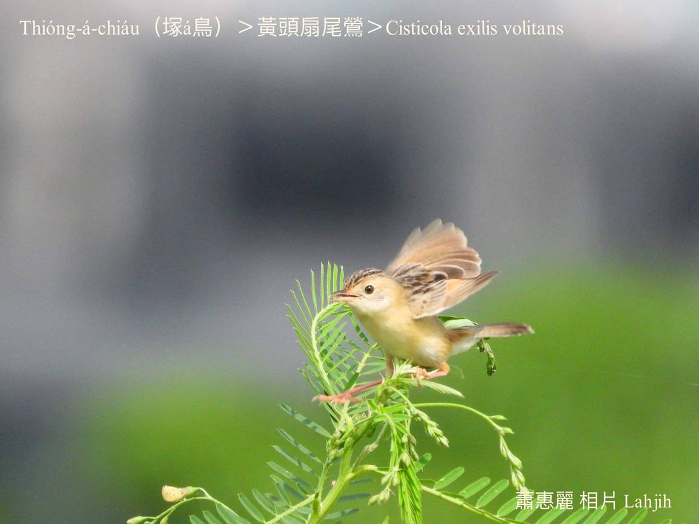
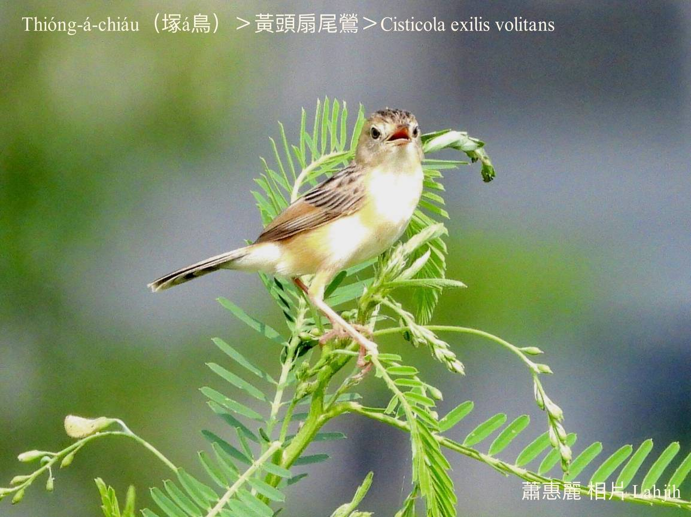
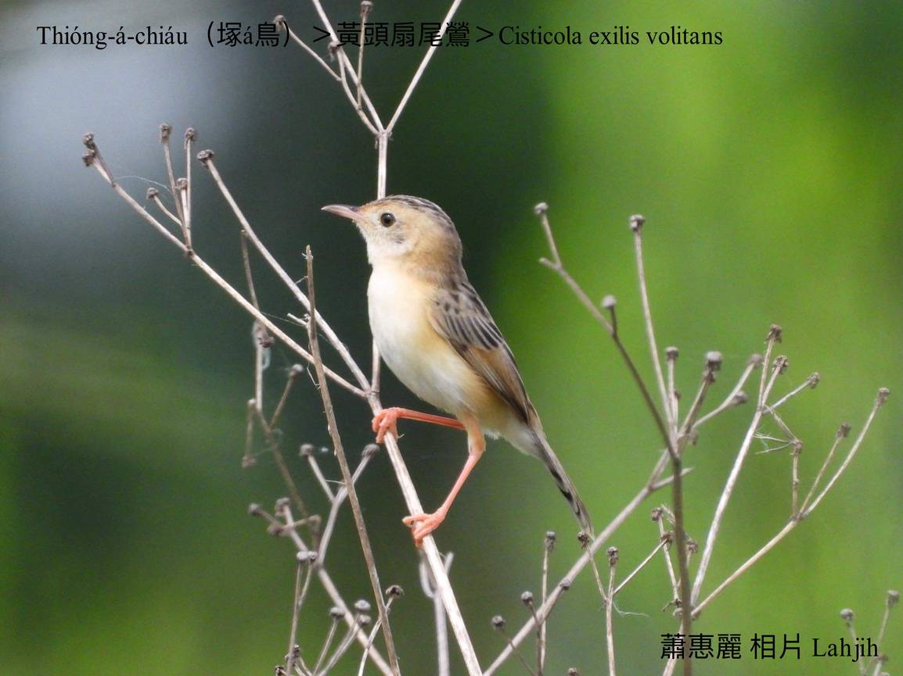
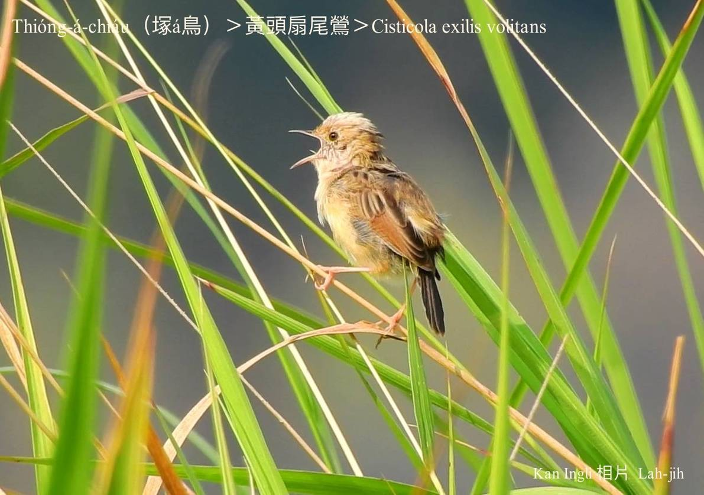
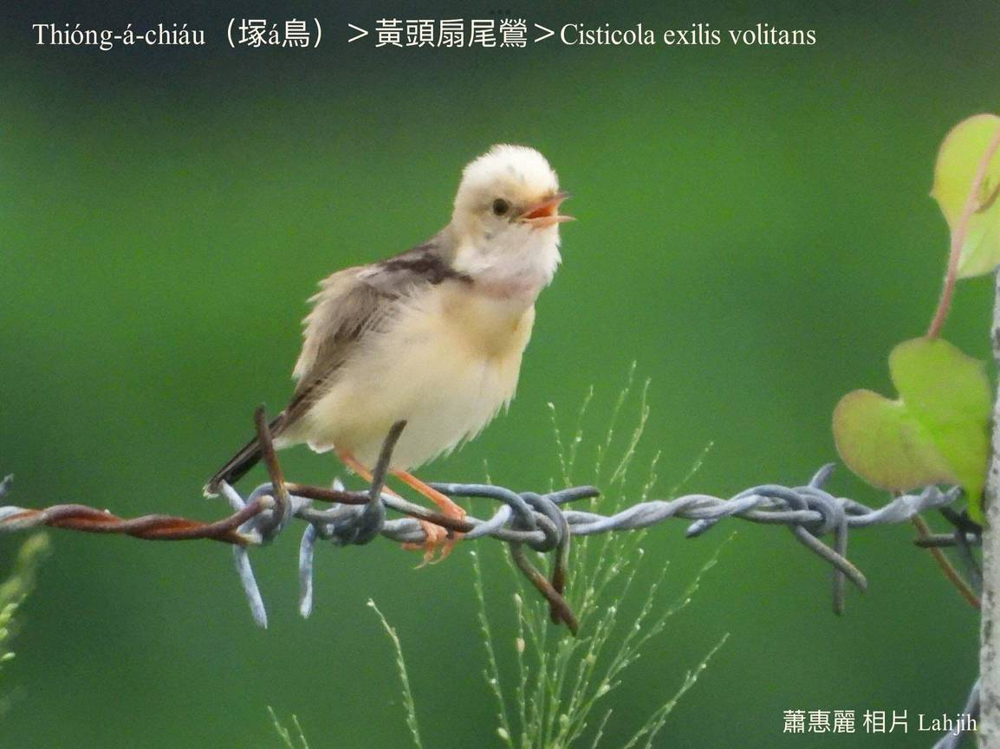
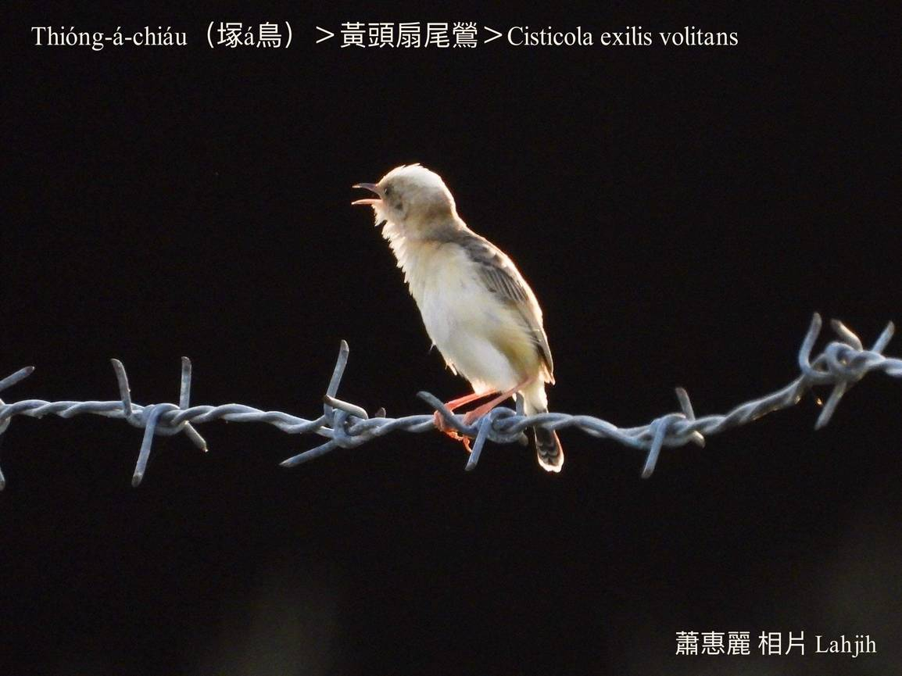

#### 44. Eng Kho『鶯科』

|台灣名|中譯名|學名|
|Thióng-á-chiáu（塚á鳥）|黃頭扇尾鶯|Cisticola exilis volitans|

# 44-4. Thióng-á-chiáu（塚á鳥）

Thióng-á-po͘  to̍h是bōng-á-po͘，khah早台灣ta̍k-só͘-chāi lóng-ú thióng-á-po͘。

Thióng-á-chiáu大部分歇tī馬纓丹、菅芒雜草拋荒ê塚á埔所在，而且háu聲「Chŭ uih，kŭi。Chŭ uih，kŭi。」ùi四方傳來，而且保護色chiâⁿ好，有聽見聲無khàiⁿ-tio̍h影，soah hō͘過路人淡薄á恐怖ê感覺，m̄-chiah hō͘人號做thióng-á-chiáu。

Thióng-á-chiáu分布tī低海拔山區到平原，墓á埔、拋荒雜草真旺ê所在，生湠期間，公鳥ē歇tiàm草á枝，kā伊ê冠羽chhèng kah phòng giâ-giâ，一直háu無停，有時á ē像半天á án-ne，ná飛ná koân，飛tiàm半空中唱歌，然後無張無持chiah ùi空中直線衝落來草phō內。用菅芒草花穗為材料做袋á形ê siū。

### 【註解】

|詞|解說|
|thióng-á-po͘|塚á埔，『墓地』。|
|bōng-á-po͘|墓á埔，『墓地』。|
|半天á|Pòaⁿ-thiⁿ-á，『雲雀』。請看29-1。|

