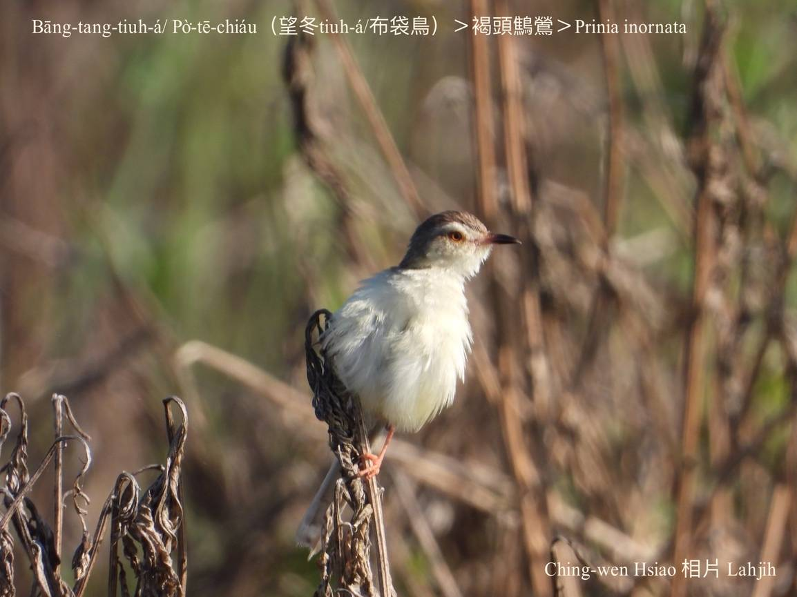
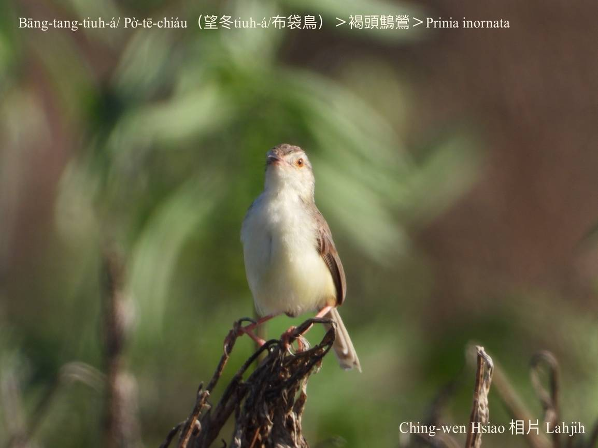

#### 44. Eng Kho『鶯科』

|台灣名|中譯名|學名|
|Bāng-tang-tiuh-á/Pò͘-tē-chiáu（望冬Tiuh-á/布袋鳥）|褐頭鷦鶯|Prinia inornata|
|Bāng-tang-tiuh-á/Pò͘-tē-chiáu（望冬Tiuh-á/布袋鳥）|灰頭鷦鶯|Prinia flaviventris|

#### 44-5. Bāng-tang-tiuh-á/Pò͘-tē-chiáu（望冬Tiuh-á/布袋鳥）

Bāng-tang to̍h是『鷦鶯』（Prinia inornata），因為伊ê尾溜時常tiuh--leh tiuh--leh，所以ka號做bāng-tang-tiuh-á。 

Bāng-tang-tiuh-á真gâu做siū，咬芒草、hm̂-á、蜘蛛絲織布袋形ê鳥á-siū，所以有人ka號做布袋鳥。

Bāng-tang-tiuh-á，Pò͘-tē-chiáu，kài有庄腳在地味，時常活動tī菅芒草phō內，不管時尾khiàu-khiàu sìm--leh sìm--leh，動作活跳古錐無時閒。

其中『褐頭鷦鶯』（Prinia inornata）是台灣chiâⁿ普遍特有種ê在地鳥，海拔1200公尺以下lóng看ē-tio̍h，khah chia̍p tī農地、草埔出現，特別kah意tī稻田、雜草中活動。

Bāng-tang-tiuh-á háu聲「chiŭ chiŭ chiŭ chiŭ」幼聲khah無變化，ná háu尾ná sìm，有夠古錐。作田人chin-chia̍p khoàiⁿ。

#### 謎猜

有chi̍t-ê bī-chhai謎題號做「Sìm-sìm枝sìm-sìm葉，Bāng-tang-tih-á，hioh bē-tio̍h。」謎底to̍h是「kú-chhài，韭菜」。

#### 腔口差ê說明

Bāng-tang-tiuh-á生做tih-tih隻á細細隻，所以阮kō͘伊ê形體號名「bāng-tang-tih-á」。

# 【Tâi-oân Chiáu-á Liām Koa-si】

### **Bāng-tang-tiuh-á Chit Pò͘-tē**

Sè bóng sè, góa ê kang-hu chin-chiàⁿ chē

Kho͘-si-á góa ē, thiàu-koân thiàu-kē góa ē

Bóe-liu sìm--leh sìm--leh thiàu-bú, góa mā ē.

Khòaⁿ sī kó͘-chui koh sai-nai

Lí kám chai, góa ê pún-téng sī siáⁿ-mi̍h

Thau-thau-á kā lí kóng

To̍h-sī chin-gâu chit pò͘-tē

### 【註解】

|詞|解說|
|小粒子細細隻|Thíⁿ-thíⁿ-chiah-á，tháiⁿ-tháiⁿ-chiah-á，sè-sè-chiah-á，tih-tih-chiah-á。|
|khoàiⁿ|Khòaⁿ-kìⁿ ê合音。|

