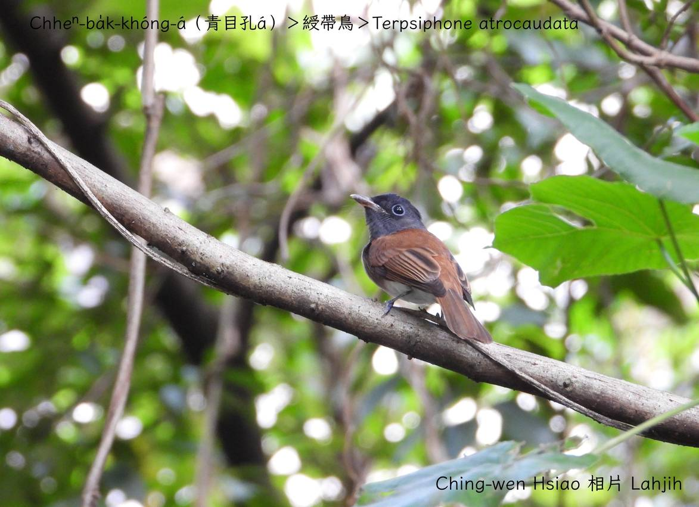

#### 45. Ong Kho『鶲科』

|台灣名|中譯名|學名|
|Chheⁿ-ba̍k-khóng-á（青目孔á）|綬帶鳥|Terpsiphone atrocaudata|

# 45-1. Chheⁿ-ba̍k-khóng-á（青目孔á）

Chheⁿ-ba̍k-khóng-á，頭殼、ām-kún烏色，ba̍k-chiu、嘴pe、尾溜烏青色，身軀àm-phú sió-khóa茄á色，kui隻看--起-來色水無kài影目，真適合樹林內生活ê保護色。

大蕊ba̍k-chiu khong一khong青色圓kho͘-á，kài-sêng hông bok kah烏青hit-khoán，m̄-chiah hō͘人號做chheⁿ-ba̍k-khóng-á，拖真長ê鳥尾mā是伊ê特色，有夠súi-tang-tang。

Chheⁿ-ba̍k-khóng-á tī台灣分布二種亞種。Âng-thâu-sū ê亞種是在地鳥，鳥公kha-chiah-phiaⁿ有金siak-siak ê烏色。
分布tī台灣本島ê亞種，是罕有ê過冬鳥，a̍h是過境鳥。

Chheⁿ-ba̍k-khóng-á háu聲「koâi koâi kí koâi-koâi，koâi koâi kí koâi-koâi」ná kho͘-si-á chiâⁿ hiáng-liāng，bē ài飛遠，大部分tī樹枝頂活動，跳來跳去，尾giâ koân-koân，tī樹頂、空中chhōe食，以昆蟲、幼蟲為主食。

# 【Tâi-oân Chiáu-á Liām Koa-si】

### **Chheⁿ-ba̍k-khóng-á Hông Bok**

Chheⁿ-ba̍k-khóng-á lí-sī kap-lâng oan-ke--hio͘h

Bô, lí-ê ba̍k-chiu ná-ē o͘-chheⁿ

Hông bok hit-ē kám-ē thiàⁿ-tiuh-tiuh

Chheⁿ-ba̍k-khóng-á lí kho͘-si-á hō͘-lâng thiaⁿ

M̄-thang oan-ke sio-phah hó--bò͘

 

### 【註解】

|詞|解說|
|Âng-thâu-sū|『臺東縣蘭嶼鄉』。|
|hiáng-liāng|響亮。|

