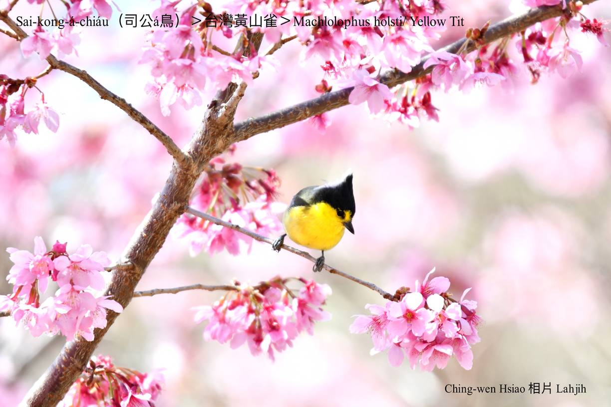

#### 46. Soaⁿ-chhiok Kho『山雀科』

|台灣名|中譯名|學名|
|Sai-kong-á-chiáu（司公á鳥）|台灣黃山雀|Machlolophus holsti（Yellow Tit）|

# 46-1. Sai-kong-á-chiáu（司公á鳥）

Sai-kong-á-chiáu頭殼頂ê鳥毛，烏烏尖尖，ná像戴一頂司公帽á，黃色khim-heng毛hām烏色翼股ná像司公衫，chiah hō͘人號做sai-kong-á-chiáu。

Sai-kong-á-chiáu生活tī海拔2000公尺針闊葉混合林內，到1500公尺山區ê闊葉樹林附近，寒天時chiah徙來海拔700公尺ê山區過冬。時常kap其他山雀科鳥類a̍h是花眉科小型鳥做夥生活，háu聲「chiauh chiauh kiu kiú kiu kiu kiú kiu kiu kiú」kín-chia̍p幼聲好聽。是台灣特有種罕有在地鳥。

Sai-kong-á-chiáu hèng食昆蟲、幼蟲，kap植物性ê漿果、幼葉。

# 【Tâi-oân Chiáu-á Liām Koa-si】

### **Sai-kong-á-chiáu Bē-hiáu Liām-keng**

Thâu tì sai-kong-bō

Sin chhēng n̂g-phâu tha̍h o͘-saⁿ

Kia̍p-chhùi iù-siaⁿ "chiauh chiauh kiu kiú kiu kiu kiú kiu kiu kiú"

Sai-kong-á-chiáu ē-hiáu chhiùⁿ-koa

Bē-hiáu liām-keng
 

### 【註解】

|詞|解說|
|司公|Sai-kong，司公kap道士無kāng，司公戴尖帽。|

