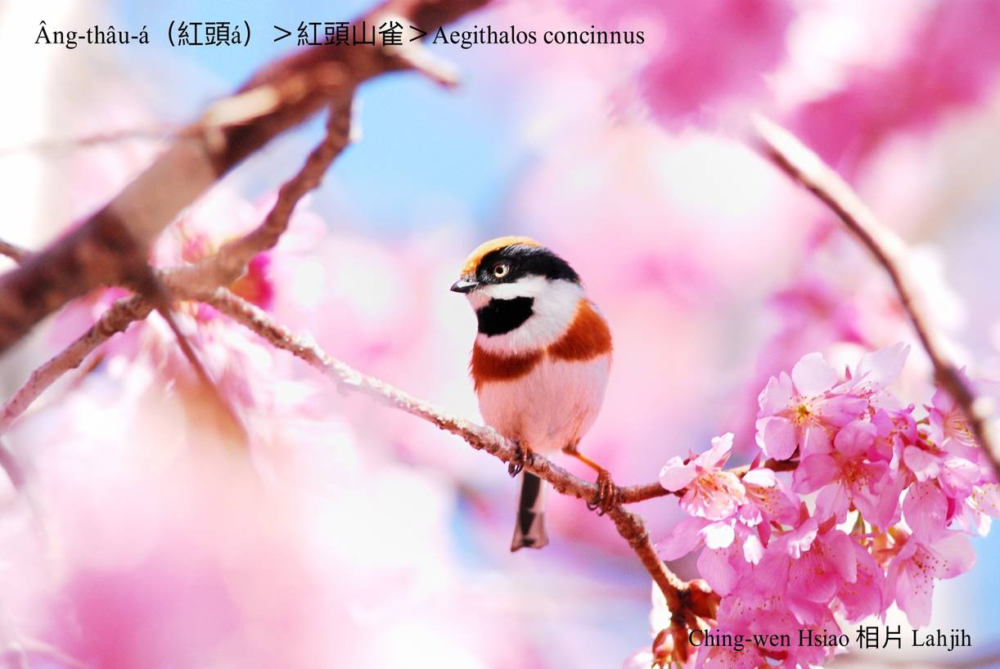
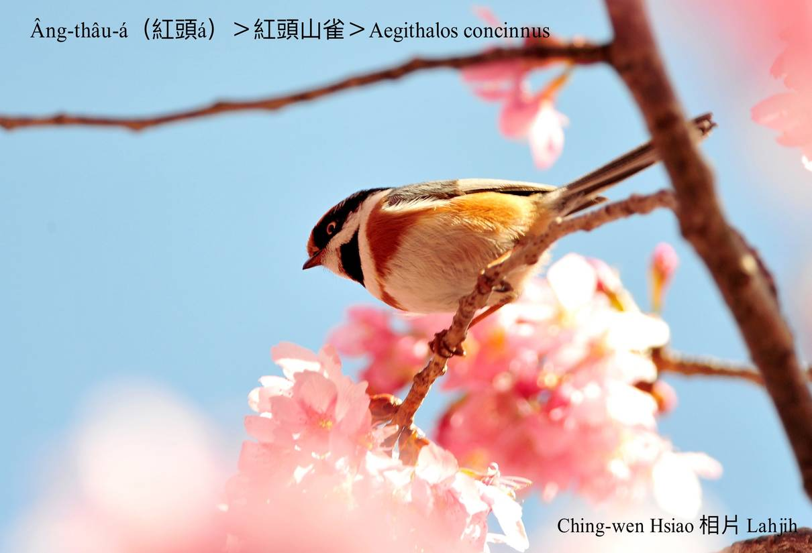

#### 46. Soaⁿ-chhiok Kho『山雀科』

|台灣名|中譯名|學名|
|Âng-thâu-á（紅頭á）|紅頭山雀|Aegithalos concinnus|

# 46-2. Âng-thâu-á（紅頭á）

Âng-thâu-á頭殼頂到後斗殼á ê所在，是紅土色，面部kap喉部是烏色，遠遠看，頭殼ê紅土色特別明顯影目，âng-tháu-á，âng-tháu-á，to̍h án-ne hō͘人叫tiâu名。

Âng-thâu-á，tī台灣是普遍ê在地鳥，分布tī中低海拔山區，歇tī樹林頂層，時常kap花眉做夥活動，食細尾蟲á。

Âng-thâu-á除了頭殼紅色是特色，其他鳥毛插色kài大膽chhiò-khoe，目chiu嘴pe烏mà-mà，ām-kui胸坎白siak-siak中央chhap烏色ām-sê-á，頂腹肚兩jiah紅土色，下腹肚是sió-khóa帶紅白色，翼股烏鐵灰，插色有夠怪奇，m̄-koh ná看ná古錐。

# 【Tâi-oân Chiáu-á Liām Koa-si】

### **Âng-thâu-á Kòa O͘-jîn Ba̍k-kiàⁿ**

Âng-thâu-á, lí boeh tó-ūi thit-thô

Ná-ē tì âng-bō, koh khan chi̍t-ki o͘-jîn ba̍k-kiàⁿ

Táⁿ-pān kah chiah-nī súi

Si̍t-chāi ū-kàu phāⁿ

Lí sī boeh khì tó-ūi

 

### 【註解】

|詞|解說|
|ām-sê-á|『圍兜』。|

