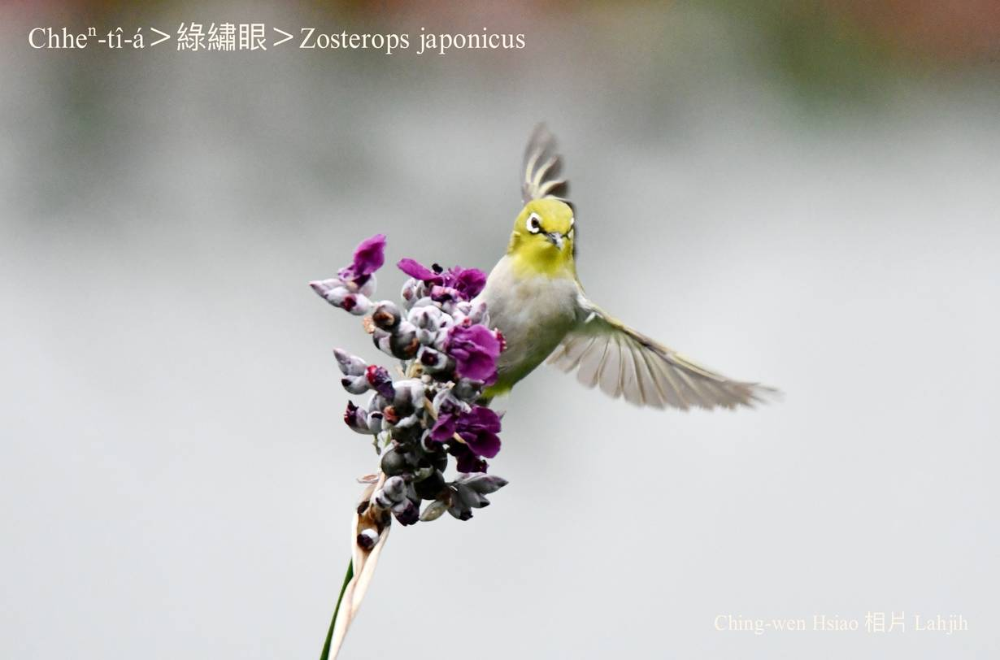
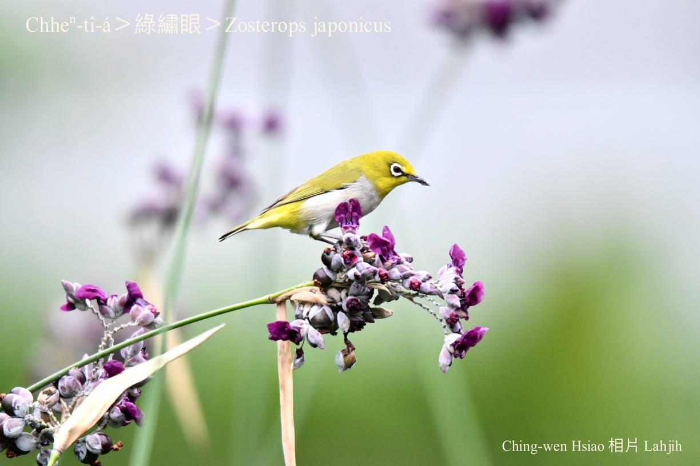
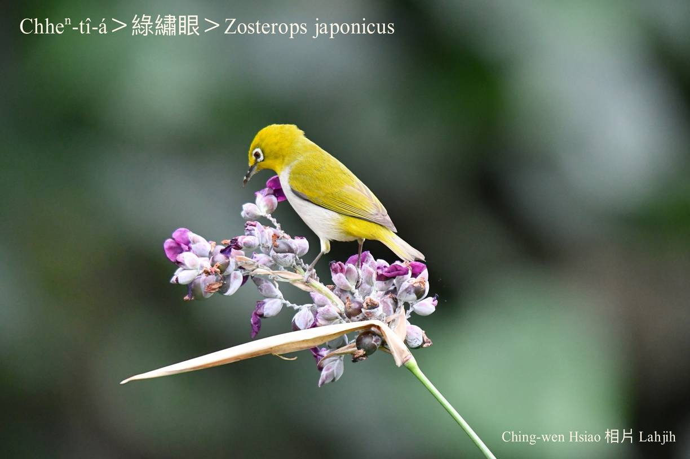
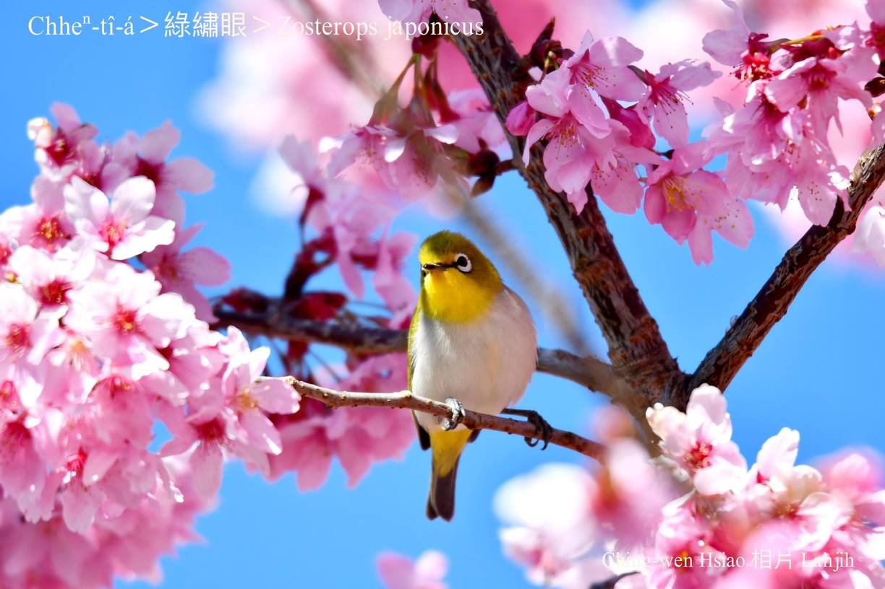
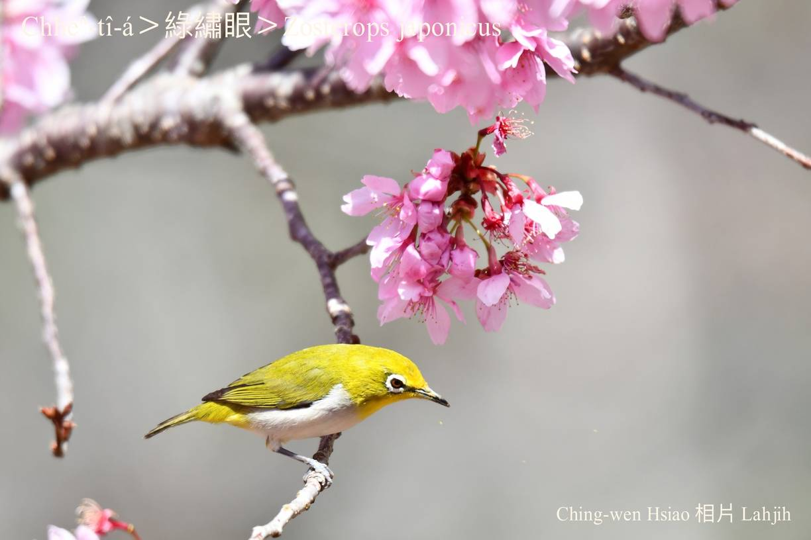
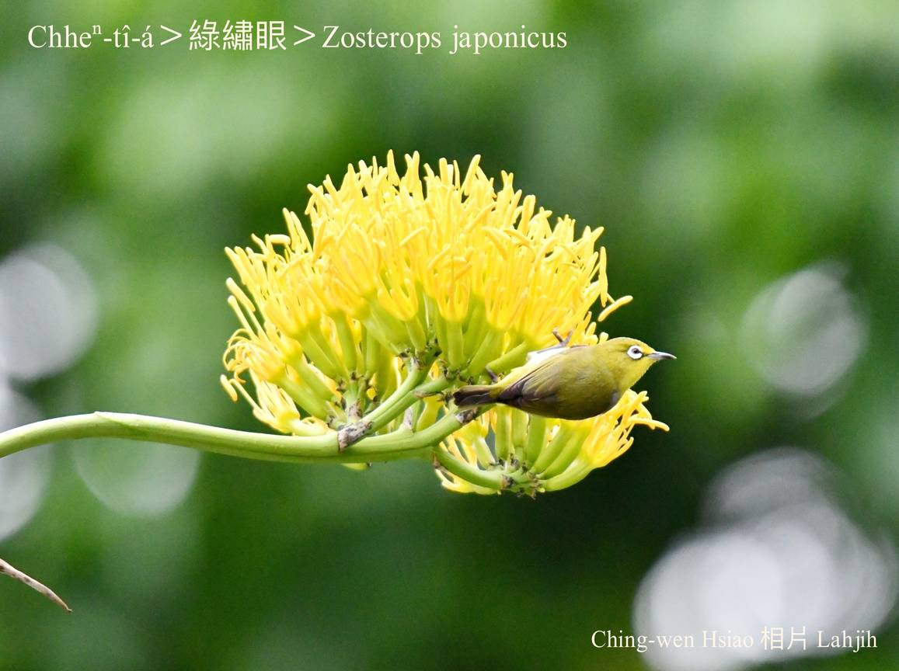
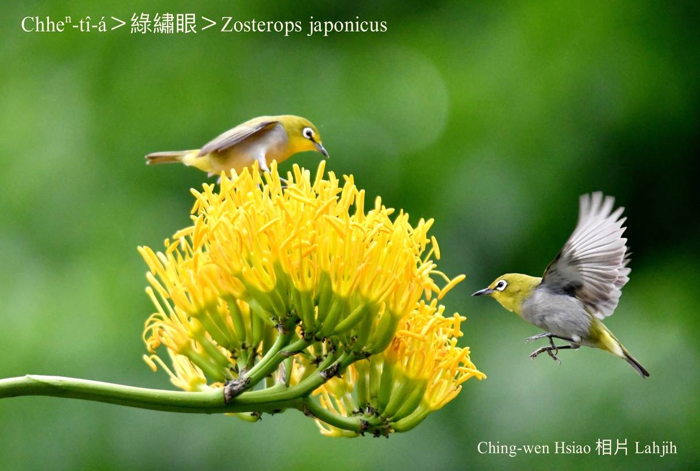
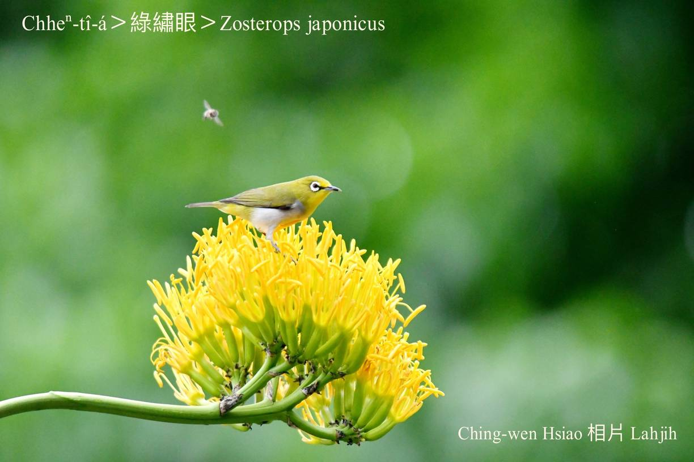
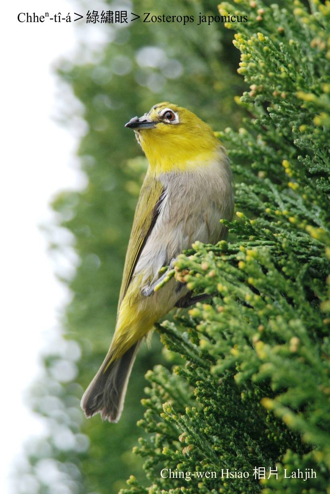
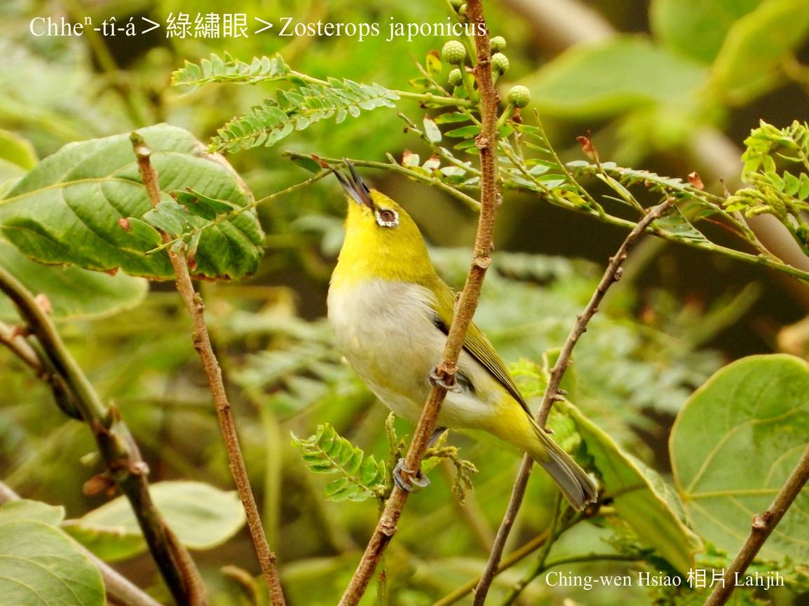

#### 47. Siù-gán Kho『繡眼科』

|台灣名|中譯名|學名|
|Chheⁿ-tî-á|綠繡眼|Zosterops japonicus|

# 47-1. Chheⁿ-tî-á

Chheⁿ-tî-á，n̂g-le̍k-sek頭khak、尾liu、kha-chiah-phiaⁿ、翼股，khong白sûn目chiu hām白霧色腹肚，kui隻看--起-來kài古錐súi-khoán，幼幼lia̍p-chia̍p「tĭ tĭ tĭ」「chiŭ chiŭ chiŭ」ê鳥仔聲，soah害你hông關tiàm láng-á內賣藝展歌聲。
 
Chheⁿ-tî-á tī平地kap低海拔山區四界lóng有伊ê形影叫聲，生湠期間，城市、庄腳、學校、公園、厝宅、籬笆，lóng有伊ê蹤跡，幾十隻、kui百隻tàu陣tī樹欉活動，chhōe食唱歌，幼聲溫柔ná kho͘-si-á。

黃綠橄á色ná青苔，有人ka號名chheⁿ-tî-á，mā有人ka叫做chheⁿ-thî-á，是台灣chiâⁿ普遍ê在地鳥，因為sió-lia̍p-chí tih-tih隻á，ná像地心引力無伊ê ta-ôa，tī樹椏活動非常liú-lia̍h，無論正khiā、倒鉤、倒吊，姿勢變化無窮。

生湠期tī 4月中旬到8月中旬，做碗形ê siū，1 siū生2-3粒卵，孵10工to̍h-ē出世，大約10~11工to̍h ē-sái-tit離siū活動，飼kiáⁿ ê khang-khòe，公母鳥平均負擔，是一夫一妻制。

# 【Tâi-oân Chiáu-á Liām Koa-si】

### **Chheⁿ-tî-á Seⁿ-súi Gâu Kho͘-si-á**

Chheⁿ-tî-á seⁿ-súi gâu kho͘-si-á

Chhiū-oe thiàu lâi thiàu khì, kho͘-si-á liām koa-si

Tĭ~ tĭ~ tĭ~ tĭ~, sè-siaⁿ koh iù-jī

Kòa-ba̍k-kiàⁿ, chháu-á-sek ú-i

Ang bó͘ un-ài, thiàⁿ-kiáⁿ hō͘-lâng tak-chhùi-chi̍h

 

### 【註解】

|詞|解說|
|n̂g-le̍k-sek|『黃綠色』。|
|tih-tih-chiah-á|Thíⁿ-thíⁿ-chiah-á，tháiⁿ-tháiⁿ-chiah-á，sè-sè-chiah-á，小粒子細細隻。|

