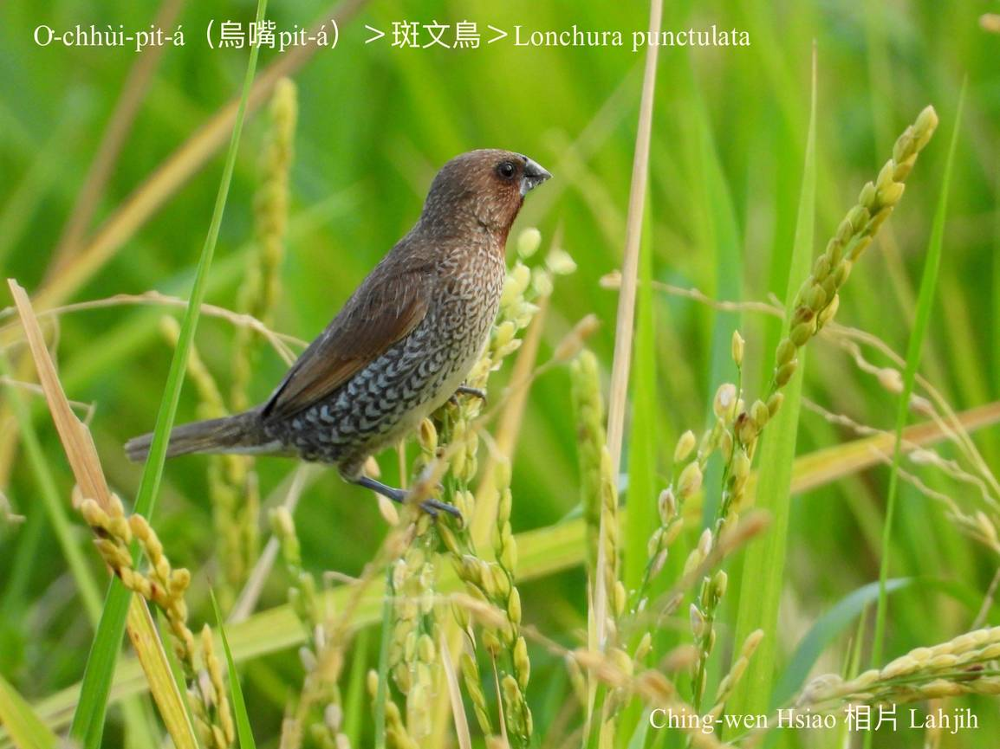

#### 48. Bûn-chiáu Kho『文鳥科』

|台灣名|中譯名|學名|
|O͘-chhùi-pit-á（烏嘴Pit-á）|斑文鳥|Lonchura punctulata（Lonchura oryzivora）|

# 48-2. O͘-chhùi-pit-á（烏嘴Pit-á）

台灣在地鳥Lonchura oryzivora『文鳥』有三種：

Lonchura punctulata『斑文鳥』hām Lonchura striata『白腰文鳥』、Lonchura malacca『黑頭文鳥』。

In ê共同特徵是嘴pe短短、尖尖、三角形，tēng-tauh有力，適合食五穀、草籽有殼種子，體形小細古錐，時常招伴飛徙做夥chhōe食，ná飛ná háu幼幼ê聲，多數食種子、草籽、五穀，khah捷出現tī樹林、草埔、矮樹欉。

Chit三種台灣在地鳥Lonchura oryzivora，台語lóng號名o͘-chhùi-pit-á，不過通常nā講tio̍h烏嘴pit-á，大部份是講『斑文鳥』（Lonchura punctulata）。

O͘-chhùi-pit-á（Lonchura punctulata）ê嘴pe烏烏，kui隻淺咖啡色ê花紋，目chiu ām-kui深咖啡色，pak-tó͘-ē花紋無明顯，生活tī平原到低山區，chiok ài kui-tīn做夥thit-thô飛來飛去，稻á收成時，mā-ē食粟á，不過平常時khah hèng食雜草種籽、昆蟲kap伊ê幼蟲，做siū tī竹模a̍h是細欉樹á，用菅芒草a̍h是草本植物ê骨做大型空心球ê siū。

O͘-chhùi-pit-á（Lonchura punctulata）háu聲幼幼一聲一聲「chiú chiú chiú chiú」，時常kui-tīn tâng-chê háu真好聽，tī台灣是chiâⁿ普遍ê在地鳥，無季節遷徙ê行為。

# 【Tâi-oân Chiáu-á Liām Koa-si】

### **O͘-chhùi-pit-á Chhùi O͘-o͘**

O͘-chhùi pit-á chhùi o͘-o͘, hèng-chia̍h chháu-á-chí

Sio-chio tàu-tīn poe-lâi poe-khì

Chhiùⁿ khoài-lo̍k koa-si, chiú chiú chiú

Siòng-miā-sian--ê siāng kah-ì, i ē kā pâi-ki

Pang siòng-miā-sian--ê kā lâng toàn ūn-khì

### 【註解】

|詞|解說|
|特徵|Te̍k-teng。|

