#### 48. Bûn-chiáu Kho『文鳥科』

|台灣名|中譯名|學名|
|O͘-chhùi-pit-á（烏嘴pit-á）|白腰文鳥|Lonchura striata|

# 48-3. O͘-chhùi-pit-á（烏嘴Pit-á）

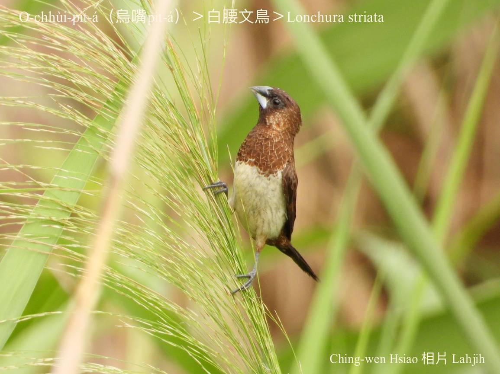

O͘-chhùi-pit-á（Lonchura striata）嘴pe téng-kiuⁿ烏phú色，ē-kiuⁿ白色，面腔hām尾溜烏咖啡色，頭，ām，翼股hām尾椎深咖啡色，翼股nā展開ē-tàng看tio̍h腰身（kha-phiaⁿ、khim-heng hām ē-tó͘）是白色，華語chiah ka號名『白腰文鳥』。

O͘-chhùi-pit-á（Lonchura striata）siāng捷出現tī田園、山腳溪á邊、魚池á邊、草埔á ê細叢樹竹林，通常tī草埔、田園活動，tī榕樹、相思á樹頂做siū。Liân-sòa「chiŭ chiù chiù chiù chiŭ chiù chiù chiù」háu lia̍p-chia̍p幼聲。

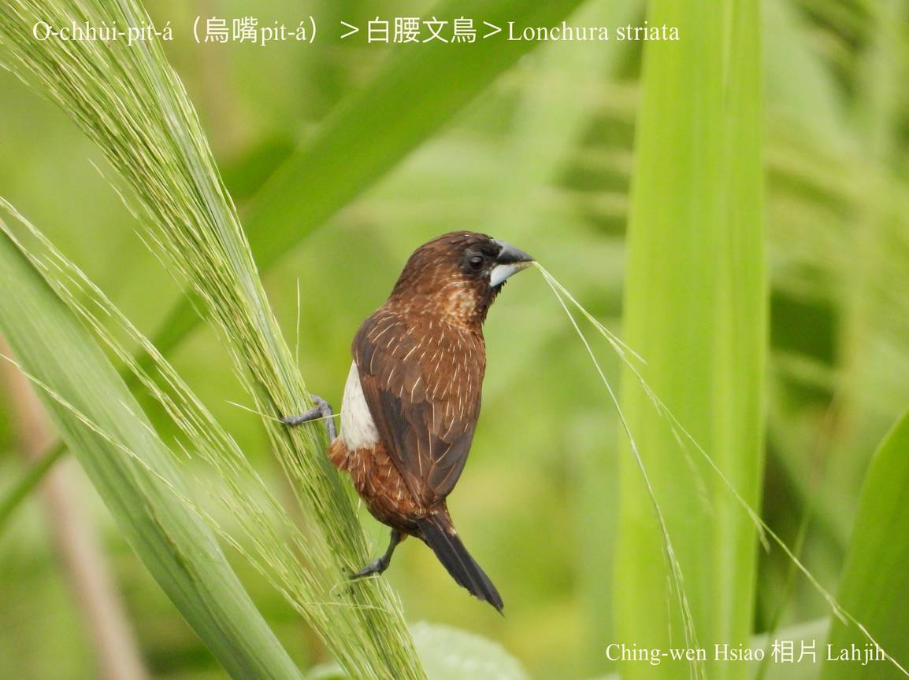
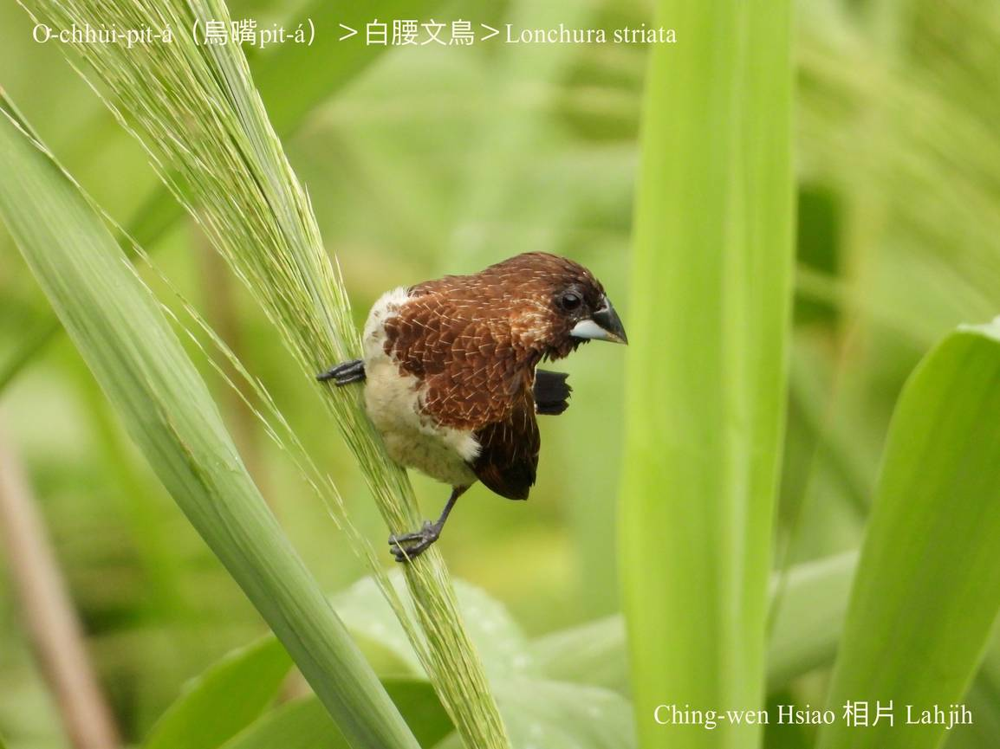
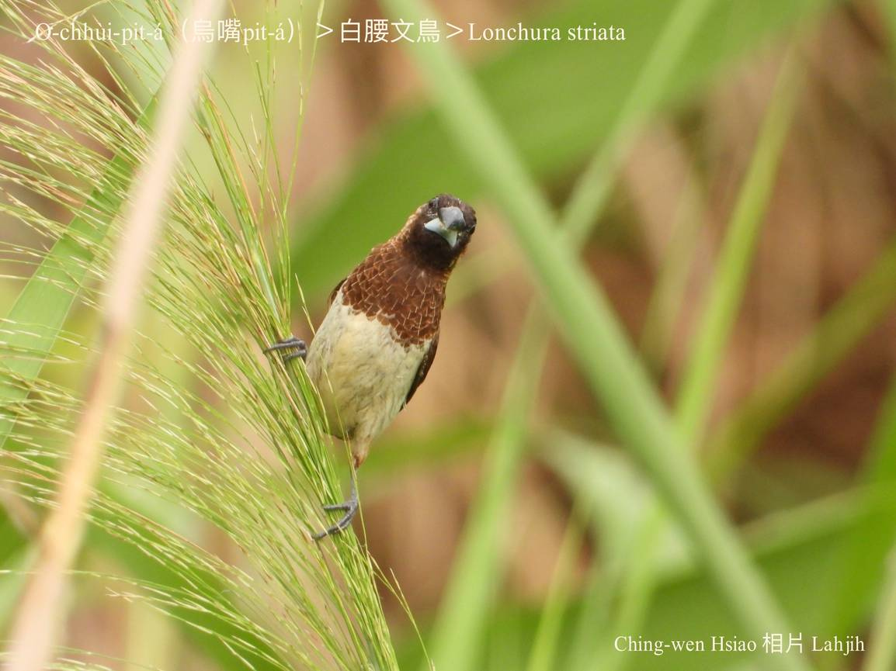
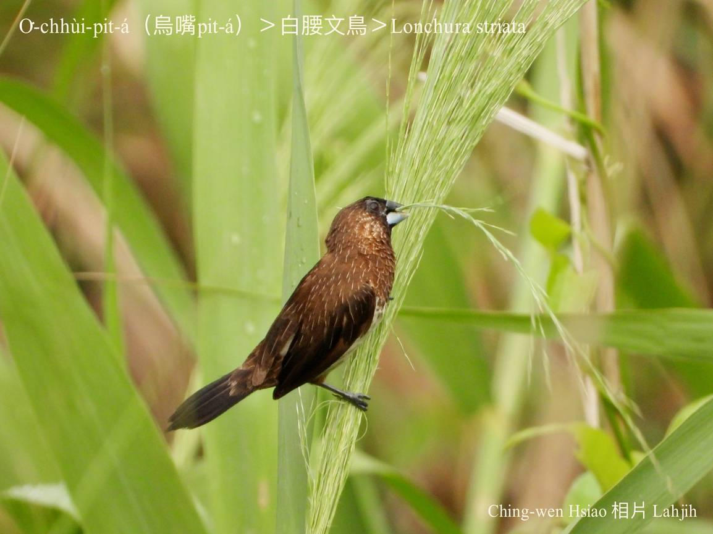
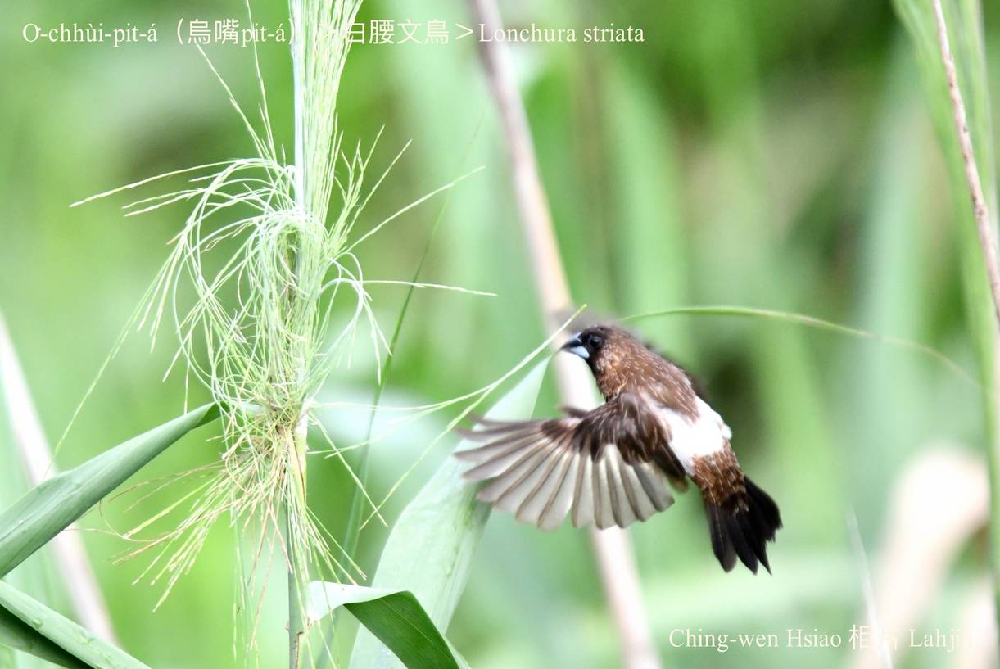
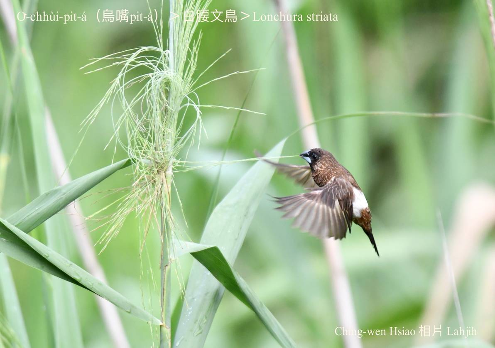
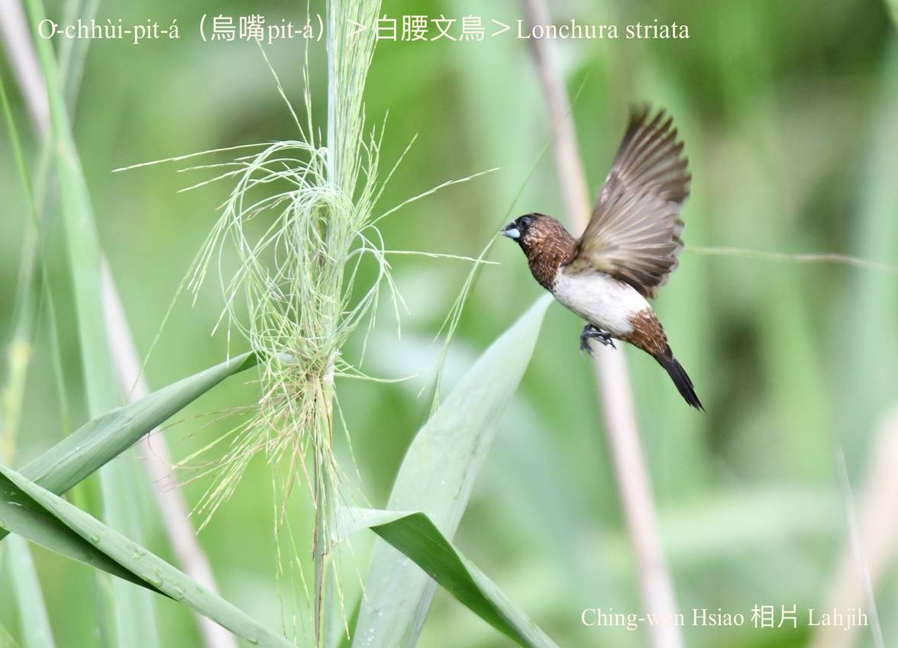
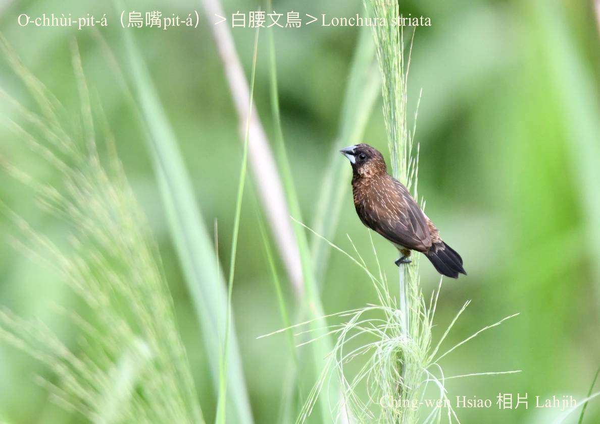
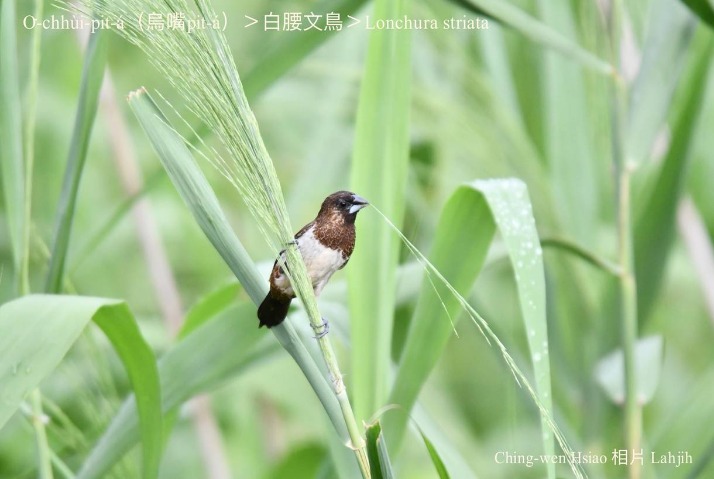
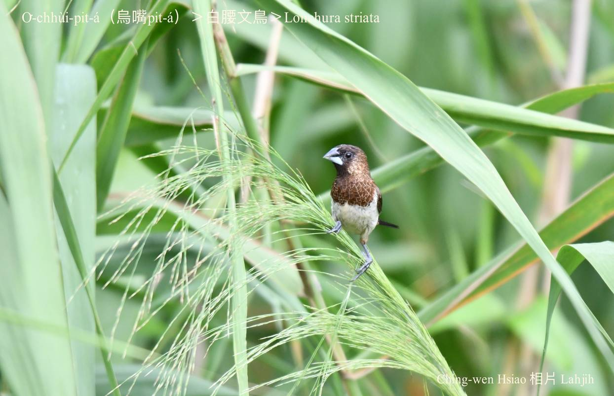
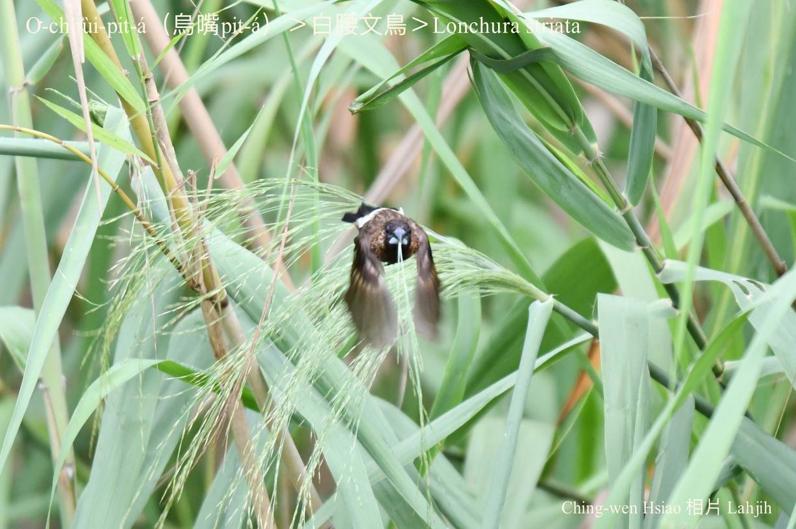

### 【註解】

|詞|解說|
|téng-kiuⁿ|『上顎』。|
|ē-kiuⁿ|『下顎』。|
|尾椎|Bóe-chui，『屁股』。|
|榕樹|Chhêng-chhiū。|

