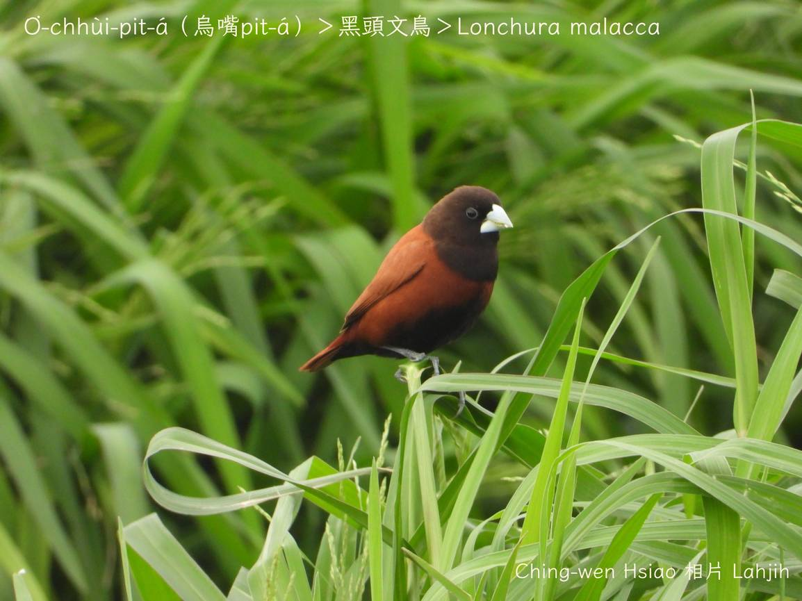
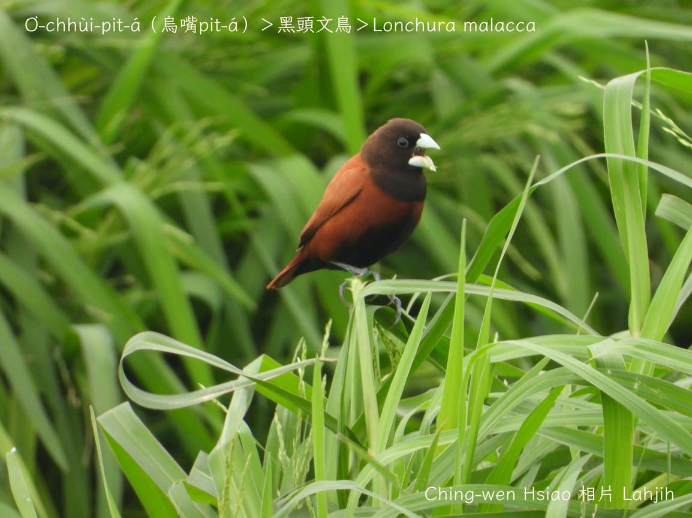
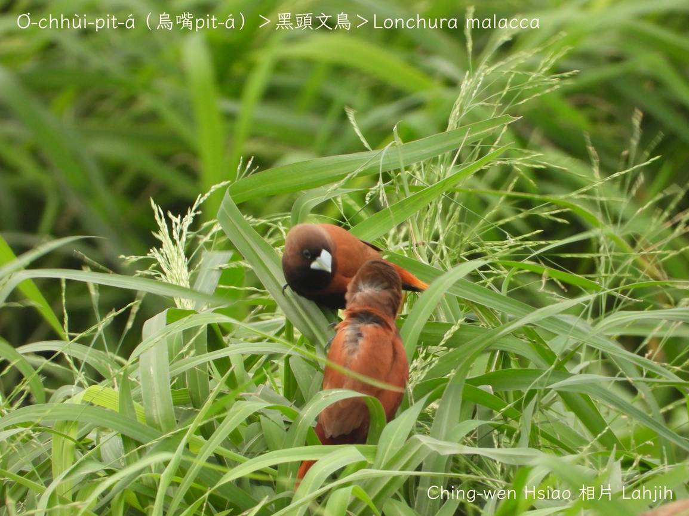
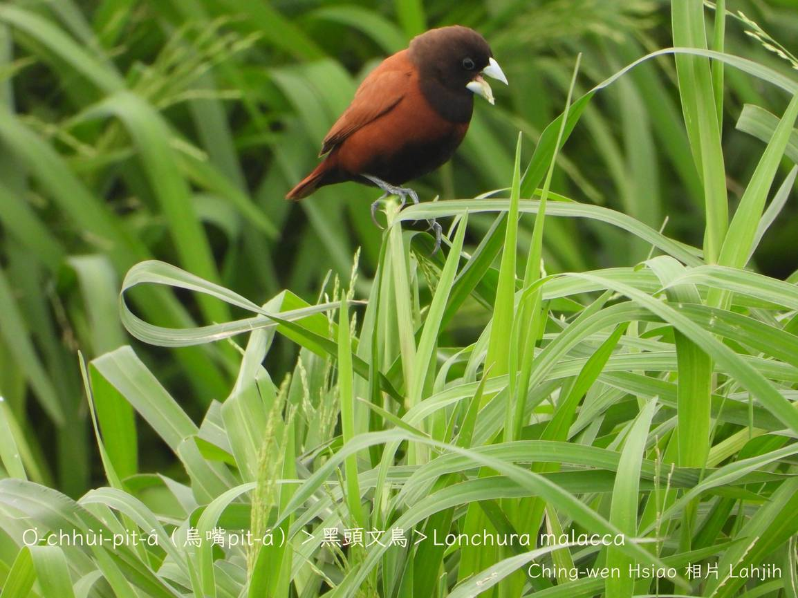
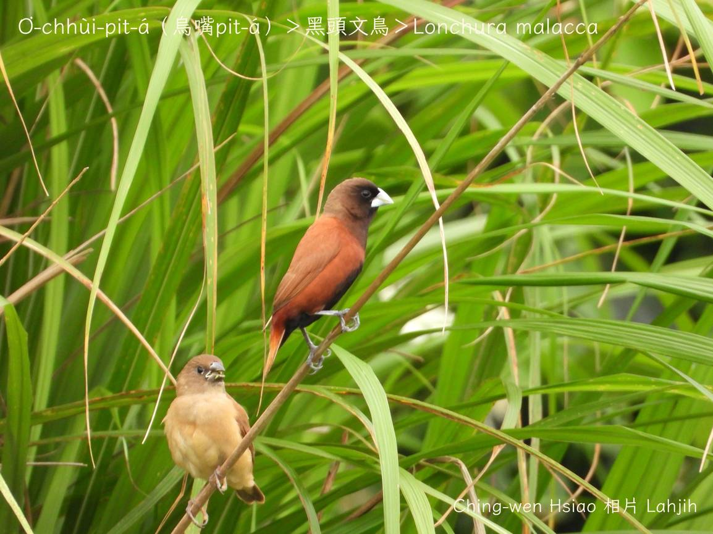
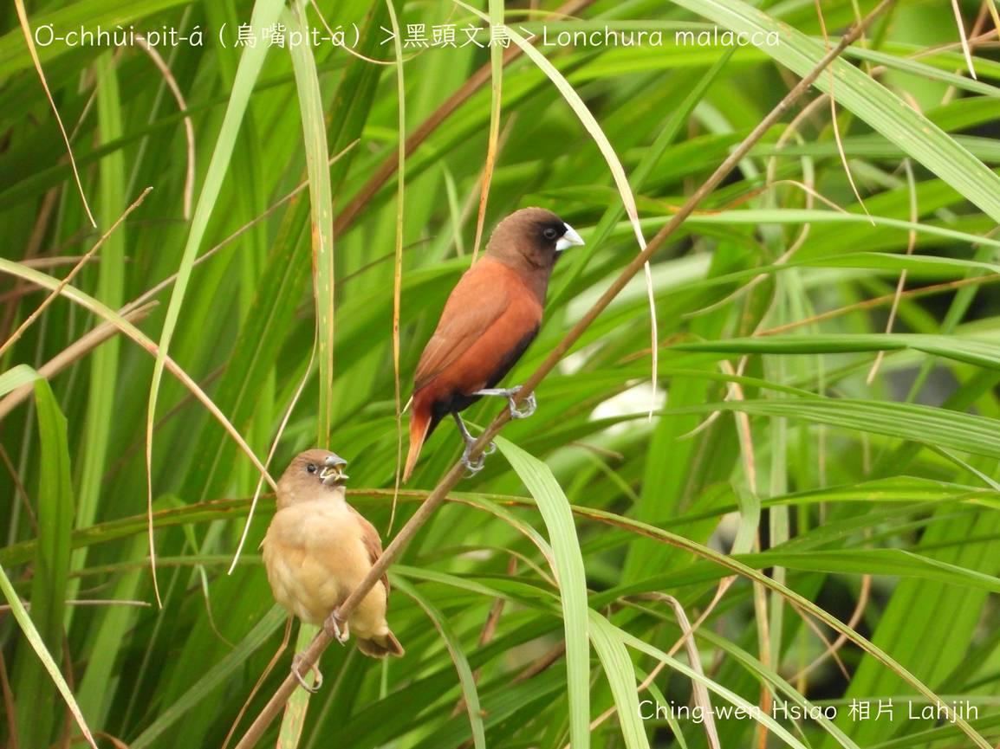
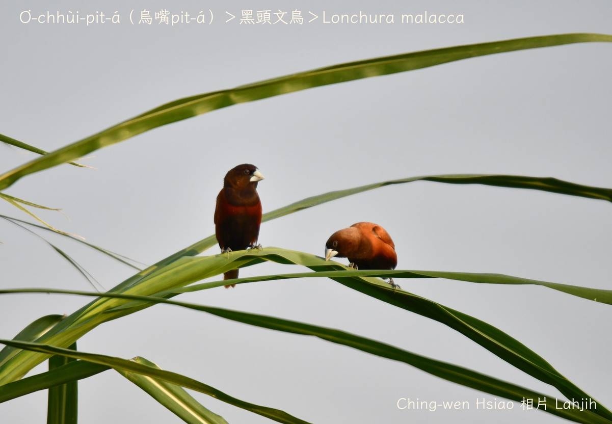
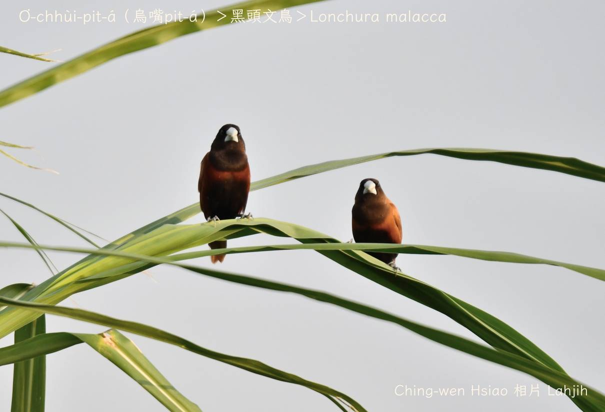
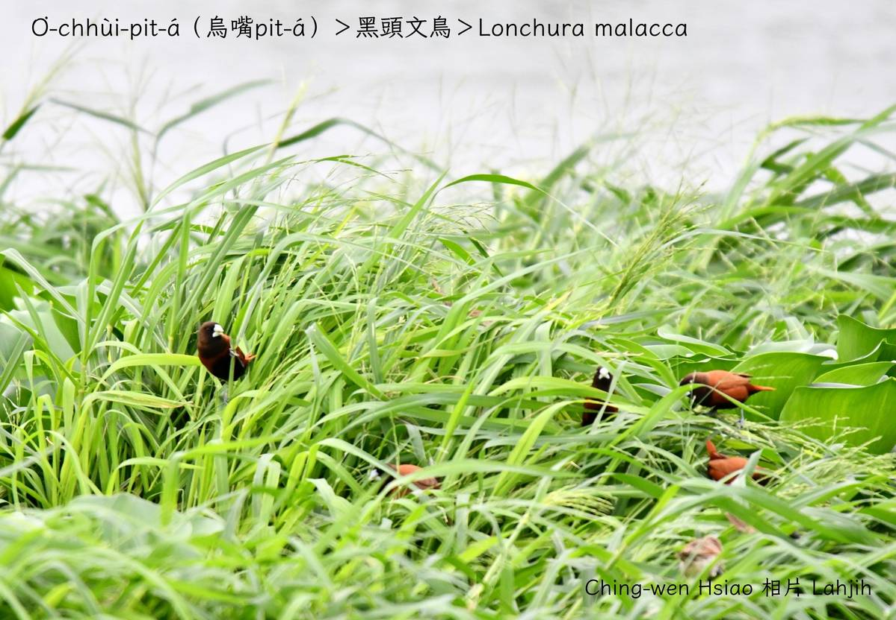
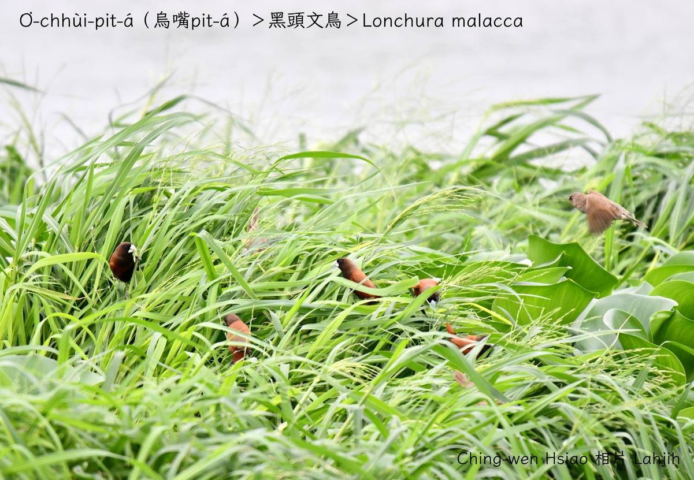

#### 48. Bûn-chiáu Kho『文鳥科』

|台灣名|中譯名|學名|
|O͘-chhùi-pit-á（烏嘴pit-á）|黑頭文鳥|Lonchura malacca|

# 48-4. O͘-chhùi-pit-á（烏嘴Pit-á）

O͘-chhùi-pit-á（Lonchura malacca）tī台灣東部khah-chē，北部khah-chió，是siāng少ê o͘-chhùi-pit-á族群。

O͘-chhùi-pit-á（Lonchura malacca）ê頭殼、ām-kún烏咖啡色，身軀、尾溜咖啡紅，嘴pe ê頂下kiuⁿ是chiâⁿ明顯ê白色，腳骨腳爪mā是白色，看--起-來特別影目。

O͘-chhùi-pit-á（Lonchura malacca）ê háu聲「chiŭ chiuh chiuh chiŭ chiuh chiuh」比另外hit兩種khah大聲，khah kah意tâm-sip ê lòm地、草坪、稻田。

### 【註解】

|詞|解說|
|影目|Iáⁿ-ba̍k。|

