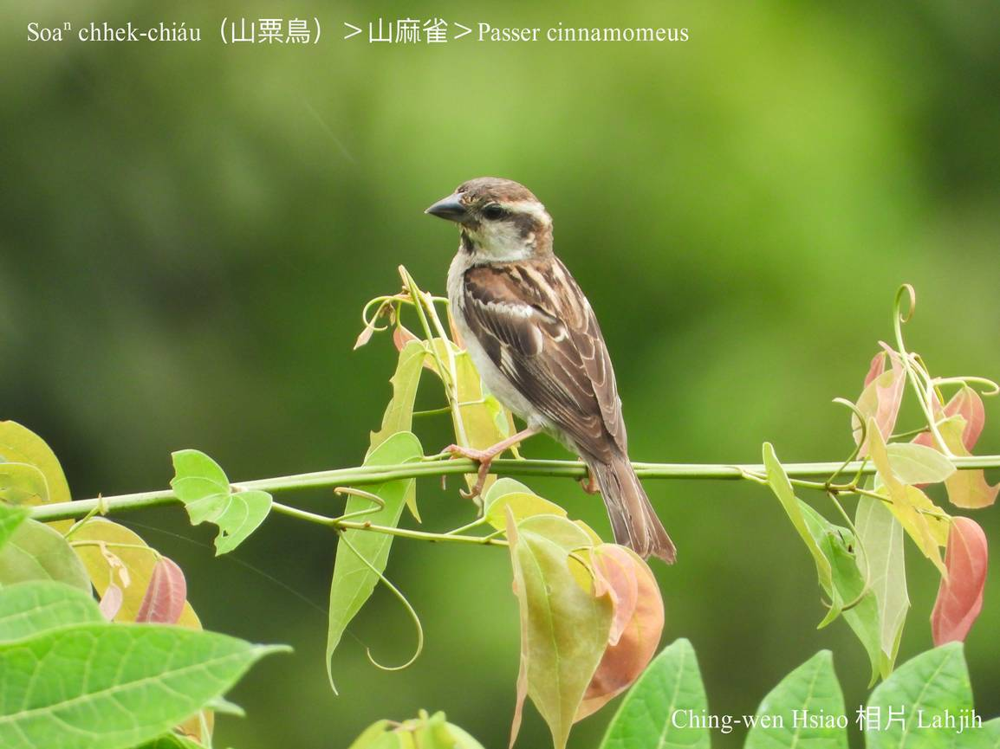
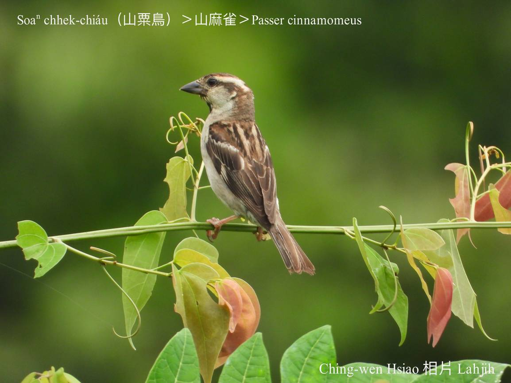
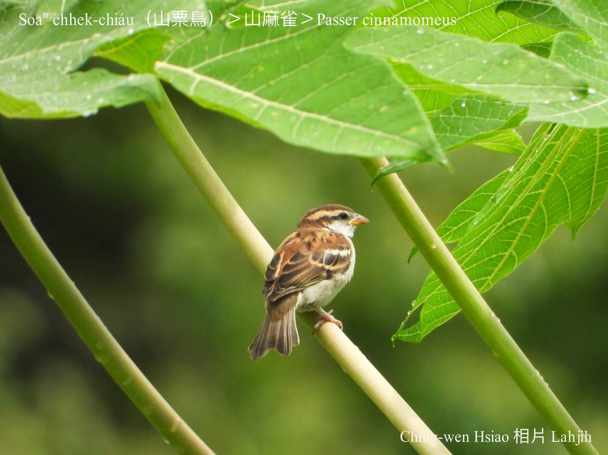
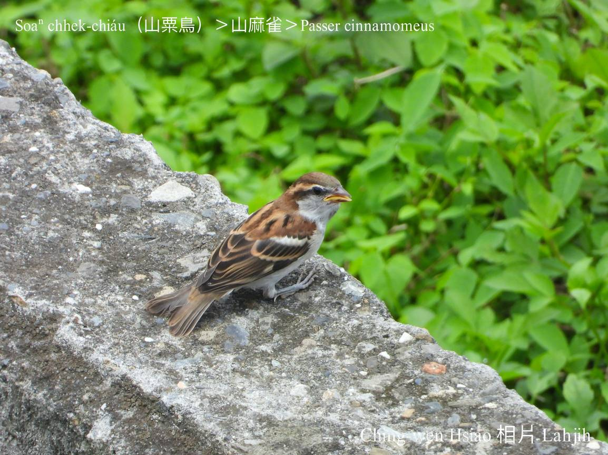
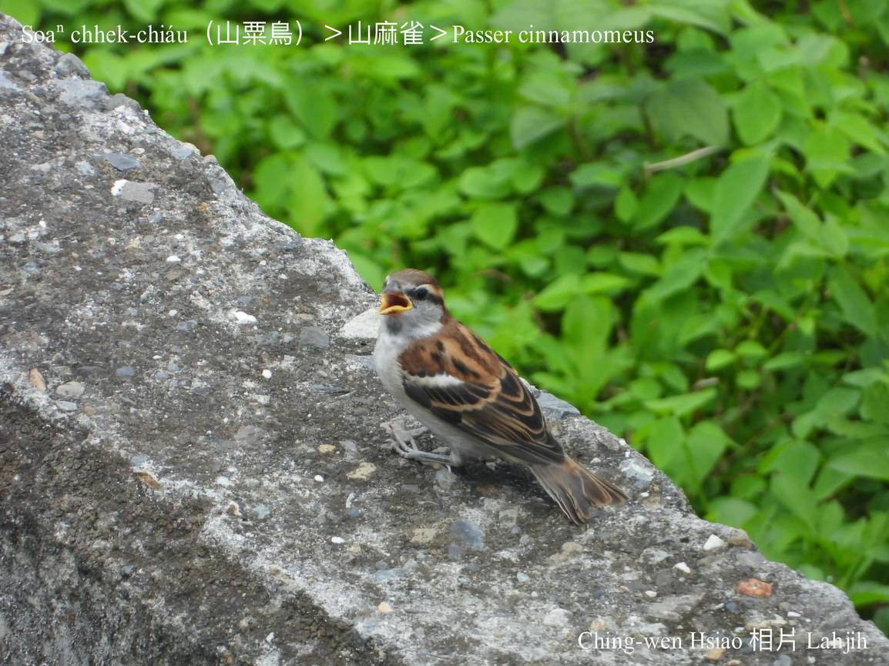
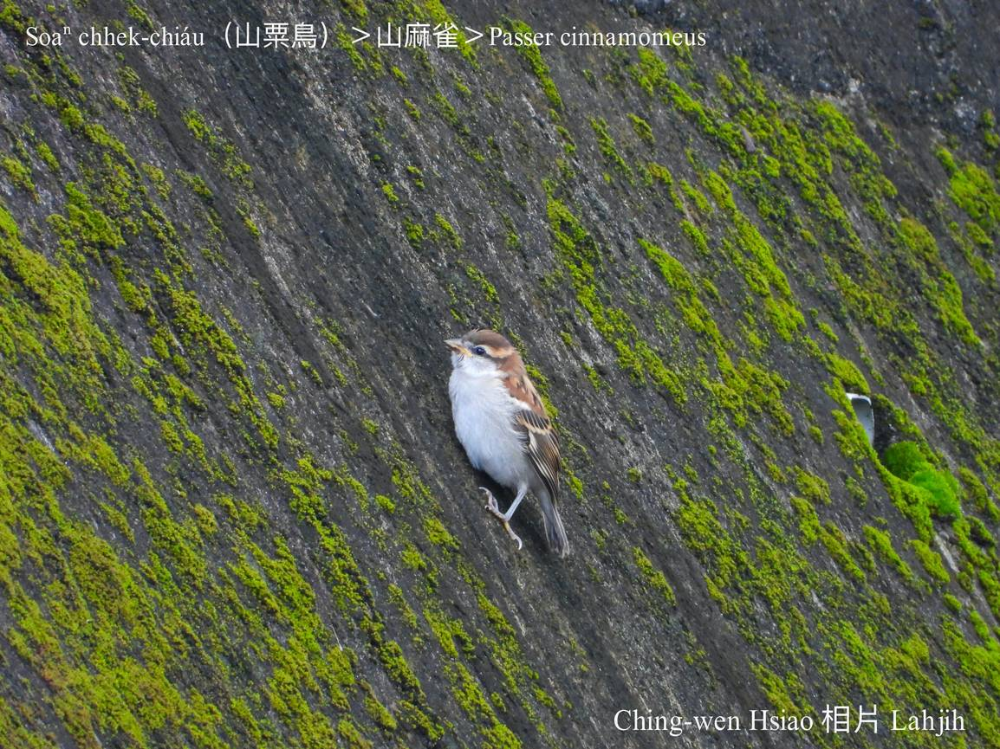
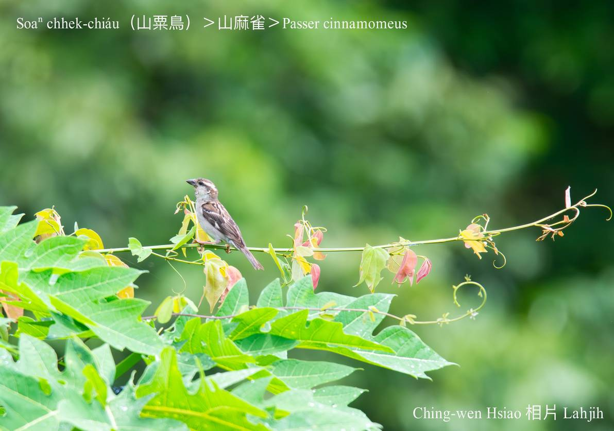
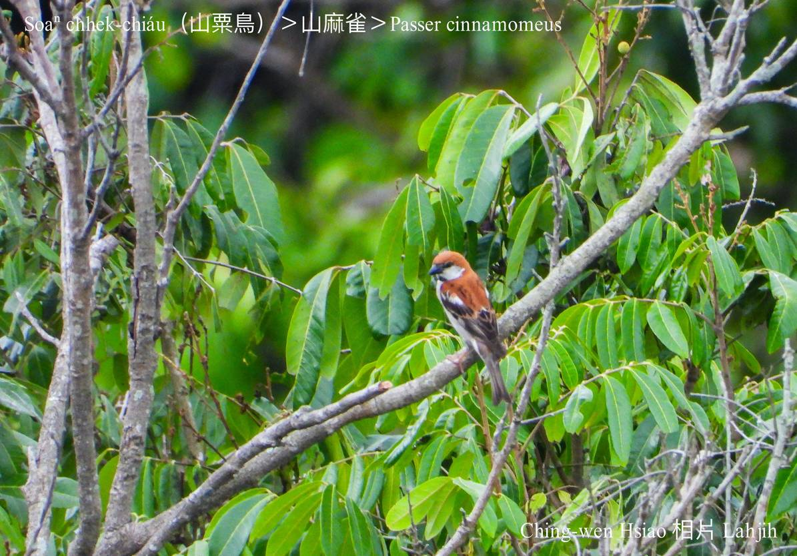
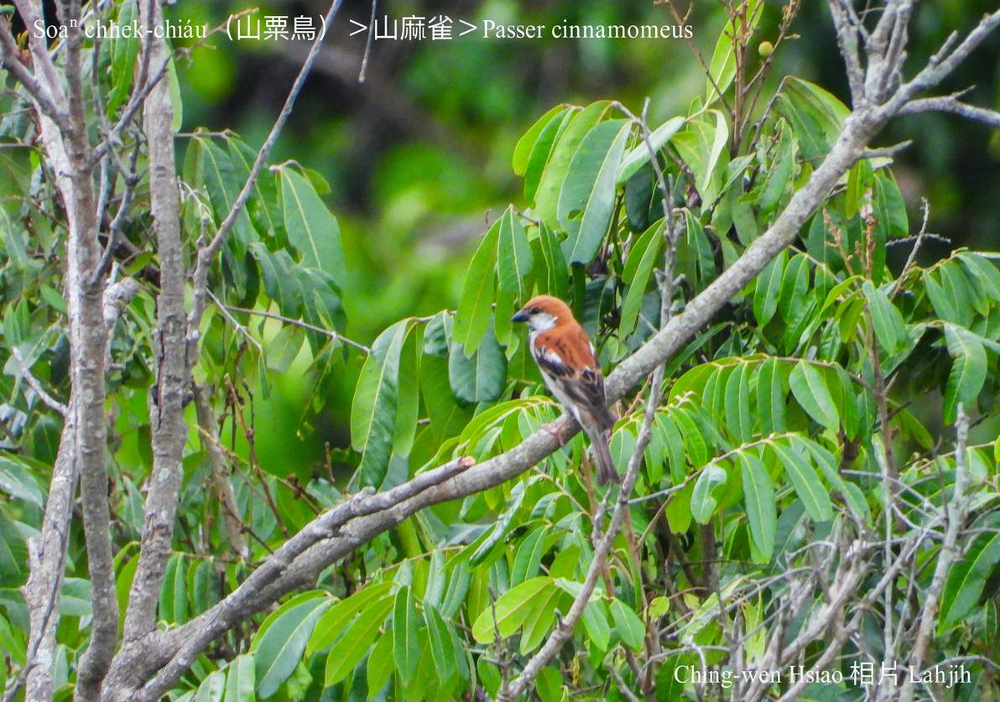
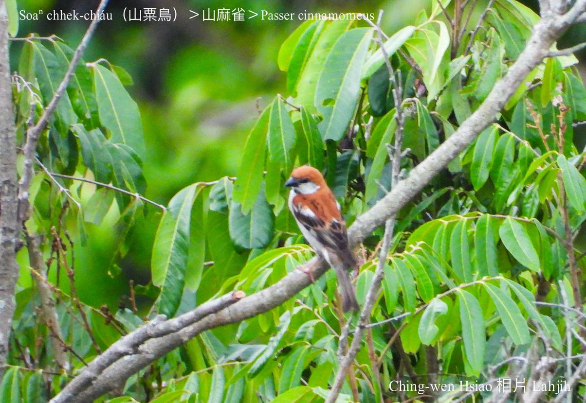

#### 48. Bûn-chiáu Kho『文鳥科』

|台灣名|中譯名|學名|
|Soaⁿ-chhek-chiáu（山粟鳥）|山麻雀|Passer cinnamomeus|

# 48-5. Soaⁿ-chhek-chiáu（山粟鳥）

山粟鳥是台灣罕有ê在地鳥，出現tī雲林、嘉義、台南、高雄、屏東200-2200公尺山區，是giōng-boeh絕種保育類動物，目前chhun無夠1000隻。

山粟鳥是公母鳥形體色水小可á bô-kâng，kah意tī樹洞、厝頂縫做siū。

