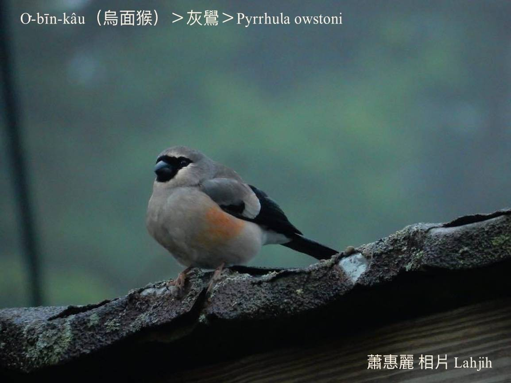
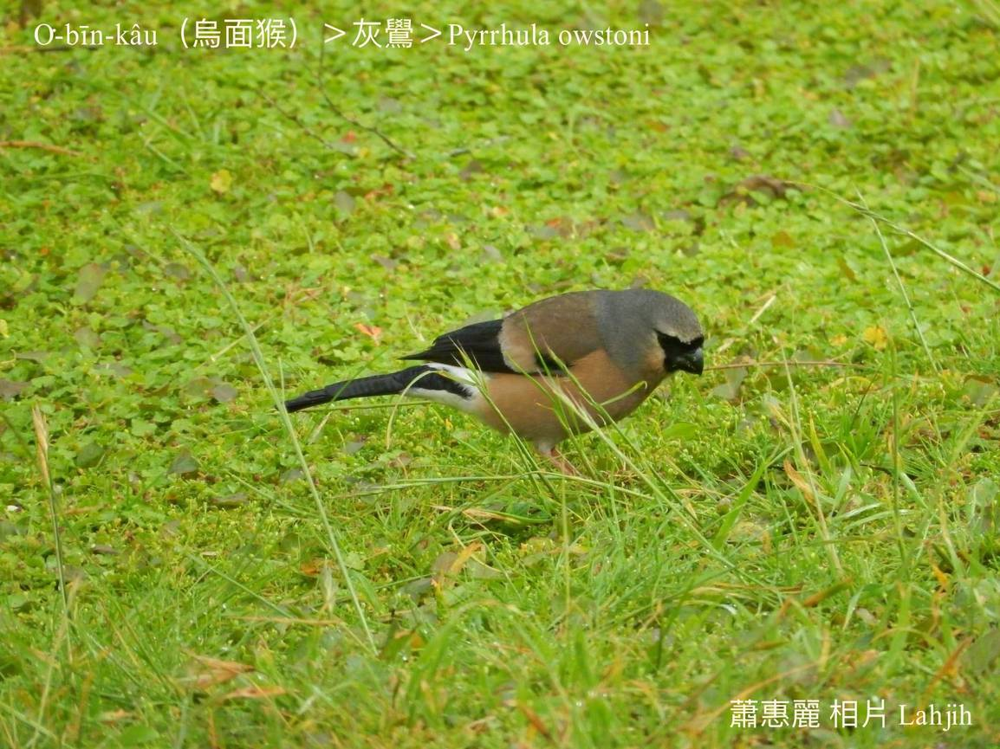

#### 49. Chhiok Kho『雀科』

|台灣名|中譯名|學名|
|O͘-bīn-kâu（烏面猴）|灰鷽|Pyrrhula owstoni|

# 49-2. O͘-bīn-kâu（烏面猴）

O͘-bīn-kâu ê面烏烏，圓圓ê頭殼kài-sêng猴面，泰雅族kā號做o͘-bīn-kâu，有ha̍h。

O͘-bīn-kâu面模嘴pe烏色，翼股、尾溜是烏色chhap一chhok-á白色，chhun--ê鳥毛是niáu鼠á色，分布tī台灣高海拔2600公尺以上ê溫帶林到寒帶林山區，kioh-sī人是和平ê動物，所以m̄驚人，tī土腳chhōe食，hō͘人phah-tio̍h-kiaⁿ mā bē-hiáu飛遠閃避。

嘴pe短tauh粗大，看伊有力圓錐形ê嘴pe，to̍h知影是食種籽ê鳥仔，mā ài食植物ê幼芽、花瓣。

O͘-bīn-kâu是台灣特有種在地鳥，叫聲「kió kioh kió kioh kió kioh」koân-siaⁿ chiâⁿ hiáng，時常kúi-nā隻做夥tiàm地面thit-thô。

### 【註解】

|詞|解說|
|niáu鼠á色|Niáu-chhí-á-sek，gray，『灰色』。|

