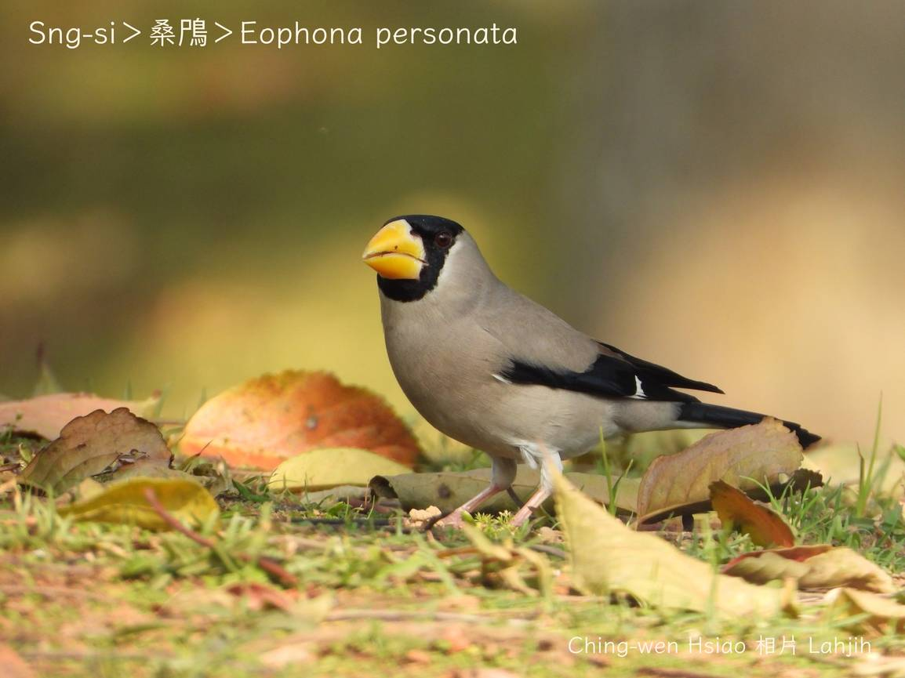
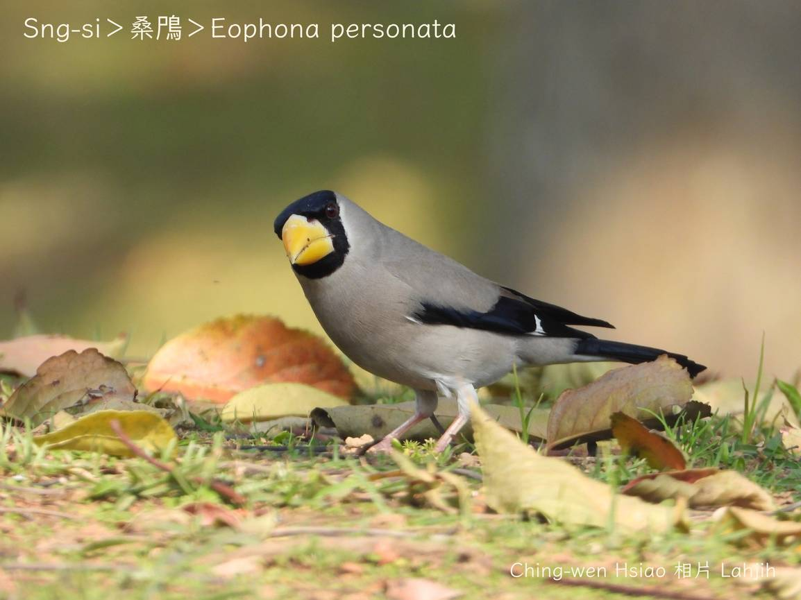
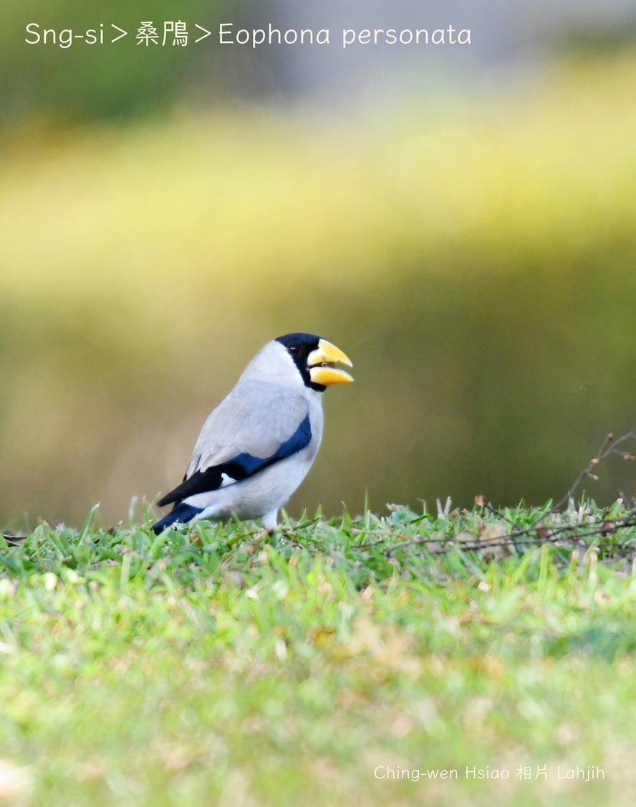
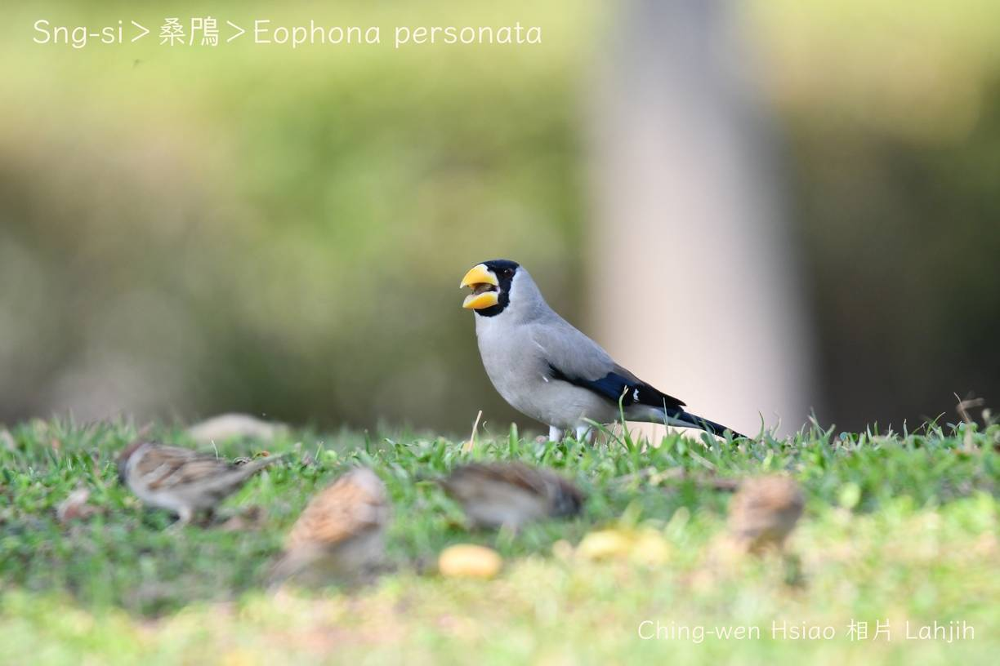
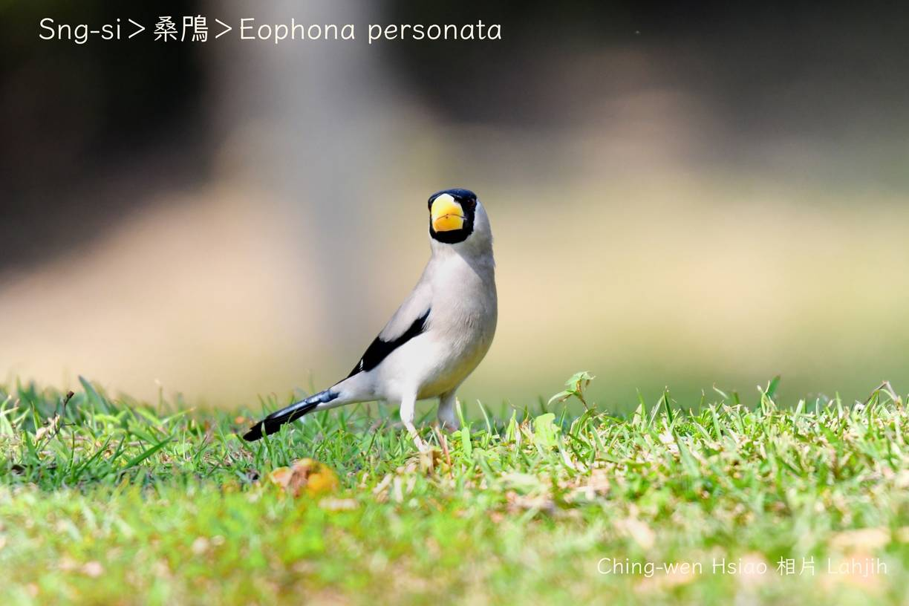
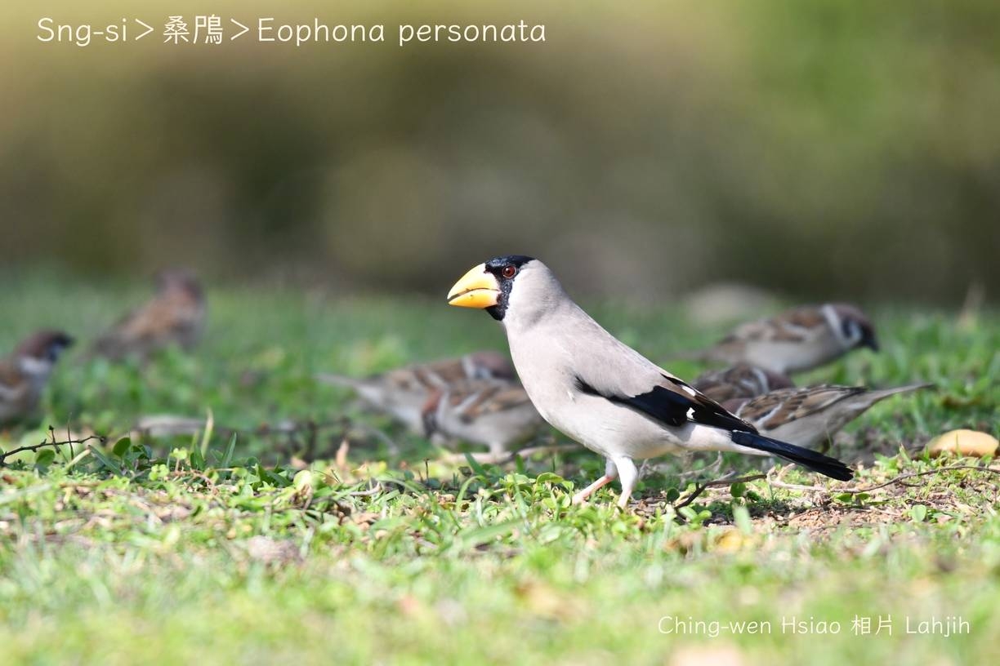
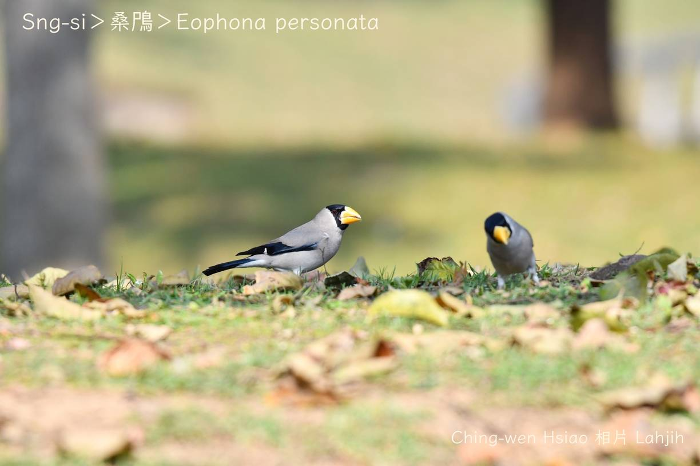
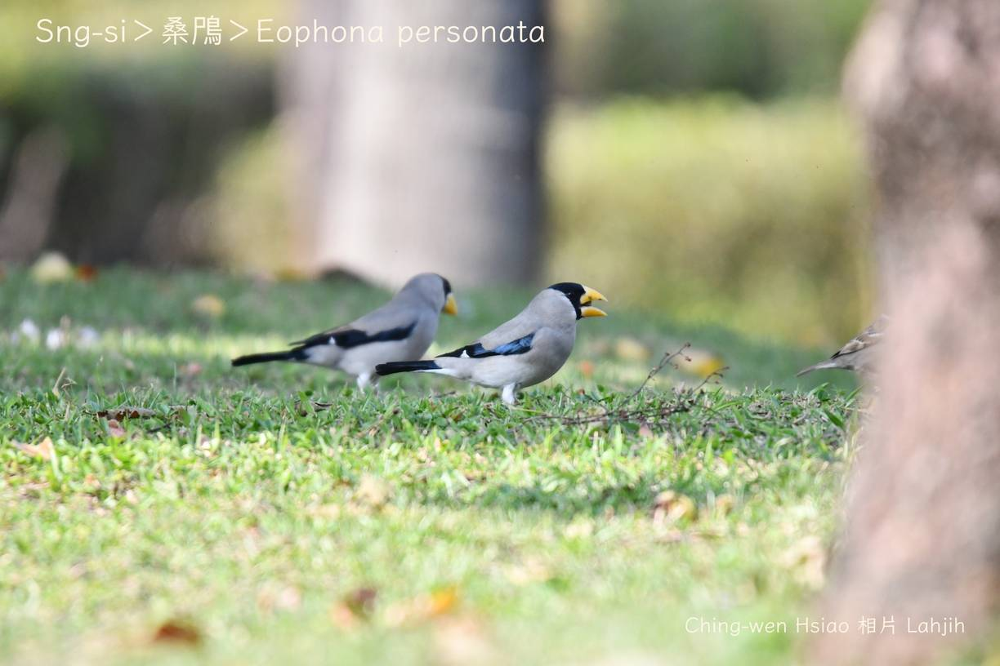

#### 49. Chhiok Kho『雀科』

|台灣名|中譯名|學名|
|Sng-si|桑鳲|Eophona personata|

# 49-3. Sng-si

Sng-si生湠tī東北亞，寒天徙到華中、華南，tī台灣是罕得看tio̍h ê迷鳥，冬天過境鳥，嘴pe大kâi，圓錐形，tēng-khok-khok chiâⁿ有力，咬破果子核á ê時，phi-phi-phia̍k-phia̍k chiok大聲。

Sng-si siāng-kài明顯特徵是柑á黃色ê大嘴pe，公母kāng色水，頭殼連ē-ham烏色，翼股尾溜烏色，有tām-po̍h-á khóng-sek kng-iāⁿ，chhun--ê淺niáu鼠á色，hèng食果子、種子，有時mā-ē食昆蟲。

### 【註解】

|詞|解說|
|Sng-si|Tī字詞典記載『桑鳲』有sng-si，song-si，sek-chhùi，sam-kong-chiáu，bô-kāng名稱。|
|niáu鼠á色|Niáu-chhí-á-sek，gray，『灰色』。|
|ē-ham|Chhùi-ē-táu，下頷。|

