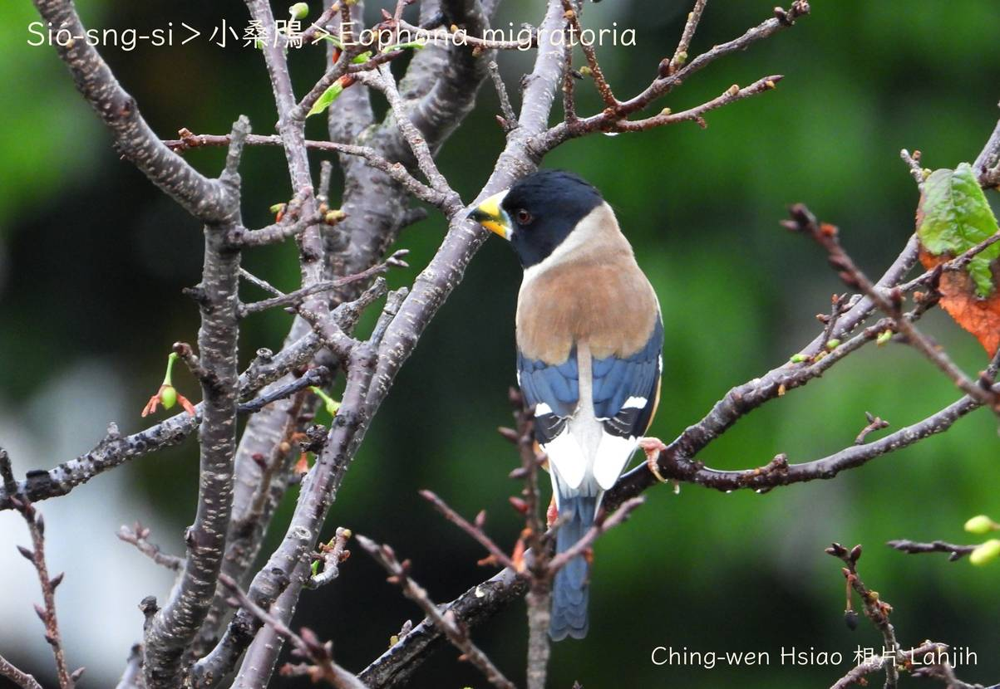
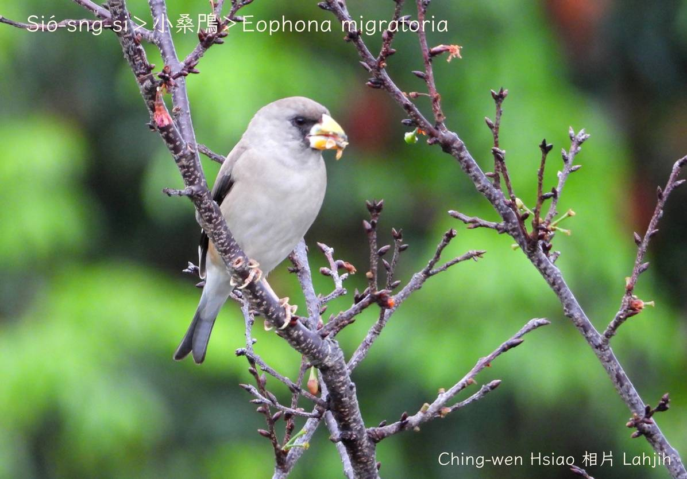
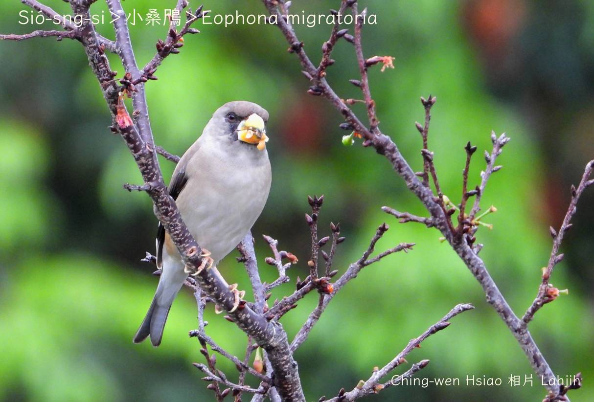
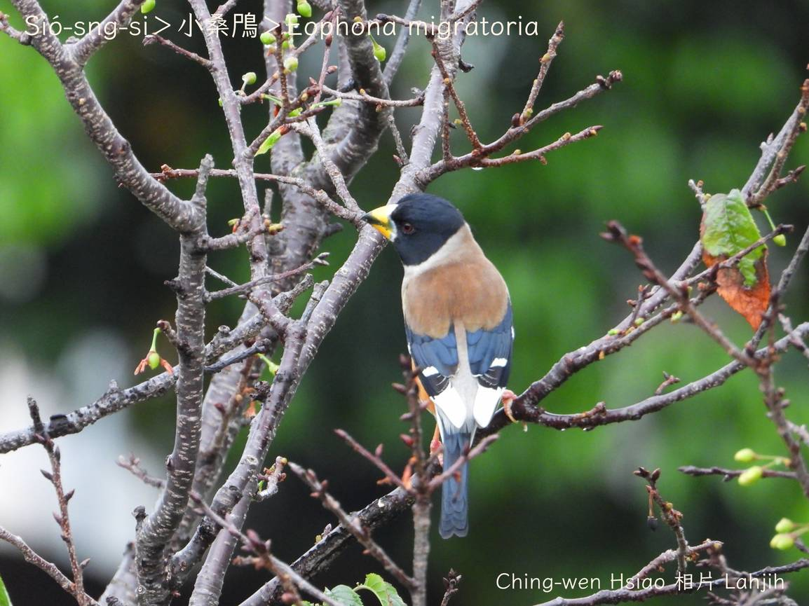
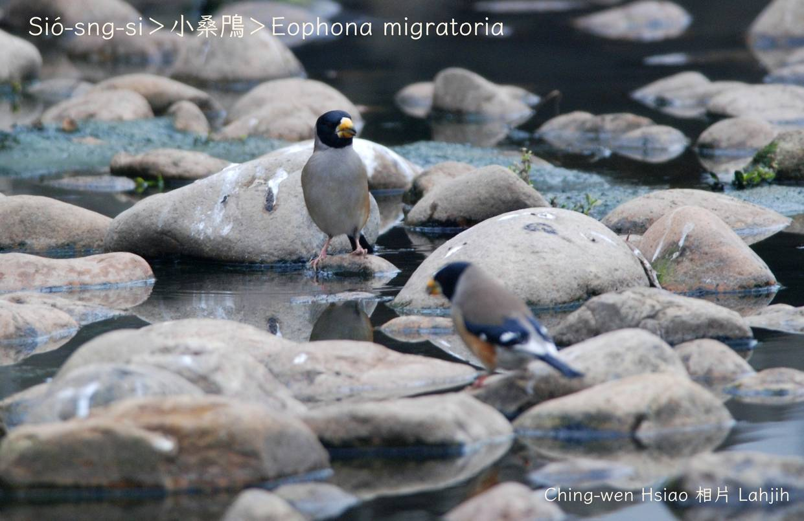
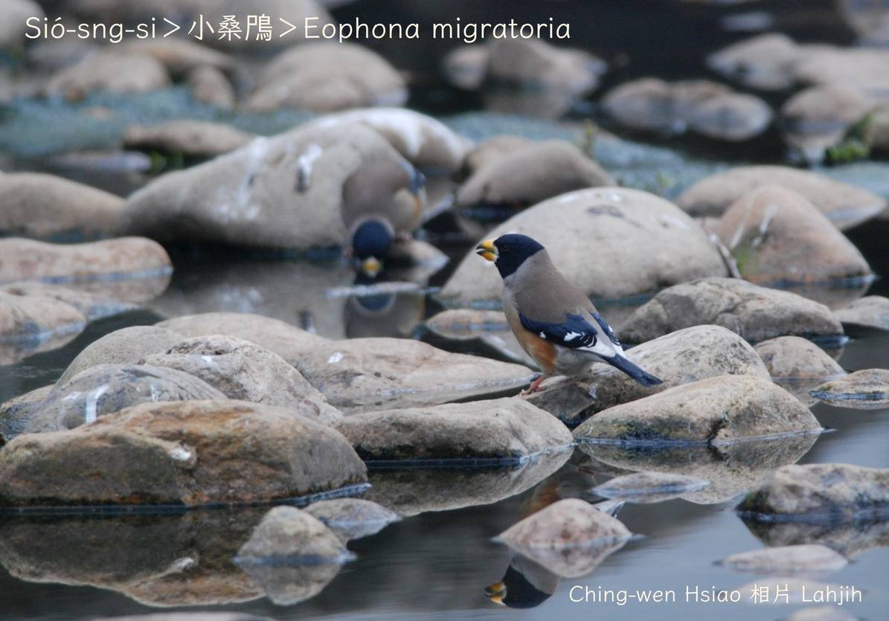
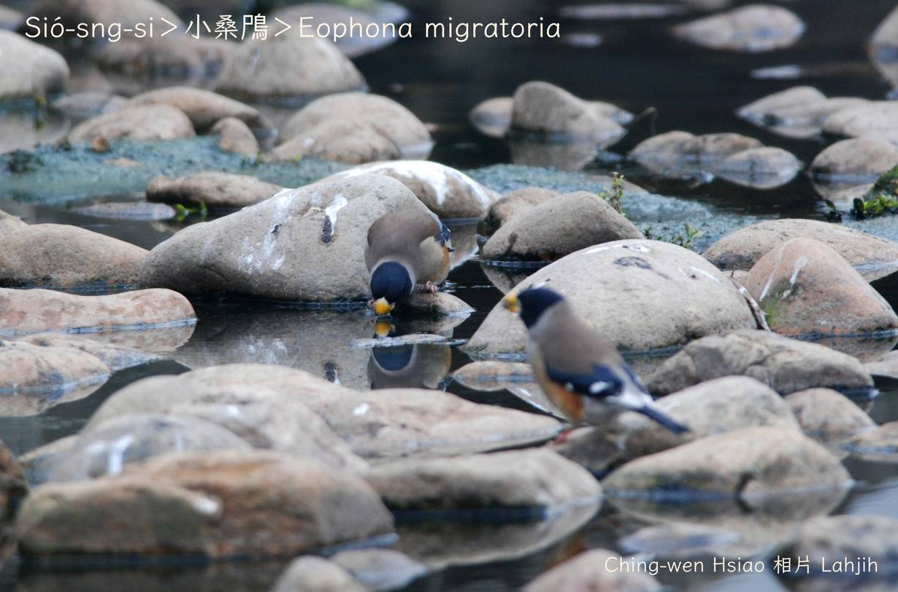

#### 49. Chhiok Kho『雀科』

|台灣名|中譯名|學名|
|Sió-sng-si|小桑鳲|Eophona migratoria|

# 49-4. Sió-sng-si

Sió-sng-si分布tī亞洲東部地區，tī台灣是過冬鳥，頭尾長度大約19公分，鳥公金黃嘴pe，頭殼烏色，翼股、尾溜烏金色chhap白色，kha-phiaⁿ phú-sek，腹肚咖啡黃色，鳥母頭殼phú-sek無烏頭。「Chiú-chiú-kŏ͘ chiuh-chiuh chiú-chiú-kŏ͘ chiuh-chiuh」親像kho͘-si-á真好聽。

Sió-sng-si ê嘴pe是典型雀鳥科特色，chiok適合咬破種子tēng殼食內面ê種子仁，hèng食果子kap種子。

