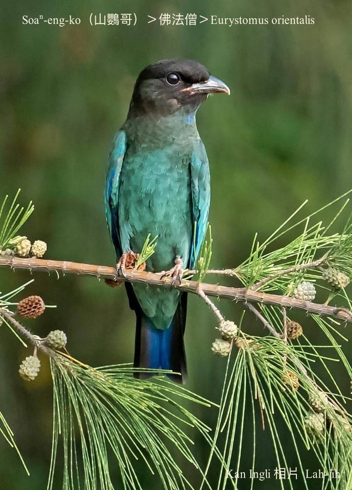
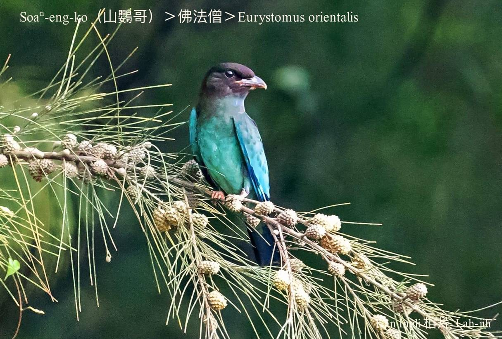
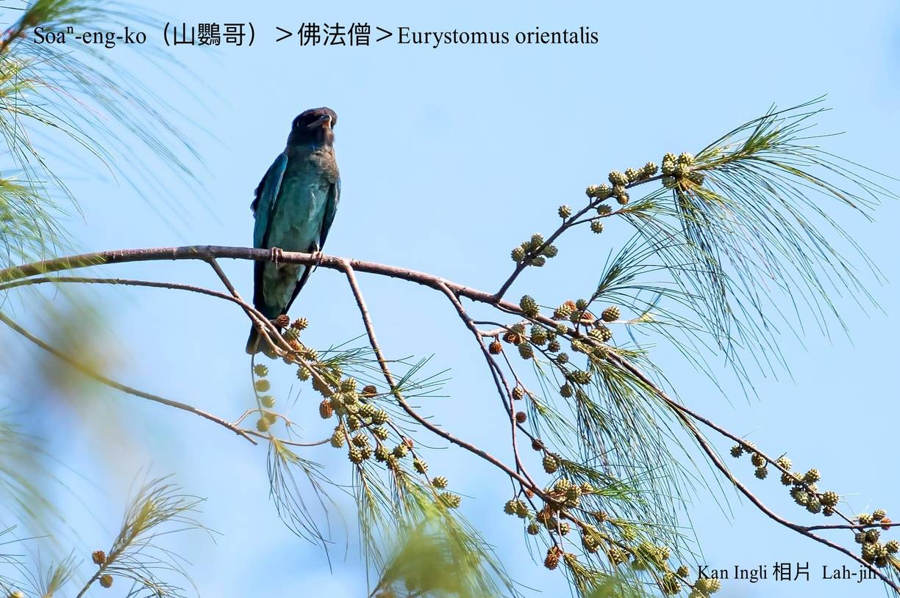
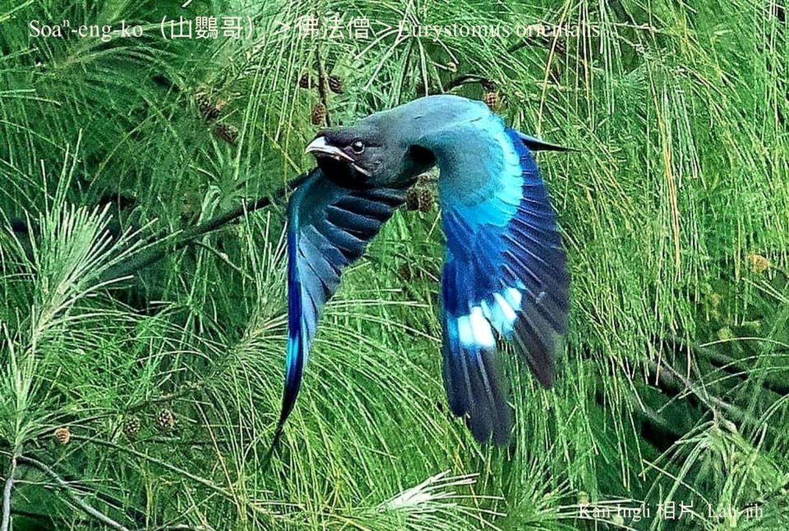
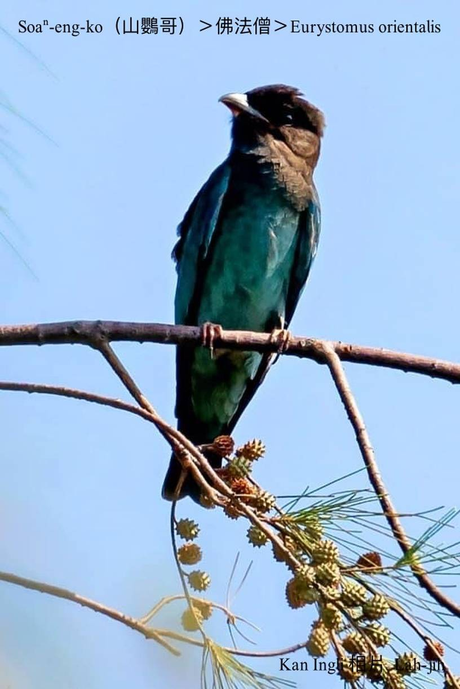
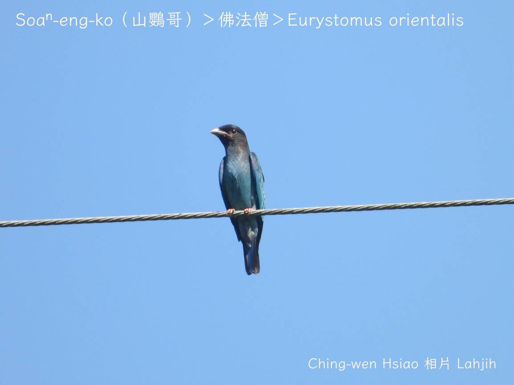
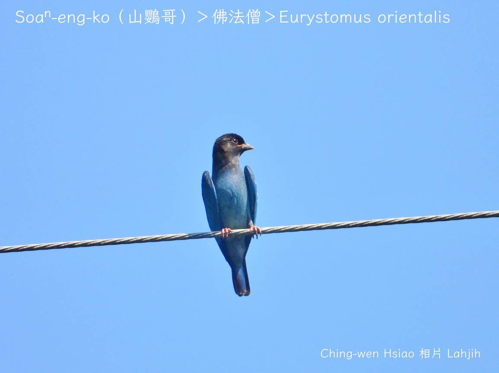
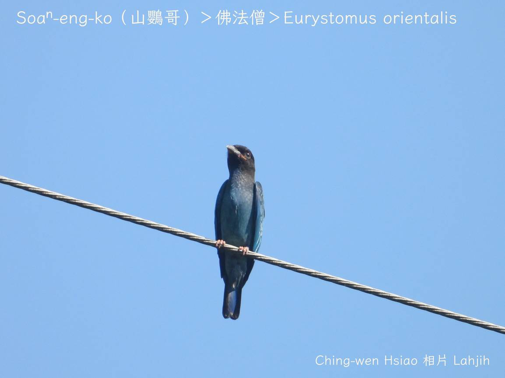
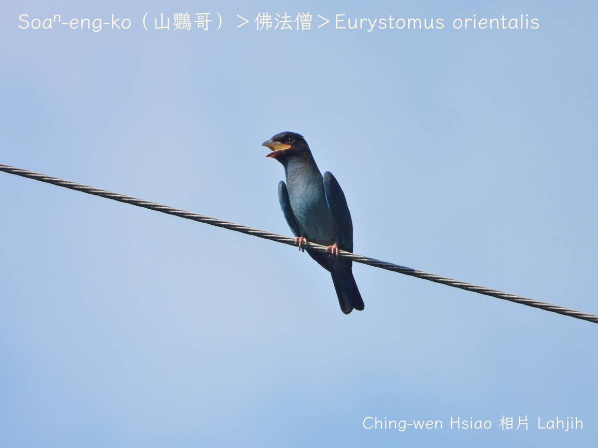
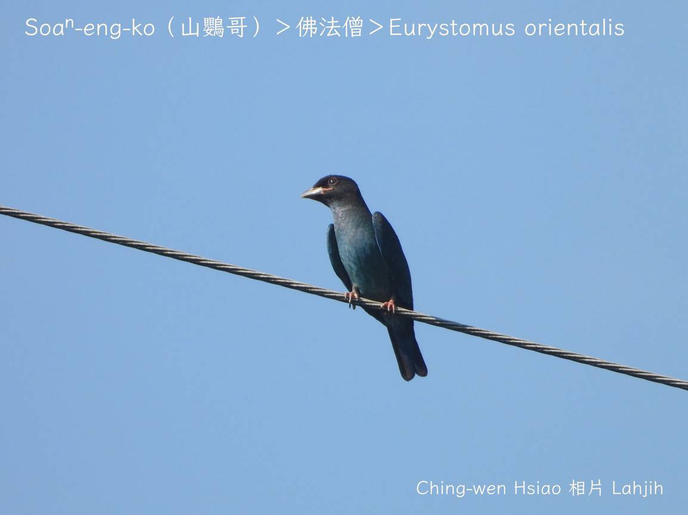

#### 50. Hu̍t-hoat-cheng Kho『佛法僧科』

|台灣名|中譯名|學名|
|Soaⁿ-eng-ko（山鸚哥）|佛法僧|Eurystomus orientalis|

# 50-1. Soaⁿ-eng-ko（山鸚哥）

Soaⁿ-eng-ko頭尾長度28公分，頭殼、ē-ham烏色，身軀phú-phú ê草á色，尾溜khóng-sek，腳爪紅肉色，目chiu烏烏chheⁿ-gìn-gìn，嘴pe鉤鉤ná鸚哥嘴，chiah hō͘人號做山鸚哥。

Soaⁿ-eng-ko tī台灣是秋天過境鳥，khah捷tī 9--月出現，kah意khiā tī電線、樹尾，警覺性chiâⁿ敏感，有人óa--來隨時飛走，oh-tit斟酌看清楚。

### 【註解】

|詞|解說|
|ē-ham|Chhùi-ē-táu，下頷。|

